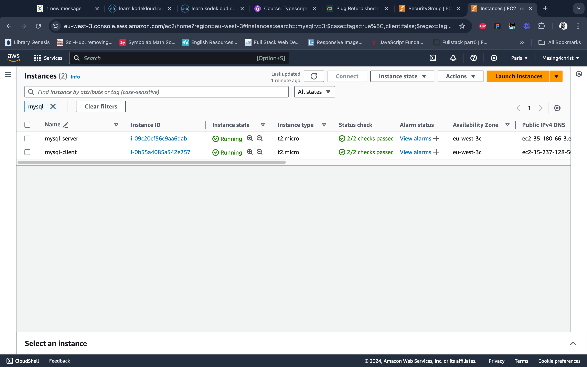
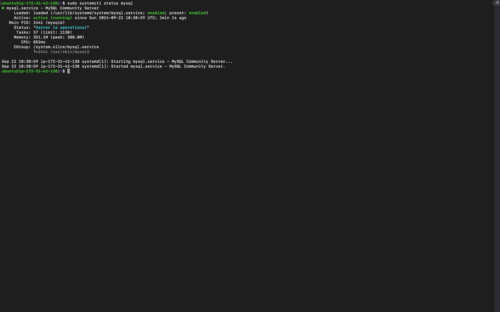
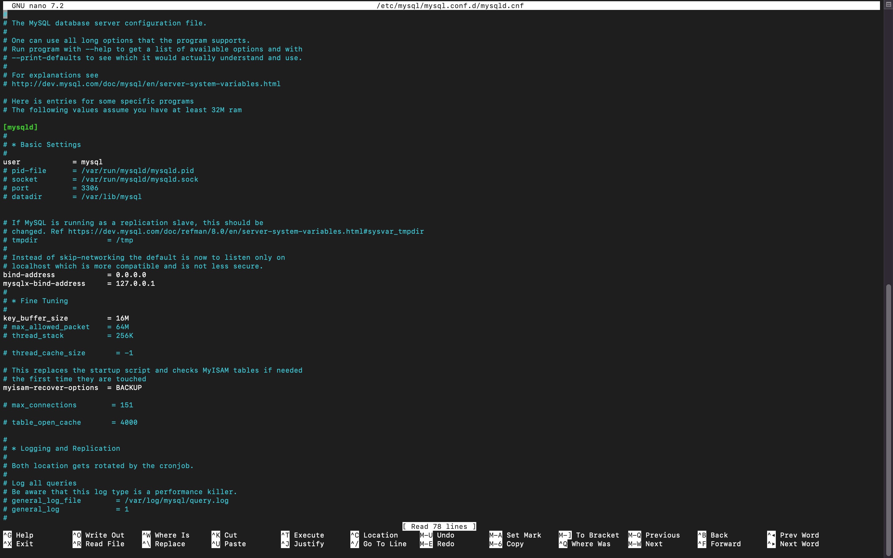
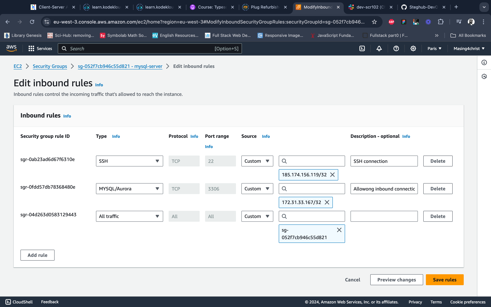
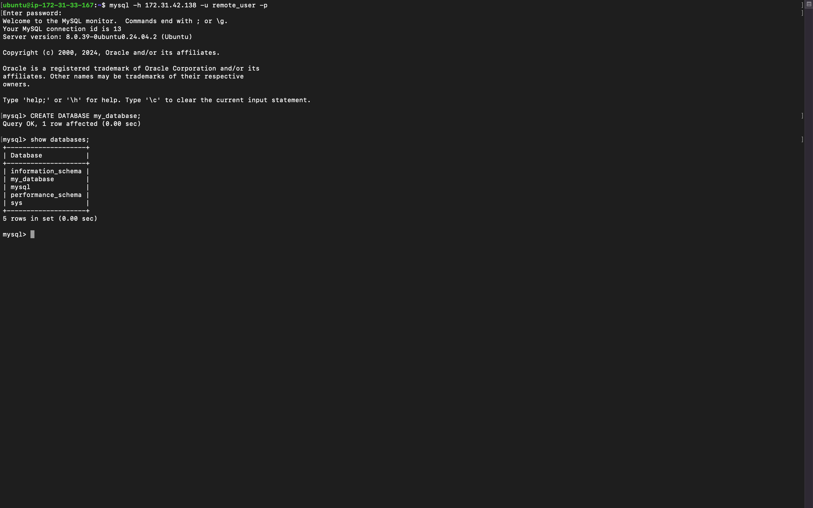

# Setting Up Client-Server Architecture with MySQL on AWS EC2: My Learning Journey

This README documents my experience configuring a client-server architecture using MySQL with two AWS EC2 instances. I’ll share the steps I took, the challenges encountered, and the insights I gained along the way.

## Table of Contents

1. [Prerequisites](#prerequisites)
2. [Installing MySQL Server on Instance B](#installing-mysql-server-on-instance-b)
3. [Configuring MySQL for Remote Access](#configuring-mysql-for-remote-access)
4. [Installing MySQL Client on Instance A](#installing-mysql-client-on-instance-a)
5. [AWS Security Group Configuration](#aws-security-group-configuration)
6. [Connecting MySQL Client to MySQL Server](#connecting-mysql-client-to-mysql-server)
7. [Network Diagnostics: Ping and Traceroute](#network-diagnostics-ping-and-traceroute)
8. [Final Steps and Reflections](#final-steps-and-reflections)
9. [Additional Notes](#additional-notes)

## Prerequisites

Before starting this project, I ensured the following:
- Two AWS EC2 instances (referred to as Instance A and Instance B) running Ubuntu.
- Basic knowledge of AWS security groups, Linux commands, and MySQL database operations.
- Installed MySQL server on Instance B and MySQL client on Instance A.

> **Personal Note:** Having a solid understanding of AWS security group settings is crucial for controlling traffic between EC2 instances. I ensured that the correct ports were open (specifically port 3306 for MySQL).

### Placeholder Image: AWS EC2 Instances Overview



## Installing MySQL Server on Instance B

Setting up MySQL server on **Instance B** was relatively straightforward. Here’s what I did:

1. SSH into **Instance B**.
2. Installed MySQL server:
    ```bash
    sudo apt update
    sudo apt install mysql-server -y
    ```
3. Started the MySQL service:
    ```bash
    sudo systemctl start mysql
    sudo systemctl enable mysql
    ```
4. Verified MySQL installation:
    ```bash
    sudo systemctl status mysql
    ```

> **Personal Note:** The process was seamless, but I highly recommend checking the MySQL service status to ensure it's running as expected.

### Placeholder Image: MySQL Server Status



## Configuring MySQL for Remote Access

Configuring MySQL for remote access is essential for connecting from **Instance A**. Here's what I did:

1. Opened the MySQL configuration file:
    ```bash
    sudo nano /etc/mysql/mysql.conf.d/mysqld.cnf
    ```
2. Modified the `bind-address` to allow remote connections:
    ```ini
    bind-address = 0.0.0.0
    ```
3. Restarted MySQL:
    ```bash
    sudo systemctl restart mysql
    ```
4. Created a MySQL user for remote access:
    ```sql
    CREATE USER 'remote_user'@'%' IDENTIFIED BY 'password';
    GRANT ALL PRIVILEGES ON *.* TO 'remote_user'@'%';
    FLUSH PRIVILEGES;
    ```

> **Insight:** Be careful when allowing remote access by setting the `bind-address` to `0.0.0.0`, as it opens MySQL to all IP addresses. For security reasons, I would recommend specifying trusted IPs in production environments.

### Placeholder Image: MySQL Config for Remote Access



## Installing MySQL Client on Instance A

Next, I set up the MySQL client on **Instance A** to connect to the MySQL server on **Instance B**.

1. SSH into **Instance A**.
2. Installed MySQL client:
    ```bash
    sudo apt update
    sudo apt install mysql-client -y
    ```
3. Verified the installation:
    ```bash
    mysql --version
    ```

> **Personal Note:** The installation was smooth, but remember to ensure that both instances are on the same VPC for better connectivity and security.

### Placeholder Image: MySQL Client Installation


## AWS Security Group Configuration

Instead of configuring a firewall directly on the instance, I opted to manage traffic through AWS Security Groups. Here’s how I set it up:

1. **Security Group for Instance B**:
   - Edited the inbound rules for the security group associated with **Instance B** to allow MySQL traffic from **Instance A**'s private IP.
   - Rule configuration:
     ```
     Type: MySQL/Aurora
     Protocol: TCP
     Port Range: 3306
     Source: <Instance A Private IP>/32
     ```

2. **Instance A**: Ensured **Instance A** had the necessary rules for SSH access.

> **Insight:** Managing security at the AWS level adds an extra layer of control and allows more granular access management without modifying the server directly.

### Placeholder Image: AWS Security Group Rules



## Connecting MySQL Client to MySQL Server

Once the security groups were configured, I connected the MySQL client from **Instance A** to the MySQL server on **Instance B**.

1. From **Instance A**, I used the following command to connect:
    ```bash
    mysql -h <Instance B Private IP> -u remote_user -p
    ```
2. Entered the password when prompted and successfully connected to the MySQL server running on **Instance B**.

> **Personal Note:** This step marked the success of my setup. The correct security group configuration was key to getting this working properly.

### Placeholder Image: MySQL Client Connected to Server


## Network Diagnostics: Ping and Traceroute

### 1. Ping

To test the network connectivity between the instances, I used the `ping` command:

```bash
ping <Instance B Private IP>
```

### Placeholder Image: Ping Results


### 2. Traceroute

For a detailed path analysis, I used `traceroute`:

```bash
traceroute <Instance B Private IP>
```

> **Personal Note:** Both `ping` and `traceroute` were helpful in diagnosing any connectivity issues, ensuring that **Instance A** could communicate with **Instance B** over the internal network.

### Placeholder Image: Traceroute Results


## Final Steps and Reflections

### Final Checklist

1. **Database Operations**: Once connected to the MySQL server, I was able to create databases, tables, and run queries without any issues.
   
    Example of a simple query to create a database:
    ```sql
    CREATE DATABASE my_database;
    ```

2. **Security**: I ensured that the security group rules were correctly configured and only allowed traffic between the two instances.

### Placeholder Image: MySQL Database Creation



### Personal Reflections

- This journey highlighted the importance of AWS security groups in managing instance connectivity. 
- Understanding how MySQL works in a client-server architecture was a key takeaway.
- Using AWS security groups instead of configuring the firewall directly on the instance felt more manageable and scalable, especially in cloud environments.

### Challenges Faced

- Initially, I had connectivity issues due to incorrect security group configurations, but careful adjustments resolved them.
- Learning how to configure MySQL for remote access was crucial, and understanding the potential security risks helped me secure the setup properly.

## Additional Notes

### Running MySQL Instances Across Different Regions or Cloud Providers

It's possible to run MySQL server and client on instances in different regions or even across different cloud environments (e.g., AWS, Google Cloud, or Azure). Here are some things to consider:

1. **Latency**: Instances in different regions may experience higher latency due to the physical distance between the servers. Choose regions close to each other to minimize latency.

2. **Networking**: 
   - Ensure that the instances are correctly networked, possibly using a VPN, VPC peering, or private links across clouds to maintain secure communication.
   - When instances are in different cloud environments, consider using services like **AWS Direct Connect**, **Azure ExpressRoute**, or **Google Cloud Interconnect** to establish private and secure communication channels.

3. **Security**: 
   - Be mindful of firewall rules, security group settings, and access control lists (ACLs) across different regions or providers to prevent unauthorized access.
   - Always limit MySQL access to trusted IP addresses or specific regions for better security.

4. **Cross-Region Costs**: Transferring data between regions (even within the same cloud provider) or between cloud environments can incur additional charges. Be sure to account for these costs in production setups.

> **Insight**: While cross-region or multi-cloud setups are viable, they require careful planning around networking, security, and costs. In production environments, consider replication strategies like master-slave or master-master replication to improve performance and availability across regions.
