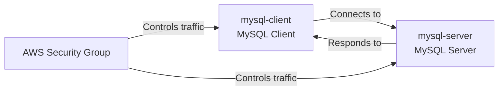
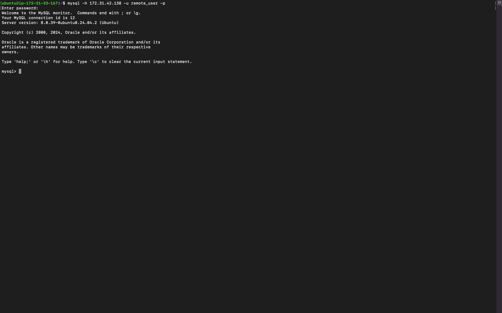
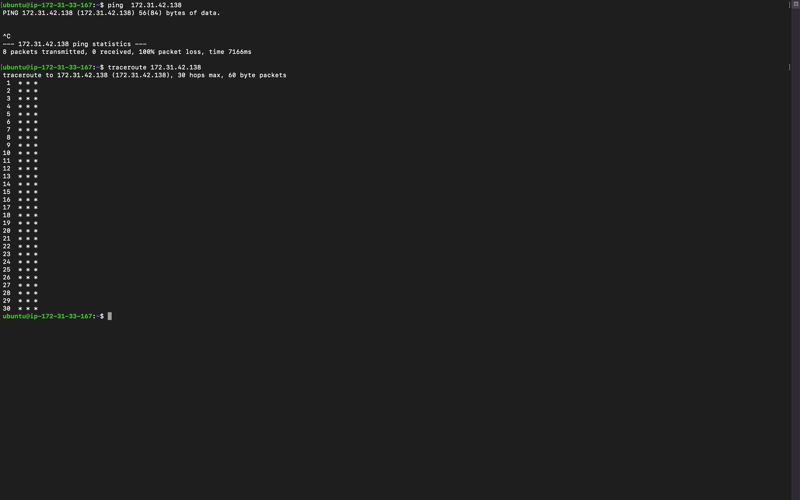

# Setting Up Client-Server Architecture with MySQL on AWS EC2: My Learning Journey

This README documents my experience configuring a client-server architecture using MySQL with two AWS EC2 instances. I'll share the steps I took, the challenges encountered, and the insights I gained along the way.

## Table of Contents

1. [Introduction](#introduction)
2. [Prerequisites](#prerequisites)
3. [Architecture Overview](#architecture-overview)
4. [Setting Up MySQL Server (mysql-server instance)](#setting-up-mysql-server-mysql-server-instance)
   - [Installation](#installation)
   - [Initial Configuration](#initial-configuration)
   - [Troubleshooting: Regaining Root Access](#troubleshooting-regaining-root-access)
5. [Configuring MySQL for Remote Access](#configuring-mysql-for-remote-access)
6. [Setting Up MySQL Client (mysql-client instance)](#setting-up-mysql-client-mysql-client-instance)
7. [AWS Security Group Configuration](#aws-security-group-configuration)
8. [Establishing Connection](#establishing-connection)
9. [Network Diagnostics: Ping and Traceroute](#network-diagnostics-ping-and-traceroute)
10. [Final Steps and Reflections](#final-steps-and-reflections)
11. [Additional Notes](#additional-notes)

## Introduction

This guide documents my journey in setting up a client-server architecture using MySQL on two AWS EC2 instances. I'll share not just the steps, but also the challenges I faced and the insights I gained. Whether you're a beginner or an experienced user, I hope my experience helps you in your own setup.

## Prerequisites

Before starting this project, I ensured the following:
- Two AWS EC2 instances (named mysql-server and mysql-client) running Ubuntu.
- Basic knowledge of AWS security groups, Linux commands, and MySQL database operations.
- SSH access to both instances.

> **Personal Note:** Having a solid understanding of AWS security group settings is crucial for controlling traffic between EC2 instances. I ensured that the correct ports were open (specifically port 3306 for MySQL).


## Architecture Overview

My setup consists of:

- **mysql-client**: MySQL Client instance
- **mysql-server**: MySQL Server instance

Both instances are in the same VPC for better security and performance.



> **Personal Insight:** Initially, I tried to set up the instances in different VPCs, which led to connectivity issues. Keeping them in the same VPC simplified the setup significantly.

## Setting Up MySQL Server (mysql-server instance)

### Installation

1. I SSH'd into the mysql-server instance.
2. Updated package lists and installed MySQL server:

```bash
sudo apt update
sudo apt install mysql-server -y
```

### Initial Configuration

1. Started and enabled the MySQL service:

```bash
sudo systemctl start mysql
sudo systemctl enable mysql
```

2. Set the root password:

```bash
sudo mysql
ALTER USER 'root'@'localhost' IDENTIFIED WITH mysql_native_password BY 'your_strong_password';
FLUSH PRIVILEGES;
EXIT;
```

3. Ran the secure installation script:

```bash
sudo mysql_secure_installation
```

> **Personal Note:** I initially ran the `mysql_secure_installation` script without setting the root password first. This locked me out of the root account, leading to a valuable lesson on the importance of following the correct sequence of steps.

4. Verified the installation:

```bash
sudo systemctl status mysql
```


### Troubleshooting: Regaining Root Access

I accidentally locked myself out of the root account by running `mysql_secure_installation` before setting the root password. Here's how I regained access:

1. Stopped MySQL:

```bash
sudo systemctl stop mysql
```

2. Started MySQL in safe mode:

```bash
sudo mkdir -p /var/run/mysqld
sudo chown mysql:mysql /var/run/mysqld
sudo mysqld_safe --skip-grant-tables &
```

3. Reset the root password:

```sql
mysql -u root
USE mysql;
UPDATE mysql.user SET authentication_string=NULL WHERE user='root';
FLUSH PRIVILEGES;
ALTER USER 'root'@'localhost' IDENTIFIED WITH mysql_native_password BY 'new_strong_password';
FLUSH PRIVILEGES;
EXIT;
```

4. Restarted MySQL normally:

```bash
sudo killall mysqld
sudo systemctl start mysql
```

> **Personal Insight:** This experience taught me the importance of carefully following the correct sequence of steps when setting up MySQL, especially when it comes to root access and running security scripts.

## Configuring MySQL for Remote Access

1. Opened the MySQL configuration file:

```bash
sudo nano /etc/mysql/mysql.conf.d/mysqld.cnf
```

2. Identified and modified two bind-address settings:

```ini
bind-address = 0.0.0.0
mysqlx-bind-address = 127.0.0.1
```

> **Personal Note:** I found two bind-address settings in the configuration file, which initially confused me. Here's what I learned about each:
> 
> - **`bind-address`**: This setting configures which IP address MySQL listens to for **standard MySQL client connections** (typically on port 3306). Setting it to `0.0.0.0` allows connections from any IP address.
>   
> - **`mysqlx-bind-address`**: This setting is used for the **MySQL X Protocol**, which enables document-based CRUD operations and JSON-based interactions, typically on port 33060. I left this at the default value of `127.0.0.1` since I wasn't using X Protocol features.

3. Restarted MySQL:

```bash
sudo systemctl restart mysql
```

4. Created a MySQL user for remote access:

```sql
CREATE USER 'remote_user'@'%' IDENTIFIED WITH mysql_native_password BY 'Password.1';
GRANT ALL PRIVILEGES ON *.* TO 'remote_user'@'%';
FLUSH PRIVILEGES;
```

> **Insight:** Be careful when allowing remote access by setting the `bind-address` to `0.0.0.0`, as it opens MySQL to all IP addresses. For security reasons, I would recommend specifying trusted IPs in production environments.


## Setting Up MySQL Client (mysql-client instance)

1. SSH'd into the mysql-client instance.
2. Installed MySQL client:

```bash
sudo apt update
sudo apt install mysql-client -y
```

3. Verified the installation:

```bash
mysql --version
```

> **Personal Note:** The installation was smooth, but remember to ensure that both instances are on the same VPC for better connectivity and security.

## AWS Security Group Configuration

Instead of configuring a firewall directly on the instance, I opted to manage traffic through AWS Security Groups. Here's how I set it up:

1. **Security Group for mysql-server**:
   - Edited the inbound rules for the security group associated with mysql-server to allow MySQL traffic from mysql-client's private IP.
   - Rule configuration:
     ```
     Type: MySQL/Aurora
     Protocol: TCP
     Port Range: 3306
     Source: <mysql-client Private IP>/32
     ```

2. **mysql-client**: Ensured mysql-client had the necessary rules for SSH access.

> **Insight:** Managing security at the AWS level adds an extra layer of control and allows more granular access management without modifying the server directly.


## Establishing Connection

Once the security groups were configured, I connected the MySQL client from mysql-client to the MySQL server on mysql-server.

1. From mysql-client, I used the following command to connect:

```bash
mysql -h <mysql-server Private IP> -u remote_user -p
```

2. Entered the password when prompted and successfully connected to the MySQL server running on mysql-server.

> **Personal Note:** This step marked the success of my setup. The correct security group configuration was key to getting this working properly.



## Network Diagnostics: Ping and Traceroute

### 1. Ping

To test the network connectivity between the instances, I used the `ping` command:

```bash
ping <mysql-server Private IP>
```

### 2. Traceroute

For a detailed path analysis, I used `traceroute`:

```bash
traceroute <mysql-server Private IP>
```

> **Personal Note:** Both `ping` and `traceroute` were helpful in diagnosing any connectivity issues, ensuring that mysql-client could communicate with mysql-server over the internal network.



## Final Steps and Reflections

### Final Checklist

1. **Database Operations**: Once connected to the MySQL server, I was able to create databases, tables, and run queries without any issues.
   
    Example of a simple query to create a database:
    ```sql
    CREATE DATABASE my_database;
    ```

2. **Security**: I ensured that the security group rules were correctly configured and only allowed traffic between the two instances.


### Personal Reflections

- This journey highlighted the importance of AWS security groups in managing instance connectivity. 
- Understanding how MySQL works in a client-server architecture was a key takeaway.
- Using AWS security groups instead of configuring the firewall directly on the instance felt more manageable and scalable, especially in cloud environments.

### Challenges Faced

- Initially, I had connectivity issues due to incorrect security group configurations, but careful adjustments resolved them.
- Learning how to configure MySQL for remote access was crucial, and understanding the potential security risks helped me secure the setup properly.
- The accidental root account lockout taught me the importance of following the correct sequence of steps during initial MySQL setup.

## Additional Notes

### Running MySQL Instances Across Different Regions or Cloud Providers

While my setup was within the same AWS region, I learned that it's possible to run MySQL server and client on instances in different regions or even across different cloud environments. Here are some things to consider:

1. **Latency**: Instances in different regions may experience higher latency. Choose regions close to each other to minimize this.

2. **Networking**: 
   - Ensure instances are correctly networked, possibly using VPN or VPC peering.
   - For cross-cloud setups, look into services like AWS Direct Connect or equivalents.

3. **Security**: 
   - Be extra careful with firewall rules and security groups.
   - Consider using SSL/TLS for encrypted connections.

4. **Costs**: Be aware of potential data transfer costs between regions or cloud providers.

> **Insight**: While cross-region or multi-cloud setups are viable, they require careful planning around networking, security, and costs. In production environments, consider replication strategies for better performance and availability.

This journey taught me a lot about MySQL, AWS, and networking. I hope my experiences and insights help you in your own setup. Remember, patience and persistence are key when working with complex systems like these!