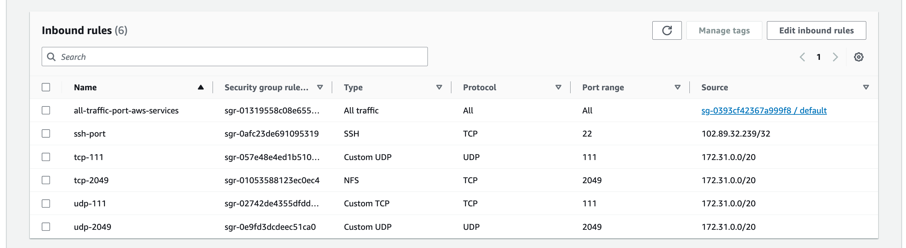

# Project: DevOps Tooling Website Solution

## Table of Contents

1. [Introduction](#introduction)
   - [Project Overview](#project-overview)
   - [Self-Study: Storage Concepts](#self-study-storage-concepts)
2. [Prerequisites](#prerequisites)
3. [Architecture Overview](#architecture-overview)
4. [Setting Up AWS EC2 Instances](#setting-up-aws-ec2-instances)
5. [Configuring NFS Server](#configuring-nfs-server)
   - [EBS Setup](#ebs-setup)
   - [LVM Configuration](#lvm-configuration)
   - [Install and Configure NFS server](#install-and-configure-nfs-server)
6. [Configuring Database Server](#configuring-database-server)
   - [EBS Setup](#ebs-setup-1)
   - [LVM Configuration](#lvm-configuration-1)
7. [AWS Security Group Configuration](#aws-security-group-configuration)
8. [Install and Configure MySQL Database Server](#install-and-configure-mysql-database-server)
9. [Configuring Web Servers](#configuring-web-servers)
   - [Installing NFS Client](#installing-nfs-client)
   - [Mounting NFS Shares](#mounting-nfs-shares)
   - [Installing Apache and PHP](#installing-apache-and-php)
10. [Deploying Tooling Website](#deploying-tooling-website)
11. [Final Steps and Reflections](#final-steps-and-reflections)

## Introduction

### Project Overview

This project is an extension of my [previous work](https://github.com/fmanimashaun/Steghub-DevOps-training/blob/main/Web_solution_with_wordpress), where I deployed a scalable WordPress application using a 3-tier architecture on AWS with EBS volumes and LVM for dynamic storage management. In this iteration,I'm enhancing the scalability and laying the foundation for a more robust DevOps tooling solution by implementing the following key changes:

1. **Centralized File Storage**: I'm introducing a Network File System (NFS) server to provide centralized, shared storage. This allows me to run multiple web servers efficiently, improving our application's scalability and performance.

2. **Multiple Web Servers**: Instead of a single web server, I'm now deploying multiple web servers that will connect to the centralized NFS storage. This setup enhances the ability to handle increased traffic and provides better fault tolerance.

3. **Dedicated Database Server**: We maintain a separate database server, continuing the practice of separating concerns in the architecture.

4. **DevOps Tooling Focus**: While the previous project centered on WordPress, this solution is geared towards hosting DevOps tools. This shift in focus prepares the infrastructure for hosting various DevOps-related applications and utilities.

5. **Enhanced Scalability**: By separating file storage from the web servers and using NFS, I'm creating a more flexible system that can easily scale by adding more web servers as needed.

6. **Continued Use of LVM**: I'm still leveraging Logical Volume Manager (LVM) for dynamic storage management, applying this to both the NFS server and database server for flexible disk space allocation.

The goal of this project is to create a scalable and maintainable infrastructure that can serve as a solid foundation for various DevOps tools and practices. By building on the [previous work](https://github.com/fmanimashaun/Steghub-DevOps-training/blob/main/Web_solution_with_wordpress) and introducing new elements like NFS, I'm moving towards a more robust, enterprise-ready solution that can adapt to growing demands and complexities in a DevOps environment.

### Self-Study: Storage Concepts

Below afre the concepts learnt during my self-study to have a general idea of how the varous technologies relates and theur use cases:

1. **Network Storage Types**:
   - **NAS (Network Attached Storage)**: File-level storage for easy file sharing in smaller environments, using protocols like NFS or SMB/CIFS.
   - **SAN (Storage Area Network)**: Block-level storage on a dedicated network, ideal for high-performance applications, using protocols like Fibre Channel or iSCSI.

2. **Data Storage Paradigms**:
   - **Block Storage**: Fixed-size data blocks with unique addresses, suitable for OS and databases, offering low-latency I/O (e.g., Amazon EBS).
   - **Object Storage**: Data stored as objects with metadata, highly scalable for unstructured data like media files (e.g., Amazon S3).
   - **Network File System (NFS)**: File-level protocol for remote file access, allowing shared access across multiple clients.

3. **AWS Cloud Storage Services**:
   - **Amazon EBS**: Block-level storage volumes for EC2 instances.
   - **Amazon S3**: Scalable object storage for various data types.
   - **Amazon EFS**: Managed NFS for EC2, providing scalable file storage.

These storage concepts form the foundation for understanding the infrastructure choices in our DevOps tooling project, particularly the use of NFS for shared storage across multiple web servers.

## Prerequisites

Before beginning this project, ensure you have the following:

1. **AWS Account**: An active AWS account with permissions to create and manage EC2 instances, EBS volumes, and security groups.


3. **Knowledge Base**:
   - Basic understanding of Linux command line
   - Familiarity with AWS services, particularly EC2 and EBS
   - Basic networking concepts

4. **Tools**:
   - SSH client (e.g., PuTTY for Windows or Terminal for MacOS/Linux)
   - Git installed on your local machine

5. **Security**:
   - Create or use an existing EC2 Key Pair for SSH access

6. **Browser**: A modern web browser for accessing the AWS Management Console

## Architecture Overview

Below is a diagram illustrating the architecture of our DevOps Tooling Website Solution:

<antArtifact identifier="devops-tooling-architecture" type="application/vnd.ant.mermaid" title="DevOps Tooling Website Solution Architecture">


This architecture provides:
- Scalability through multiple web servers
- Centralized file storage via NFS
- Separated database for better resource management

## Setting Up AWS EC2 Instances

Follow these steps to set up the required EC2 instances:

1. **Launch NFS Server**:
   - Navigate to EC2 dashboard in AWS Console
   - Click "Launch Instance"
   - Choose "Red Hat Enterprise Linux 9.4" AMI
   - Select t2.small instance type
   - Configure instance details (VPC, subnet, etc.)
   - Add 3 x 15GB EBS volumes
   - Configure security group (will be detailed later)
   - Review and launch with your EC2 key pair

2. **Launch Web Servers** (Repeat 3 times):
   - Follow similar steps as NFS server
   - Choose t2.small instance type
   - No additional EBS volumes required

3. **Launch Database Server**:
   - Follow similar steps as NFS server
   - Choose t2.micro instance type
   - Add 3 x 10GB EBS volumes

4. **Verify Instances**:
   - Ensure all instances are in the "running" state
   - Note down the private IP addresses of all instances
   - Confirm that all instances are in the same subnet (for this project)

5. **Tag Instances**:
   - Add descriptive tags to each instance (e.g., "NFS Server", "Web Server 1", "DB Server")
   - Consider adding a tag to indicate that this is a learning/development environment

6. **Configure Elastic IPs** (Optional):
   - Allocate and associate Elastic IPs to web servers if public access is required

> **Important Considerations:**
>- *Ensure all instances are in the same VPC and subnet for this project. Remember that while this simplifies our setup, it's **not a recommended practice for production environments**.*
>- *Use the same key pair for all instances for easier management*
>- *Double-check that the correct number and size of EBS volumes are attached to the NFS and DB servers*

> *For the purpose of this project and to simplify the setup, all instances are placed in the same subnet. However, it's crucial to understand that this configuration is not recommended for production environments due to security concerns. In a production setting, it's best practice to separate these components into different subnets (e.g., public subnet for web servers, private subnet for application servers, and another private subnet for databases) to enhance security through network segregation.*


## Configuring NFS Serve

Connect to the nfs-server instance via the ssh terminal to have access to the system.

### EBS Setup

1. **Check Volume Visibility**:
   After SSH'ing into the instances, I listed the attached block devices using:

   ```bash
   lsblk
   ```
   The new volumes appeared as `/dev/xvdb`, `/dev/xvdc`, and `/dev/xvdd`.

   

   > note down the name of the EBB volumes as shown on the output of the **lsblk** command

### LVM Configuration

1. **Install LVM Tools**:
   Since Red Hat Enterprise Linux 9.4 was being used, I ensured LVM was installed, I also installed nano (text editor)

   ```bash
   sudo dnf update
   sudo dnf install lvm2 nano
   ```

   you can check for available partition using **lvmdiskscan** command, however, since it is a fresh EBS volumes, there is no partition on it at the moment.

2. **Create partitions on EBS volumes**:

   Using the **gdisk** utitlity to create a single partition on each EBS block as follows:

   ```bash
   sudo gdisk /dev/xvdb
   ```

   This will launch the partition utility interface as shown below:

   

   use the following commands to create and save the partition table to disk:
   - **n** - To create a partition table, accept all defaults by pressing **Enter** key
   - **p** - Print partition table informatoon
   - **w** - Write changes to disk

   

   You do the same for the remaining EBS blocks using the commands below:
   - xvdc block:
   ```bash
   sudo gdisk /dev/xvdc
   ```

    - xvdd block:
   ```bash
   sudo gdisk /dev/xvdd
   ```

   confirm the partitions using **lsblk**
   ```bash
   lsblk
   ```


> note down the partition names: **xvdb1**, **xvdc1** and **xvdd1**

3. **Create Physical Volumes**:
   Converted the three attached EBS block partitions into physical volumes (PVs):

   ```bash
   sudo pvcreate /dev/xvdb1 /dev/xvdc1 /dev/xvdd1
   ```

4. **Create Volume Group**:
   Next, Created a volume group (VG) to aggregate the PVs:

   ```bash
   sudo vgcreate webdata-vg /dev/xvdb1 /dev/xvdc1 /dev/xvdd1
   ```

5. **Create Logical Volumes**:
   Created logical volumes (LVs) for storing application data, logs and opt for jenkins. Here's how I did it:

   ```bash
   sudo lvcreate -n lv-apps -L 14G  webdata-vg
   sudo lvcreate -n lv-logs -L 14G  webdata-vg
   sudo lvcreate -n lv-opt -L 14G  webdata-vg
   lsblk
   ```

   

   To verify the entire setup - view the VG, PV and LV, you can run:
   ```bash
   sudo vgdisplay -v
   ```

6. **Create File system and Mount points for the LVs**:
   Create o a file system on the Logival volumes by running the follwoing commands:

   ```bash
   sudo mkfs -t xfs /dev/webdata-vg/lv-apps
   sudo mkfs -t xfs /dev/webdata-vg/lv-logs
   sudo mkfs -t xfs /dev/webdata-vg/lv-opt
   ```

   

   - Create the following mount points:

   ```bash
   sudo mkdir /mnt/apps /mnt/logs /mnt/opt
   ```

### Install and Configure NFS server

1. Install NFS server:

   ```bash
   sudo dnf update -y
   sudo dnf install nfs-utils -y
   sudo systemctl start nfs-server
   sudo systemctl enable nfs-server
   sudo systemctl status nfs-server
   ```

2. Set permission to the mount points:

   ```bash
   sudo chown -R nobody: /mnt/apps
   sudo chown -R nobody: /mnt/logs
   sudo chown -R nobody: /mnt/opt

   sudo chmod -R 777 /mnt/apps
   sudo chmod -R 777 /mnt/logs
   sudo chmod -R 777 /mnt/opt

   sudo systemctl restart nfs-server
   ```

   

3. Configure access to NFS for clients within same subnet (172.31.0.0/20)
   ```bash
   sudo nano /etc/exports
   ```

      paste the code below into the exports file:
      ```yml
      # exporting the nfs mount points: 
      /mnt/apps 172.31.0.0/20(rw,sync,no_all_squash,no_root_squash)
      /mnt/logs 172.31.0.0/20(rw,sync,no_all_squash,no_root_squash)
      /mnt/opt 172.31.0.0/20(rw,sync,no_all_squash,no_root_squash)
      ```
   ```bash
   sudo exportfs -arv
   ```
   


4. Check the NFS server port:
   ```bash
   rpcinfo -p | grep nfs
   ```
   Add the following ports to the security group for the nfs-server on aws console:
      - TCP 111
      - TCP 2049
      - UDP 111
      - UDP 2049
   
   

## Configuring Database Server

Connect to the db-server instance via the ssh terminal to have access to the system.

### EBS Setup

1. **Check Volume Visibility**:
   After SSH'ing into the instances, I listed the attached block devices using:

   ```bash
   lsblk
   ```
   The new volumes appeared as `/dev/xvdb`, `/dev/xvdc`, and `/dev/xvdd`.

   

   > note down the name of the EBB volumes as shown on the output of the **lsblk** command

### LVM Configuration

1. **Install LVM Tools**:
   Since Red Hat Enterprise Linux 9.4 was being used, I ensured LVM was installed, I also installed nano (text editor) and wget (for downloading)

   ```bash
   sudo dnf update
   sudo dnf install lvm2 nano
   ```

   you can check for available partition using **lvmdiskscan** command, however, since it is a fresh EBS volumes, there is no partition on it at the moment.

2. **Create partitions on EBS volumes**:

   Using the **gdisk** utitlity to create a single partition on each EBS block as follows:

   ```bash
   sudo gdisk /dev/xvdb
   ```

   This will launch the partition utility interface as shown below:

   

   use the following commands to create and save the partition table to disk:
   - **n** - To create a partition table, accept all defaults by pressing **Enter** key
   - **p** - Print partition table informatoon
   - **w** - Write changes to disk

   

   You do the same for the remaining EBS blocks using the commands below:
   - xvdc block:
   ```bash
   sudo gdisk /dev/xvdc
   ```

    - xvdd block:
   ```bash
   sudo gdisk /dev/xvdd
   ```

   confirm the partitions using **lsblk**
   ```bash
   lsblk
   ```


> note down the partition names: **xvdb1**, **xvdc1** and **xvdd1**

3. **Create Physical Volumes**:
   Converted the three attached EBS block partitions into physical volumes (PVs):

   ```bash
   sudo pvcreate /dev/xvdb1 /dev/xvdc1 /dev/xvdd1
   ```

4. **Create Volume Group**:
   Next, Created a volume group (VG) to aggregate the PVs:

   ```bash
   sudo vgcreate dbdata-vg /dev/xvdb1 /dev/xvdc1 /dev/xvdd1
   ```

5. **Create Logical Volumes**:
   Created logical volumes (LVs) for storing WordPress application data and logs. Here's how I did it:

   ```bash
   sudo lvcreate -n db-lv -L 14G  dbdata-vg
   sudo lvcreate -n log-lv -L 14G  dbdata-vg
   lsblk
   ```

   

   To verify the entire setup - view the VG, PV and LV, you can run:
   ```bash
   sudo vgdisplay -v
   ```

6. **Create File system and Mount LVs**:
   Create o a file system on the Logival volumes by running the follwoing commands:

   ```bash
   sudo mkfs -t ext4 /dev/dbdata-vg/db-lv
   sudo mkfs -t ext4 /dev/dbdata-vg/log-lv
   ```

   

   Then mounted them:

   - Create the following locations:

   ```bash
   sudo mkdir -p /db /home/recovery/logs
   ```

   > note the **-p** is to ensure the parent directory are created if not existing.

   > The **/home/recovery/logs** directory is to backup the **/var/log** directory before mounting the **/dev/dbdata-vg/log-lv** to the location as the mount process will wipe the location clean.

   - Backup the **/var/log**:
   ```bash
   sudo rsync -av /var/log/ /home/recovery/logs/
   ```
   >The -av flag in the rsync command has the following meanings:
   >
   > - a (archive): This option enables archive mode, which ensures that the data is copied recursively and preserves symbolic links, file permissions, timestamps, and ownership. It's a commonly used option when making backups or transfers where you want to keep the file attributes intact.
   >
   > - v (verbose): This option enables verbose mode, meaning that rsync will display detailed information about what files are being transferred during the operation. It helps to see the progress and details of the copy process.

   - Mount the LVs:

   ```bash
   sudo mount /dev/dbdata-vg/db-lv /db
   sudo mount /dev/dbdata-vg/log-lv /var/log
   ```

   - Restore the **/var/log**:
   ```bash
   sudo rsync -av /home/recovery/logs/ /var/log/ 
   ```

7. **Persistent Mounts**:
   To ensure the volumes are automatically mounted at boot, updated `/etc/fstab`:

   - Get the UUID of the LVs:
      ```bash
      sudo blkid
      ```

   

   - Update the `/etc/fstab`:
   ```bash
   sudo nano /etc/fstab
   ```

   - Paste the code below:
   ```yml
   # mounts for wordpress webserver
   UUID=ac925709-a000-4cb5-926d-bc9c792c499c /db ext4 defaults 0 0
   UUID=44d455e2-38ff-414e-839e-39110887379d /var/log ext4 defaults 0 0
   ```

   - Save and reload the daemon:
   ```bash
   sudo systemctl daemon-reload
   ```

   - Test the mount:
   ```bash
   sudo mount -a # if no output, the mount is successfully added to the fstab
   ```

### AWS Security Group Configuration

Security groups were configured to control access between the WordPress and MySQL instances.

1. **MySQL Security Group**:
   - Allowed traffic on port 3306 from the subnet CIDR block (172.31.0.0/20) for database communication.

   - Opened SSH (port 22) for administrative access.

### Install and Configure MYSQL Database server
While still inside the **db-server**, let setup the mysql database:

```bash
sudo dnf update
sudo dnf install mysql-server -y
```

### Initial Configuration

2. Started and enabled the MySQL service:

```bash
sudo systemctl start mysqld
sudo systemctl enable mysqld
```

3. Set the root password:

```bash
sudo mysql
ALTER USER 'root'@'localhost' IDENTIFIED WITH mysql_native_password BY 'Password.1';
FLUSH PRIVILEGES;
EXIT;
```

4. Ran the secure installation script:

```bash
sudo mysql_secure_installation
```

> **Personal Note:** I initially ran the `mysql_secure_installation` script without setting the root password first. This locked me out of the root account, leading to a valuable lesson on the importance of following the correct sequence of steps.

5. Verified the installation:

```bash
sudo systemctl status mysqld
```

6. Create admin user for the wordpress application:
```bash
sudo mysql -u root -p
```

```bash
CREATE DATABASE tooling;
CREATE USER 'webaccess'@'172.31.%' IDENTIFIED WITH mysql_native_password BY 'Password.1';
GRANT ALL PRIVILEGES ON tooling.* TO 'webaccess'@'172.31.%';
FLUSH PRIVILEGES;
EXIT;
```

7. Test the remote connection to the newly created database via **web-server** instance:
   Connect to the web-server instance via the ssh interface and run this command:

   - Install the MySQL client:
   ```bash
   sudo dnf update
   sudo dnf install mysql
   ```
   - Connect to the remote mysql server:
   ```bash
   sudo mysql -h 172.31.3.89 -u webaccess -p
   ```

   if you can connect into the mysql shell, then the setup was successful.


