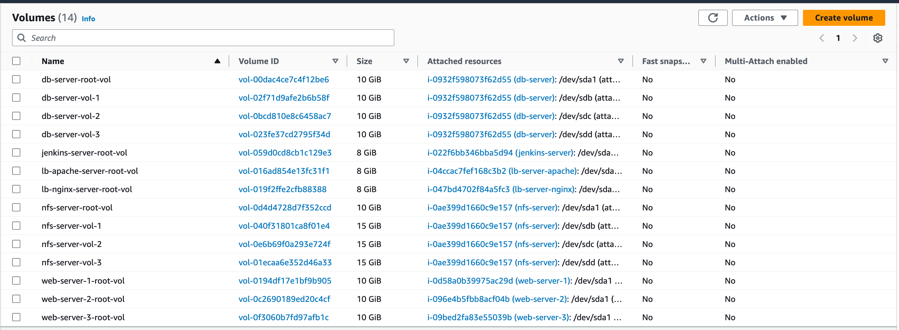
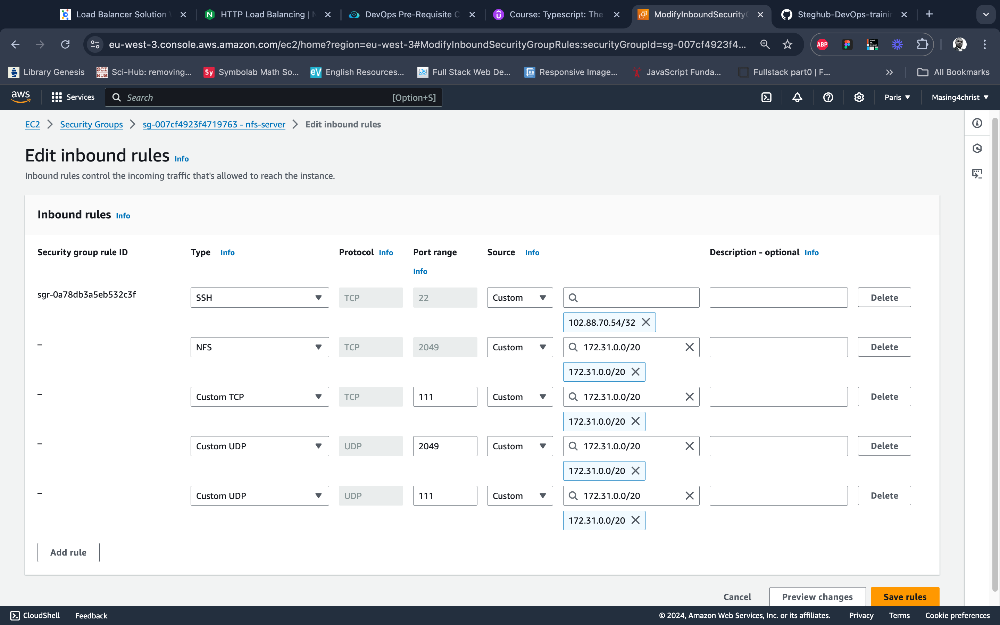
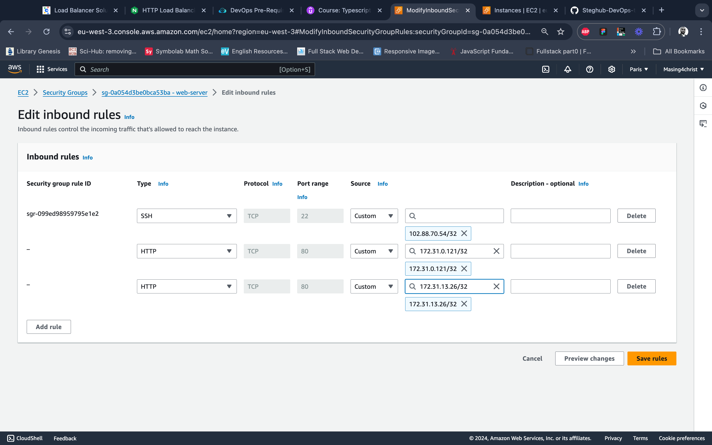
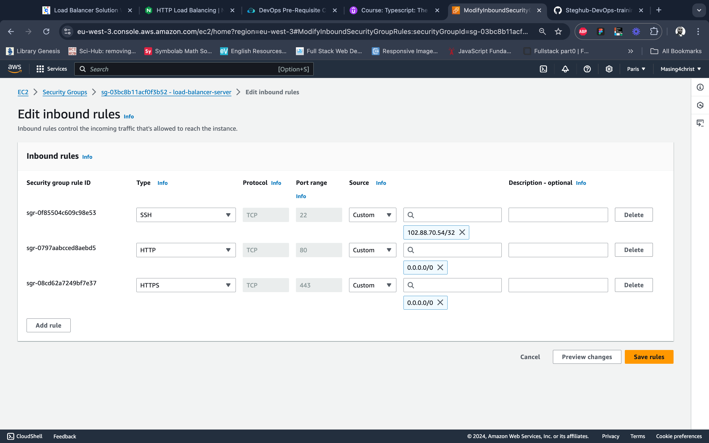
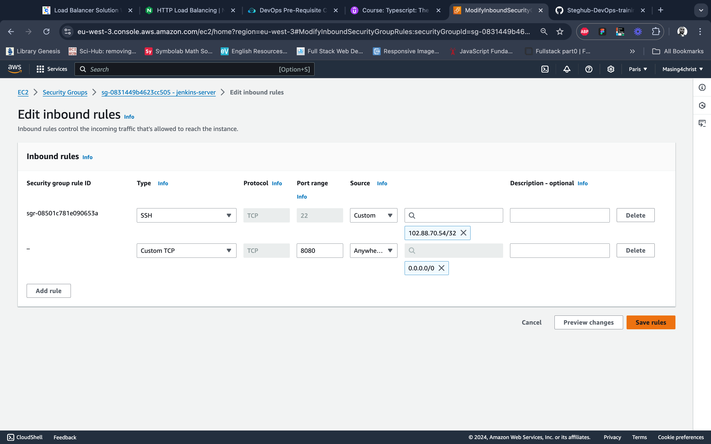

# Load Balancer Solution with Nginx and SSL/TLS

## Table of Contents
1. [Introduction](#introduction)
2. [Project Overview](#project-overview)
3. [Architecture](#architecture)
4. [Prerequisites](#prerequisites)
5. [AWS setup overview](#aws-setup-overview)
6. [Self-Study](#self-study)
   - [SSL/TLS and Certificate Authorities (CAs)](#ssltls-and-certificate-authorities-cas)
   - [Domains, DNS, and Common DNS Records](#domains-dns-and-common-dns-records)
   - [Key Concepts for Nginx Load Balancing](#key-concepts-for-nginx-load-balancing)
7. [Implementation](#implementation)
8. [Testing and Validation](#testing-and-validation)
9. [Future Improvements](#future-improvements)
10. [References](#references)

## Introduction
In this project, we’ll enhance the DevOps Tooling Website setup by:
1. Replacing the Apache load balancer with Nginx.
2. Adding an Elastic IP and configuring a custom domain.
3. Implementing SSL/TLS to secure traffic with HTTPS.

## Project Overview
This project builds on the previously established DevOps Tooling Website Solution, Load Balancer Solution, and CI/CD deployment with Jenkins, integrating more advanced configurations. We’ll focus on:
- Setting up an Nginx load balancer.
- Associating an Elastic IP and domain.
- Adding SSL/TLS for secure communication.

## Architecture

```mermaid
graph TD
  Client((Client))
  GitHub[GitHub]

  Client <--> |HTTPS traffic| LB
  GitHub -.-> |Webhook trigger| Jenkins

  subgraph AWS_Cloud[AWS Cloud]
    subgraph LB_Layer[Load Balancer Layer]
      LB[Load Balancer t2.micro with SSL/TLS]
    end

    LB <--> |Distributed traffic| WS1
    LB <--> |Distributed traffic| WS2
    LB <--> |Distributed traffic| WS3

    subgraph Web_Layer[Web Server Layer]
      WS1[Web Server 1 t2.small]
      WS2[Web Server 2 t2.small]
      WS3[Web Server 3 t2.small]
    end

    subgraph NFS_Layer[NFS Server Layer]
      NFS[NFS Server t2.small]
      EBS1[EBS 15GB]
      EBS2[EBS 15GB]
      EBS3[EBS 15GB]
      NFS --- EBS1
      NFS --- EBS2
      NFS --- EBS3
    end

    subgraph DB_Layer[Database Layer]
      DB[DB Server t2.micro]
      DBEBS1[EBS 10GB]
      DBEBS2[EBS 10GB]
      DBEBS3[EBS 10GB]
      DB --- DBEBS1
      DB --- DBEBS2
      DB --- DBEBS3
    end

    subgraph CICD_Layer[CI/CD Layer]
      Jenkins[Jenkins Server t2.micro]
      JenkinsEBS[EBS 8GB]
      Jenkins --- JenkinsEBS
    end

    WS1 <-.-> |NFS Traffic| NFS
    WS2 <-.-> |NFS Traffic| NFS
    WS3 <-.-> |NFS Traffic| NFS

    WS1 <-.-> |DB Traffic| DB
    WS2 <-.-> |DB Traffic| DB
    WS3 <-.-> |DB Traffic| DB

    Jenkins -.-> |Transfer built files| NFS
  end

  Jenkins <-.-> |Pull source code| GitHub

  style NFS fill:#f9f,stroke:#000,stroke-width:4px
  style WS1 fill:#bbf,stroke:#000,stroke-width:2px
  style WS2 fill:#bbf,stroke:#000,stroke-width:2px
  style WS3 fill:#bbf,stroke:#000,stroke-width:2px
  style DB fill:#bfb,stroke:#000,stroke-width:4px
  style LB fill:#ffa,stroke:#000,stroke-width:4px
  style Jenkins fill:#ff9900,stroke:#000,stroke-width:4px
  style GitHub fill:none,stroke:#000,stroke-width:2px
  style AWS_Cloud fill:#f0f0f0,stroke:#000,stroke-width:2px
  style LB_Layer fill:#ffe6cc,stroke:#d79b00,stroke-width:2px
  style Web_Layer fill:#dae8fc,stroke:#6c8ebf,stroke-width:2px
  style NFS_Layer fill:#fff2cc,stroke:#d6b656,stroke-width:2px
  style DB_Layer fill:#d5e8d4,stroke:#82b366,stroke-width:2px
  style CICD_Layer fill:#e1d5e7,stroke:#9673a6,stroke-width:2px

  classDef default fill:#fff,stroke:#000,stroke-width:2px;
  classDef plaintext fill:none,stroke:none,color:black;
  class Client,LB,NFS,WS1,WS2,WS3,DB,EBS1,EBS2,EBS3,DBEBS1,DBEBS2,DBEBS3,Jenkins,JenkinsEBS default;
  class AWS_Cloud,LB_Layer,Web_Layer,NFS_Layer,DB_Layer,CICD_Layer plaintext;
```

This architecture includes a client, GitHub for source control, Jenkins for CI/CD, and an AWS environment with the following components:
- A **Load Balancer Layer** using Nginx with SSL/TLS.
- **Web Server Layer** with three web servers handling application traffic.
- **NFS Server Layer** for shared storage across web servers.
- **Database Layer** to support data needs.
- **CI/CD Layer** for automated builds and deployments using Jenkins.

## Prerequisites
Before starting, ensure you have:
1. Completed the [DevOps Tooling Website Solution](https://github.com/fmanimashaun/Steghub-DevOps-training/blob/main/DevOps_tooling_website_solution) setup, including:
   - NFS Server
   - Database Server
   - Three Web Servers
2. Implemented the load balancer as described in the [Load Balancer Solution with Apache](https://github.com/fmanimashaun/Steghub-DevOps-training/blob/main/Load_balancer_solution_with_apache).
3. Set up CI/CD with Jenkins, following the [Jenkins Deployment Guide](https://github.com/fmanimashaun/Steghub-DevOps-training/tree/main/Tooling_website_deployment_automation_with_continuous_integration-jenkins).
4. A basic understanding of Linux and command-line interfaces.
5. Familiarity with Jenkins.
6. Access to an AWS account.
7. A GitHub account and repository for the project.

## AWS setup overview
1. EC2 Instances Overview

  

2. EBS Overview

  

3. Security Groups Overview

  

4. NFS server Security Group Setup Overview

  

5. DB server Security Group Setup Overview

  

6. Web server Security Group Setup Overview

  

7. Load balancer server Security Group Setup Overview

  

8. Jenkins server Security Group Setup Overview

  


## Self-Study

### SSL/TLS and Certificate Authorities (CAs)
**SSL (Secure Sockets Layer)** and **TLS (Transport Layer Security)** are protocols for encrypting internet traffic and verifying server identity. SSL/TLS prevents data interception by encrypting data between the client and server.

A **Certificate Authority (CA)** is a trusted entity that issues digital certificates, verifying a website’s legitimacy. Popular CAs include Let's Encrypt, DigiCert, and GlobalSign. CAs validate the domain owner’s identity before issuing a certificate, adding credibility and security to a domain.

### Domains, DNS, and Common DNS Records
A **Domain Name** is the website's address that users type into a browser. **DNS (Domain Name System)** maps domain names to IP addresses, making it possible for browsers to load resources from servers.

#### Common DNS Records:
1. **A Record**: Maps a domain to an IPv4 address.
2. **AAAA Record**: Maps a domain to an IPv6 address.
3. **CNAME Record**: Maps a domain or subdomain to another domain (e.g., www.example.com to example.com).
4. **MX Record**: Directs email to a mail server.
5. **TXT Record**: Holds arbitrary text, often for domain verification and security settings.

### Key Concepts for Nginx Load Balancing
Nginx is commonly used for load balancing due to its flexibility and high performance. Key concepts include:
1. **Upstream Servers**: Define backend servers to which Nginx directs traffic.
2. **Load Balancing Methods**: Nginx supports multiple methods, such as:
   - **Round Robin**: Distributes requests sequentially.
   - **Least Connections**: Sends traffic to the server with the fewest connections.
3. **SSL/TLS Termination**: Decrypts SSL traffic at the load balancer, reducing the load on backend servers.
4. **Health Checks**: Ensures backend servers are available, rerouting traffic if a server fails.

## Implementation

1. **Set Up Nginx Load Balancer**:
   - Launch a new EC2 instance for the Nginx load balancer (similar to the Apache load balancer setup).
   - Install Nginx:
     ```bash
     sudo apt update
     sudo apt install nginx -y
     ```

2. **Edit the Nginx configuration** (usually at `/etc/nginx/nginx.conf` or in `/etc/nginx/conf.d/`):
   - Define the `up

stream` block to enable session persistence with cookies.
   - Use hostnames for backend servers to allow easy management through `/etc/hosts`.

   ```nginx
   http {
       # Load Balancer Configuration
       upstream mycluster {
           sticky cookie srv_id expires=1h;  # Enables sticky sessions with cookies
           server Web1:80 max_fails=3 fail_timeout=10s;
           server Web2:80 max_fails=3 fail_timeout=10s;
           server Web3:80 max_fails=3 fail_timeout=10s;
       }

       server {
           listen 80;
           server_name yourdomain.com;

           location / {
               proxy_pass http://mycluster;
               proxy_set_header Host $host;
               proxy_set_header X-Real-IP $remote_addr;
               proxy_set_header X-Forwarded-For $proxy_add_x_forwarded_for;
               proxy_set_header X-Forwarded-Proto $scheme;
           }

           error_log /var/log/nginx/error.log;
           access_log /var/log/nginx/access.log;
       }
   }
   ```

3. **Update `/etc/hosts` File**:
   - Map hostnames to IPs for the backend servers:

     ```plaintext
     172.31.2.177 Web1
     172.31.2.114 Web2
     172.31.5.137 Web3
     ```

4. **Test and Restart Nginx**:
   - Test the configuration:
     ```bash
     sudo nginx -t
     ```
   - Restart Nginx:
     ```bash
     sudo systemctl restart nginx
     ```

4. Attach an Elastic IP and Configure Domain
    
    - In AWS, allocate an Elastic IP and attach it to the Nginx instance.
    - Register a domain (e.g., Route 53 or any domain provider or using an existing domain) and create an A record pointing to the Elastic IP.

5. Install SSL/TLS Certificate
    - **Install Certbot for Nginx**:
    ```bash
    sudo apt install certbot python3-certbot-nginx -y
    ```
    - **Obtain and Install SSL Certificate**:
    ```bash
    sudo certbot --nginx -d <your-domain.com> -d www.<your-domain.com>
    ```
    - **Schedule Auto-Renewal**:
    ```bash
    sudo crontab -e
    ```
    Add:
    ```bash
    0 0 * * * /usr/bin/certbot renew --quiet
    ```

6. **Swap Apache with Nginx Load Balancer**:
   - After verifying the Nginx load balancer works, update DNS to route traffic through Nginx instead of the Apache load balancer.

## Testing and Validation
1. **Access via HTTPS**: Confirm that your domain is accessible over HTTPS and correctly routes to backend servers.
2. **Trigger CI/CD Pipeline**: Push changes to GitHub and verify Jenkins automatically deploys updates.
3. **Check SSL Certificate Renewal**: Manually check Certbot renewal logs to confirm setup.

## Future Improvements
- Add monitoring and alerting for Nginx with tools like Prometheus or Grafana.
- Integrate Docker for containerized web servers.
- Implement blue-green deployments to allow seamless updates without downtime.

## References
- [DevOps Tooling Website Solution](https://github.com/fmanimashaun/Steghub-DevOps-training/blob/main/DevOps_tooling_website_solution)
- [Load Balancer Solution with Apache](https://github.com/fmanimashaun/Steghub-DevOps-training/blob/main/Load_balancer_solution_with_apache)
- [Jenkins CI/CD Pipeline](https://github.com/fmanimashaun/Steghub-DevOps-training/tree/main/Tooling_website_deployment_automation_with_continuous_integration-jenkins)
- [Nginx Documentation](https://nginx.org/en/docs/)
- [Certbot for SSL/TLS](https://certbot.eff.org/)
- [DevOps Tooling Solution: Step-by-Step AWS Setup with NFS, MySQL, and PHP | RHEL 9.4 Tutorial](https://www.youtube.com/watch?v=FwqMLh0AUJM)
- [Mastering Load Balancing with Apache: A Hands-On DevOps Project on AWS](https://www.youtube.com/watch?v=mY70zQ54FMQ)
- [Automate Your DevOps Tooling Website Deployment with Jenkins CI/CD on AWS | Step-by-Step Tutorial](https://www.youtube.com/watch?v=jkOIwwBbG3g)
