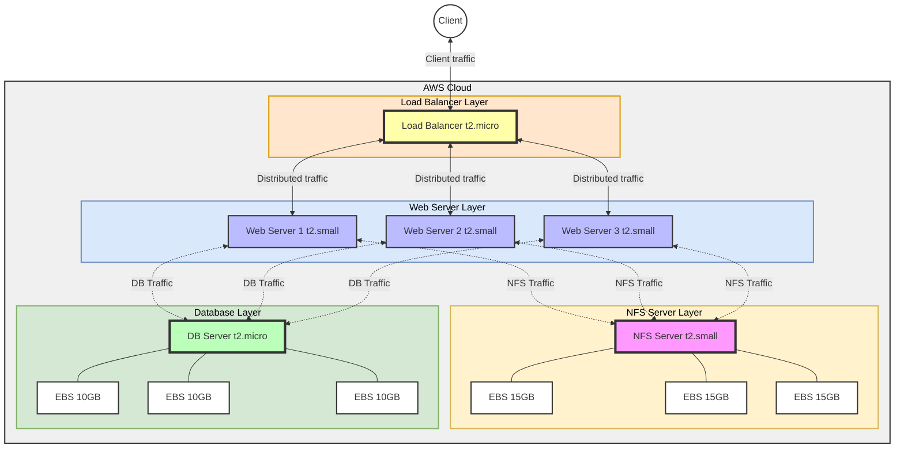

# Load Balancer Solution with Apache

## Table of Contents

1. [Introduction](#introduction)
2. [Prerequisites](#prerequisites)
3. [Project Objectives](#project-objectives)
4. [Self-Study: Load Balancing Concepts](#self-study-load-balancing-concepts)
5. [Implementation Steps](#implementation-steps)
   - [Step 1: Provision EC2 Instance for Load Balancer](#step-1-provision-ec2-instance-for-load-balancer)
   - [Step 2: Open Necessary Ports](#step-2-open-necessary-ports)
   - [Step 3: Install Apache and Configure as a Load Balancer](#step-3-install-apache-and-configure-as-a-load-balancer)
   - [Step 4: Configure Load Balancing](#step-4-configure-load-balancing)
   - [Step 5: Verify Load Balancer Configuration](#step-5-verify-load-balancer-configuration)
   - [Step 6: Configure Local DNS Names (Optional)](#step-6-configure-local-dns-names-optional)
6. [Testing and Validation](#testing-and-validation)
7. [Troubleshooting](#troubleshooting)
8. [Conclusion](#conclusion)
9. [Future Improvements](#future-improvements)
10. [References](#references)

## Introduction

This project extends the [DevOps Tooling Website Solution](https://github.com/fmanimashaun/Steghub-DevOps-training/blob/main/DevOps_tooling_website_solution) by implementing a load balancing solution using Apache. The goal is to distribute traffic evenly among the web servers, thereby improving the scalability and reliability of our application.

Below is a diagram illustrating the architecture of our DevOps Tooling Website Solution with load balancer:

<antArtifact identifier="devops-tooling-architecture-with-load-balancer" type="application/vnd.ant.mermaid" title="DevOps Tooling Website Solution Architecture with Load Balancer">



## Prerequisites

Before starting this project, ensure you have completed the setup described in the [DevOps Tooling Website Solution](https://github.com/fmanimashaun/Steghub-DevOps-training/blob/main/DevOps_tooling_website_solution). This includes:

- NFS Server
- Database Server
- Three Web Servers

Additionally, you should have:

- Basic understanding of Linux systems and the command line
- Familiarity with Apache web server
- Access to an AWS account

## Project Objectives

1. Implement a load balancing solution using Apache
2. Ensure even distribution of traffic across the three web servers
3. Improve the overall scalability and reliability of the DevOps tooling website
4. Gain practical experience in configuring a load balancer

## Self-Study: Load Balancing Concepts

During my self-study on load balancers, I gained insights into their crucial role in modern application architectures. Here are the key points I learned:

1. **Purpose**: Load balancers distribute network or application traffic across multiple servers, improving reliability and performance.

2. **Key Benefits**:

   - Increased application availability
   - Enhanced scalability for handling traffic spikes
   - Improved security against DDoS attacks
   - Better overall application performance

3. **Types**:

   - Layer 4 (Transport Layer) - works with TCP/UDP protocols
   - Layer 7 (Application Layer) - can make routing decisions based on HTTP headers and content

4. **Common Algorithms**:

   - Round Robin: Requests are distributed sequentially to each server
   - Least Connections: New requests are sent to the server with the fewest current connections
   - Source IP Hash: The client's IP address is used to determine which server receives the request

5. **Cloud Integration**: Modern cloud platforms offer load balancing as a service, making it easier to implement and scale.

6. **Session Persistence**: Learned about its importance for maintaining user sessions in stateful applications.

7. **Health Checks**: Understood how load balancers monitor backend server health to ensure traffic is only sent to operational servers.

This study has given me a solid foundation in understanding how load balancers contribute to building robust, scalable web applications.

## Implementation Steps

### Step 1: Provision EC2 Instance for Load Balancer

1. Log in to your AWS Management Console
2. Navigate to EC2 and click "Launch Instance"
3. Choose Ubuntu Server 20.04 LTS (HVM), SSD Volume Type
4. Select an instance type (t2.micro is sufficient for this project)
5. Configure Instance Details:
   - Network: Choose the same VPC as your web servers
   - Subnet: Choose a public subnet
6. Add Storage: The default 8 GB is sufficient
7. Add Tags: Name it "Load-Balancer"
8. Configure Security Group: We'll do this in the next step
9. Review and Launch
10. Select an existing key pair or create a new one, then launch the instance

### Step 2: Open Necessary Ports

1. In the EC2 Dashboard, go to "Security Groups"
2. Find the security group associated with your load balancer instance
3. Edit inbound rules and add the following:
   - Type: HTTP, Source: Anywhere
   - Type: SSH, Source: Your IP
4. Save rules

### Step 3: Install Apache and Configure as a Load Balancer

1. Connect to your EC2 instance via SSH:

   ```
   ssh -i <your-private-key.pem> ubuntu@<your-instance-public-ip>
   ```

2. Update the server:

   ```
   sudo apt update
   sudo apt upgrade -y
   ```

3. Install Apache and required modules:

   ```
   sudo apt install apache2 -y
   sudo apt install libxml2-dev -y
   ```

   ```bash
   sudo systemctl start apache2
   sudo systemctl enable apache2
   ```

4. Enable necessary modules:

   ```
   sudo a2enmod rewrite
   sudo a2enmod proxy
   sudo a2enmod proxy_balancer
   sudo a2enmod proxy_http
   sudo a2enmod headers
   sudo a2enmod lbmethod_bytraffic
   ```

5. Restart Apache to apply changes:

   ```
   sudo systemctl restart apache2
   ```

6. Check Apache status to ensure it's running:
   ```
   sudo systemctl status apache2
   ```

### Step 4: Configure Load Balancing

1. Open Apache's default configuration file:

   ```
   sudo nano /etc/apache2/sites-available/000-default.conf
   ```

2. Add the following configuration just before the closing `</VirtualHost>` tag:

   ```
   <Proxy "balancer://mycluster">
       BalancerMember http://172.31.2.177:80 loadfactor=5 timeout=1
       BalancerMember http://172.31.2.114:80 loadfactor=5 timeout=1
       BalancerMember http://172.31.5.137:80 loadfactor=5 timeout=1
       ProxySet lbmethod=bytraffic
       # ProxySet lbmethod=byrequests
   </Proxy>

   ProxyPreserveHost On
   ProxyPass / balancer://mycluster/
   ProxyPassReverse / balancer://mycluster/
   ```

3. Replace `172.31.2.177`, `172.31.2.114`, and `172.31.5.137` with the actual private IP addresses of your web servers.

>**Load Balancing Methods**
Apache provides several load balancing methods. The method is specified by the lbmethod parameter in the ProxySet directive. Here's a summary of available methods:
> 1. **byrequests (default)**: Distributes requests based on the number of requests that each worker has served. This ensures that each backend server handles an equal number of requests over time.
> 2. **bytraffic**: Distributes requests based on the amount of network traffic each worker has handled. This is useful when requests vary significantly in size.
> 3. **bybusyness**: Distributes requests to the worker with the least active connections. This is useful when backend servers queue requests independently of Apache.
> 4. **heartbeat**: Uses server health checks to distribute requests. This requires additional modules and configuration.
>
>To change the load balancing method, simply update the lbmethod parameter in the ProxySet directive. For example:

```apache

ProxySet lbmethod=bytraffic

```

Choose the method that best suits your application's needs and traffic patterns.

4. Save the file and exit the editor

5. Restart Apache to apply the changes:
   ```
   sudo systemctl restart apache2
   ```

### Step 5: Verify Load Balancer Configuration

1. Open a web browser and enter your load balancer's public IP address or public DNS name
2. You should see the DevOps Tooling Website
3. Refresh the page multiple times to ensure traffic is being distributed among the web servers
4. Check Apache access logs on each web server to confirm they're receiving traffic:
   ```
   sudo tail -f /var/log/apache2/access.log
   ```

### Step 6: Configure Local DNS Names (Optional)

1. Open the hosts file on your load balancer:

   ```
   sudo nano /etc/hosts
   ```

2. Add entries for your web servers:

   ```
   <WebServer1-Private-IP-Address> Web1
   <WebServer2-Private-IP-Address> Web2
   <WebServer3-Private-IP-Address> Web3
   ```

3. Save the file and exit the editor

4. Update your Apache configuration to use these names:

   ```
   sudo nano /etc/apache2/sites-available/000-default.conf
   ```

5. Replace the IP addresses with the corresponding names (Web1, Web2, Web3)

6. Restart Apache:
   ```
   sudo systemctl restart apache2
   ```

## Testing and Validation

1. **Access Testing**:

   - Try accessing your application through the load balancer's public IP or DNS name
   - Verify that you can reach the DevOps Tooling Website

2. **Load Distribution**:

   - Refresh the page multiple times
   - Check the access logs on each web server to confirm they're all receiving traffic

3. **Failover Testing**:

   - Stop Apache on one of the web servers:
     ```
     sudo systemctl stop apache2
     ```
   - Continue accessing the website through the load balancer
   - Verify that the site remains accessible and that traffic is distributed to the remaining servers

4. **Session Persistence** (if configured):
   - Log in to the application
   - Refresh several times and ensure you remain logged in, indicating your session is being maintained

## Troubleshooting

If you encounter issues, try the following:

1. **Check Apache Status**:

   ```
   sudo systemctl status apache2
   ```

2. **Review Apache Error Logs**:

   ```
   sudo tail -f /var/log/apache2/error.log
   ```

3. **Verify Connectivity**: Ensure the load balancer can reach the web servers

   ```
   ping <WebServer-Private-IP>
   ```

4. **Check Security Groups**: Verify that the necessary ports are open between the load balancer and web servers

5. **Validate Configuration**: Double-check your Apache configuration for typos or misconfigurations

## Conclusion

This project enhances the DevOps Tooling Website Solution by implementing a load balancing solution using Apache. This improvement distributes traffic evenly among the web servers, increasing the scalability and reliability of the application. Through this process, you've gained practical experience in configuring a load balancer and improved your understanding of web application architecture.

## Future Improvements

- Implement SSL/TLS for secure communication
- Explore other load balancing algorithms and their impact on performance
- Set up monitoring and alerting for the load balancer
- Implement automated scaling of web servers based on traffic
- Explore containerization and how it might simplify the deployment process

## References

- [Apache Documentation on mod_proxy_balancer](https://httpd.apache.org/docs/2.4/mod/mod_proxy_balancer.html)
- [DigitalOcean Tutorial on Apache Load Balancing](https://www.digitalocean.com/community/tutorials/how-to-use-apache-as-a-reverse-proxy-with-mod_proxy-on-ubuntu-16-04)
- [AWS Documentation on Elastic Load Balancing](https://docs.aws.amazon.com/elasticloadbalancing/latest/application/introduction.html)
- [Introduction to Load Balancing Concepts](https://www.nginx.com/resources/glossary/load-balancing/)
- [Load Balancing Concepts](https://www.f5.com/glossary/load-balancer)
- [3-Tier application setup with NFS](https://youtu.be/FwqMLh0AUJM)
