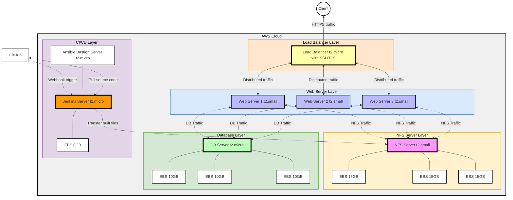

# Load Balancer Solution with Nginx and SSL/TLS

## Table of Contents
1. [Introduction](#introduction)
2. [Project Overview](#project-overview)
3. [Architecture](#architecture)
4. [Prerequisites](#prerequisites)
5. [AWS setup overview](#aws-setup-overview)
6. [Self-Study](#self-study)
   - [SSL/TLS and Certificate Authorities (CAs)](#ssltls-and-certificate-authorities-cas)
   - [Domains, DNS, and Common DNS Records](#domains-dns-and-common-dns-records)
   - [Key Concepts for Nginx Load Balancing](#key-concepts-for-nginx-load-balancing)
7. [Implementation](#implementation)
8. [Testing and Validation](#testing-and-validation)
9. [Future Improvements](#future-improvements)
10. [References](#references)

## Introduction
In this project, we’ll enhance the DevOps Tooling Website setup by:
1. Replacing the Apache load balancer with Nginx.
2. Adding an Elastic IP and configuring a custom domain.
3. Implementing SSL/TLS to secure traffic with HTTPS.

## Project Overview
This project builds on the previously established DevOps Tooling Website Solution, Load Balancer Solution, and CI/CD deployment with Jenkins, integrating more advanced configurations. We’ll focus on:
- Setting up an Nginx load balancer.
- Associating an Elastic IP and domain.
- Adding SSL/TLS for secure communication.

## Architecture



This architecture includes a client, GitHub for source control, Jenkins for CI/CD, and an AWS environment with the following components:
- A **Load Balancer Layer** using Nginx with SSL/TLS.
- **Web Server Layer** with three web servers handling application traffic.
- **NFS Server Layer** for shared storage across web servers.
- **Database Layer** to support data needs.
- **CI/CD Layer** for automated builds and deployments using Jenkins.

## Prerequisites
Before starting, ensure you have:
1. Completed the [DevOps Tooling Website Solution](https://github.com/fmanimashaun/Steghub-DevOps-training/blob/main/DevOps_tooling_website_solution) setup, including:
   - NFS Server
   - Database Server
   - Three Web Servers
2. Implemented the load balancer as described in the [Load Balancer Solution with Apache](https://github.com/fmanimashaun/Steghub-DevOps-training/blob/main/Load_balancer_solution_with_apache).
3. Set up CI/CD with Jenkins, following the [Jenkins Deployment Guide](https://github.com/fmanimashaun/Steghub-DevOps-training/tree/main/Tooling_website_deployment_automation_with_continuous_integration-jenkins).
4. A basic understanding of Linux and command-line interfaces.
5. Familiarity with Jenkins.
6. Access to an AWS account.
7. A GitHub account and repository for the project.

## AWS setup overview
1. EC2 Instances Overview

  

2. EBS Overview

  

3. Security Groups Overview

  

4. NFS server Security Group Setup Overview

  

5. DB server Security Group Setup Overview

  

6. Web server Security Group Setup Overview

  

7. Load balancer server Security Group Setup Overview

  

8. Jenkins server Security Group Setup Overview

  


## Self-Study

### SSL/TLS and Certificate Authorities (CAs)
**SSL (Secure Sockets Layer)** and **TLS (Transport Layer Security)** are protocols for encrypting internet traffic and verifying server identity. SSL/TLS prevents data interception by encrypting data between the client and server.

A **Certificate Authority (CA)** is a trusted entity that issues digital certificates, verifying a website’s legitimacy. Popular CAs include Let's Encrypt, DigiCert, and GlobalSign. CAs validate the domain owner’s identity before issuing a certificate, adding credibility and security to a domain.

### Domains, DNS, and Common DNS Records
A **Domain Name** is the website's address that users type into a browser. **DNS (Domain Name System)** maps domain names to IP addresses, making it possible for browsers to load resources from servers.

#### Common DNS Records:
1. **A Record**: Maps a domain to an IPv4 address.
2. **AAAA Record**: Maps a domain to an IPv6 address.
3. **CNAME Record**: Maps a domain or subdomain to another domain (e.g., www.example.com to example.com).
4. **MX Record**: Directs email to a mail server.
5. **TXT Record**: Holds arbitrary text, often for domain verification and security settings.

### Key Concepts for Nginx Load Balancing
Nginx is commonly used for load balancing due to its flexibility and high performance. Key concepts include:
1. **Upstream Servers**: Define backend servers to which Nginx directs traffic.
2. **Load Balancing Methods**: Nginx supports multiple methods, such as:
   - **Round Robin**: Distributes requests sequentially.
   - **Least Connections**: Sends traffic to the server with the fewest connections.
3. **SSL/TLS Termination**: Decrypts SSL traffic at the load balancer, reducing the load on backend servers.
4. **Health Checks**: Ensures backend servers are available, rerouting traffic if a server fails.

## Implementation

1. **Set Up Nginx Load Balancer**:
   - Launch a new EC2 instance for the Nginx load balancer (similar to the Apache load balancer setup).
   - Install Nginx:
     ```bash
     sudo apt update
     sudo apt install nginx -y
     ```

    ```bash
    sudo systemctl status nginx
    ```

    

2. **Edit the Nginx configuration** (usually at `/etc/nginx/nginx.conf` or in `/etc/nginx/conf.d/`):
   - Use hostnames for backend servers to allow easy management through `/etc/hosts`.

    ```bash
    sudo nano /etc/hosts
    ```
   - Map hostnames to IPs for the backend servers:

     ```plaintext
      172.31.3.234 web1
      172.31.9.174 web2
      172.31.1.127 web3
     ```

   - Define the `upstream` block.

   ```bash
   sudo nano /etc/nginx/nginx.conf
   ```

   ```nginx
   http {
       # Load Balancer Configuration
       upstream mycluster {
           server web1:80 weight=5;
           server web2:80 weight=5;
           server web3:80 weight=5;
       }

       server {
           listen 80;
           server_name _;

           location / {
               proxy_pass http://mycluster;
               proxy_set_header Host $host;
               proxy_set_header X-Real-IP $remote_addr;
               proxy_set_header X-Forwarded-For $proxy_add_x_forwarded_for;
               proxy_set_header X-Forwarded-Proto $scheme;
           }

           error_log /var/log/nginx/error.log;
           access_log /var/log/nginx/access.log;
       }
   }
   ```

4. **Test and Restart Nginx**:
   - Test the configuration:
     ```bash
     sudo nginx -t
     ```
     > NB: If the configuration is error-free, you’ll see output similar to:
     ```
     nginx: the configuration file /etc/nginx/nginx.conf syntax is ok
     nginx: configuration file /etc/nginx/nginx.conf test is successful
     ```

  - Remove the default page:
    ```
    sudo rm /etc/nginx/sites-enabled/default
    ```

   - Restart Nginx:
     ```bash
     sudo systemctl restart nginx
     ```

4. Register a domain

Get a domain name from any domain providers but if you in Nigeria, I will recommend getting `.com.ng` or `.net.ng`for as low as **2,600 naira** from [Domainking](https://clients.domainking.ng/aff.php?aff=5317)


>NB: Make sure you unselect **Domain Warranty - 2999/yr** to keep the cost within 2,600 naira

5. Attach an Elastic IP and Configure Domain
    
    - In AWS, allocate an Elastic IP and attach it to the Nginx instance.
    - create an A record in your domain DNS manager and pointing to the Elastic IP.
    - Create a CNAME record and point to the A record.
    - update the server_name in your nginx config with `<domainname>.com www.<domainname>.com` e.g `fmanimashaun.com.ng www.fmanimashaun.com.ng`
    - Visit [DNS Check](https://dnschecker.org/) to test your dns record.
    - Add the Private IP of the load balancer to the web server security group on AWS

  

6. Install SSL/TLS Certificate
    - Make sure the snapd service is active:
    ```bash
    sudo systemctl status snapd
    ```

    

    - **Install Certbot for Nginx**:
    ```bash
    sudo snap install --classic certbot
    ```
    - **Obtain and Install SSL Certificate**:
    1. Let certbot obtain the domain names directly from nginx config file:
    ```bash
    sudo ln -s /snap/bin/certbot /usr/bin/certbot
    ```

    2. Install certificate with the command and follow the instructions:
    ```bash
    sudo certbot --nginx
    ```
    3. Simulate the renewal process:
    By default, LetEncrypt certificate is valid for 90 days, it is recommended to renew it every 60 days to ensure your site remains secured. to simulate the renewal process, run the command:
    ```bash
    sudo certbot renew --dry-run
    ```
   
    >NB: Remember to open the https port on AWS

    - **Schedule Auto-Renewal**:
    ```bash
    crontab -e
    ```
    Add:
    ```bash
    */12 * * * * root /usr/bin/certbot renew > /dev/null 2>&1
    ```

    >This command runs twice daily (every 12 hours).
    >The **> /dev/null 2>&1** redirect suppresses all output, both standard and error messages, keeping the system logs clean.

    >NB: This will check the SSL certificate validity twice daily. You can adjust it if twice is too much, see [cron guru](https://crontab.guru/) for reference

  

7. **Swap Apache with Nginx Load Balancer**:
   - After verifying the Nginx load balancer works, update DNS to route traffic through Nginx instead of the Apache load balancer.

## Testing and Validation
1. **Access via HTTPS**: Confirm that your domain is accessible over HTTPS and correctly routes to backend servers.

2. **Trigger CI/CD Pipeline**: Push changes to GitHub and verify Jenkins automatically deploys updates.
3. **Check SSL Certificate Renewal**: Manually check Certbot renewal logs to confirm setup.


## Future Improvements
- Add monitoring and alerting for Nginx with tools like Prometheus or Grafana.
- Integrate Docker for containerized web servers.
- Implement blue-green deployments to allow seamless updates without downtime.

## References
- [DevOps Tooling Website Solution](https://github.com/fmanimashaun/Steghub-DevOps-training/blob/main/DevOps_tooling_website_solution)
- [Load Balancer Solution with Apache](https://github.com/fmanimashaun/Steghub-DevOps-training/blob/main/Load_balancer_solution_with_apache)
- [Jenkins CI/CD Pipeline](https://github.com/fmanimashaun/Steghub-DevOps-training/tree/main/Tooling_website_deployment_automation_with_continuous_integration-jenkins)
- [Nginx Documentation](https://nginx.org/en/docs/)
- [Certbot for SSL/TLS](https://certbot.eff.org/)
- [DevOps Tooling Solution: Step-by-Step AWS Setup with NFS, MySQL, and PHP | RHEL 9.4 Tutorial](https://www.youtube.com/watch?v=FwqMLh0AUJM)
- [Mastering Load Balancing with Apache: A Hands-On DevOps Project on AWS](https://www.youtube.com/watch?v=mY70zQ54FMQ)
- [Automate Your DevOps Tooling Website Deployment with Jenkins CI/CD on AWS | Step-by-Step Tutorial](https://www.youtube.com/watch?v=jkOIwwBbG3g)
