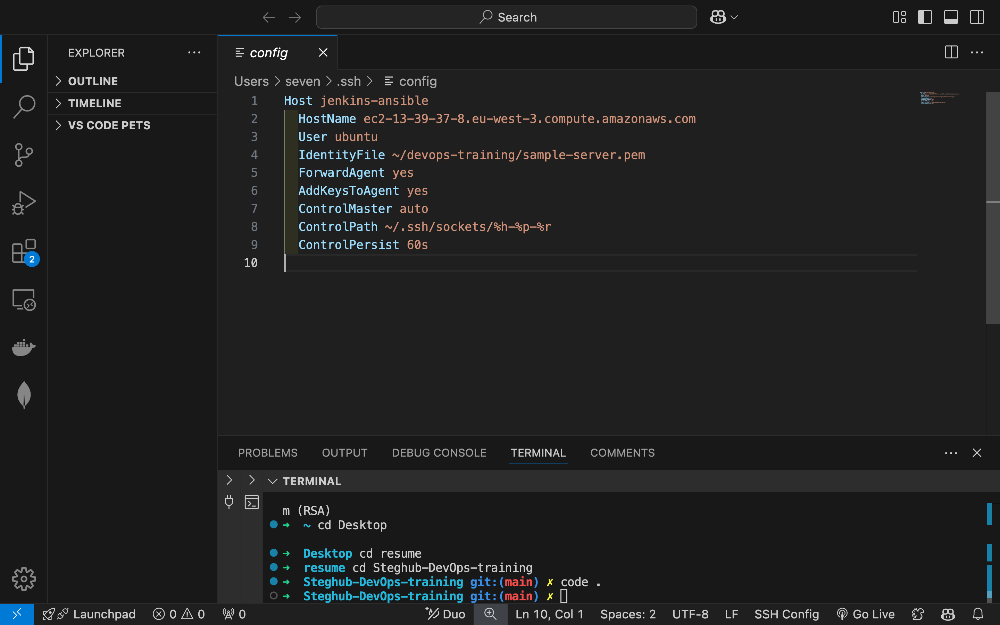

# Ansible Configuration Management

## Table of Contents
1. [Introduction](#introduction)
2. [Project Overview](#project-overview)
3. [Architecture](#architecture)
4. [Prerequisites](#prerequisites)
5. [AWS setup overview](#aws-setup-overview)
6. [Self-Study](#self-study)
	 - [What is a Jump Server or Bastion Host?](#what-is-a-jump-server-or-bastion-host)
	 - [What is Ansible and Its Role as a Configuration Management Tool?](#what-is-ansible-and-its-role-as-a-configuration-management-tool)
	 - [SSH-Agent and Remote SSH in Visual Studio Code](#ssh-agent-and-remote-ssh-in-visual-studio-code)
7. [Implementation](#implementation)
8. [Testing and Validation](#testing-and-validation)
9. [Future Improvements](#future-improvements)
10. [References](#references)

## Introduction

This project extends the [DevOps Tooling Website Deployment with CI/CD](../DevOps_tooling_website_solution/README.md) - Jenkins workflow by incorporating Ansible to automate configuration management and application deployment. The Jenkins server is leveraged as a bastion host, allowing seamless execution of Ansible playbooks across target servers.

## Project Overview
This project builds upon the foundation laid by previous projects in the DevOps Tooling series, expanding their scope and introducing additional automation and configuration management capabilities.

1. [DevOps Tooling Website Solution](../DevOps_tooling_website_solution/README.md): The initial project in the series, focused on providing a complete DevOps solution for web application deployment, including the necessary tools and setup for a scalable, automated environment.

2. [DevOps Tooling Website Deployment with CI/CD - Jenkins](../Tooling_website_deployment_automation_with_continuous_integration-jenkins/README.md): This project added continuous integration and continuous deployment (CI/CD) capabilities to the website solution. It implemented Jenkins as the automation server, streamlining the deployment pipeline and enabling automated testing, building, and deployment of applications.

3. [Load Balancer Solution with Nginx and SSL/TLS](../Load_Balancer_solution_with_nginx_and_ssl_tls/README.md): Building on the previous solutions, this project introduced a load balancing solution using Nginx, ensuring high availability and fault tolerance for the application. Additionally, SSL/TLS encryption was implemented to enhance security and ensure safe communication between users and servers.

The current project further extends these efforts by incorporating Ansible for automated configuration management and application deployment. By leveraging the Jenkins server as a bastion host, Ansible playbooks can be executed seamlessly across target servers, ensuring consistent configurations and streamlined application updates. This integration aims to simplify the infrastructure management process and enhance the automation of the deployment pipeline.

## Architecture


This architecture includes a client, GitHub for source control, Jenkins for CI/CD, and an AWS environment with the following components:
- A **Load Balancer Layer** using Nginx with SSL/TLS.
- **Web Server Layer** with three web servers handling application traffic.
- **NFS Server Layer** for shared storage across web servers.
- **Database Layer** to support data needs.
- **CI/CD & Ansible Layer** for automated builds and deployments using Jenkins and automated configuration management using Ansible.

## Prerequisites
Before starting, ensure you have:
1. Completed the [DevOps Tooling Website Solution](../DevOps_tooling_website_solution/README.md) setup, including:
	 - NFS Server
	 - Database Server
	 - Three Web Servers
2. Implemented the load balancer as described in the [Load Balancer Solution with Nginx](../Load_Balancer_solution_with_nginx_and_ssl_tls/README.md).
3. Set up CI/CD with Jenkins, following the [Jenkins Deployment Guide](../Tooling_website_deployment_automation_with_continuous_integration-jenkins/README.md).
4. A basic understanding of Linux and command-line interfaces.
5. Familiarity with Jenkins.
6. Access to an AWS account.
7. A GitHub account and repository for the project.

## AWS setup overview
1. EC2 Instances Overview

	

2. Security Groups Overview

	

3. Jenkins server Security Group Setup Overview

	


## Self-Study

### What is a Jump Server or Bastion Host?

A **Jump Server** (also called a **Bastion Host**) is a server that serves as an intermediary between a secure internal network and an external network. Its primary purpose is to provide secure access to servers in the internal network by acting as a controlled entry point. It is typically used to manage access to systems that are otherwise not directly accessible from outside the network.

**Importance**:
- **Security**: A bastion host provides an added layer of security by ensuring that only authenticated users can access the internal network.
- **Access Control**: It acts as a gatekeeper, controlling which users can access which servers and ensuring that the traffic is logged for auditing purposes.
- **Single Point of Entry**: Instead of allowing direct SSH access to each internal server, a bastion host consolidates access to a single server, simplifying the security management process.

### What is Ansible and Its Role as a Configuration Management Tool?

**Ansible** is an open-source automation tool used to automate configuration management, application deployment, and task orchestration. It is known for being simple to use, agentless (doesn’t require special software to be installed on managed nodes), and powerful in managing IT infrastructure.

**Key Features of Ansible**:
- **Configuration Management**: Allows you to define the desired state of your infrastructure (such as server configuration, applications installed, etc.) and automatically enforce that state.
- **Playbooks**: Ansible’s configuration files, written in YAML format, that define the tasks to be executed on target systems.
- **Idempotency**: Ansible ensures that running a playbook multiple times will not result in unintended changes or errors if the system is already in the desired state.

**Use Case in This Project**:
- In this project, Ansible is used to automate the configuration management and application deployment process, ensuring that servers are consistently configured and deployed without manual intervention.

### SSH-Agent and Remote SSH in Visual Studio Code

**SSH-Agent**:
An **SSH agent** is a program that holds your private SSH keys and manages authentication requests. It allows you to securely authenticate with remote systems without needing to repeatedly enter your SSH passphrase. The agent can be used to manage keys and handle the authentication for SSH connections.

**Using SSH-Agent**:
- After you load your private key into the SSH agent using the `ssh-add` command, you can make SSH connections to remote systems securely, without needing to provide your passphrase each time.
- The SSH agent improves workflow efficiency and security by managing key-based authentication.

**Remote SSH in Visual Studio Code**:
VS Code’s **Remote - SSH** extension allows developers to seamlessly work on remote machines over SSH directly from their local VS Code environment. It provides the following benefits:
- **Remote Development**: You can develop and debug code on a remote server, while using your local machine for editing and interacting with files.
- **Ease of Setup**: By using VS Code's remote capabilities, developers can quickly and easily connect to remote servers via SSH.
- **SSH Key Management**: When combined with an SSH agent, Remote - SSH in VS Code ensures that your private keys are securely stored and used for authenticating SSH connections, streamlining the connection process to remote environments.

**Use Case in This Project**:
- In this project, **Remote SSH in VS Code** is used to access and manage remote servers, where the SSH agent helps handle the authentication and makes it easy to configure and deploy the application using Ansible and Jenkins. 


## Implementation
### Step 1A: Configure SSH Agent on Local Machine (Unix-like system - linux or mac)

1. Open **Visual Studio Code** and initialize the SSH agent:

   ```bash
   eval "$(ssh-agent -s)"
   ssh-add ~/path_to_the_private_key
   ssh-add -l
   ```

   > **Note:** Replace `~/path_to_the_private_key` with the actual path to your private key file (e.g., `~/.ssh/id_rsa`). Ensure that the private key has proper permissions (e.g., `chmod 600`).

2. Use **Remote SSH** in VS Code to connect to the remote host. Configure the `~/.ssh/config` file when prompted:

   ```bash
   Host jenkins-ansible
     HostName ec2-13-39-37-8.eu-west-3.compute.amazonaws.com
     User ubuntu
     IdentityFile ~/devops-training/sample-server.pem
     ForwardAgent yes
     AddKeysToAgent yes
   ```

   > **Note:** If the `~/.ssh/config` file does not exist, create it manually using `touch ~/.ssh/config`.

3. Create the socket directory to enable multiplexed connections:

   ```bash
   mkdir -p ~/.ssh/sockets
   ```

4. Save the configuration and connect. If successful, VS Code will establish an SSH connection to the `jenkins-ansible` server.


### Step 1B: Configure SSH Agent on Local Machine (Windows)

1. Open PowerShell as an Administrator and Enable and Start the ssh-agent Service:

   ```powershell
   Set-Service -Name ssh-agent -StartupType Manual
   Start-Service ssh-agent
   ```
   >The first command sets the service's startup type to manual, allowing it to be started as needed. The second command starts the service immediately.

2. Verify the Service Status:

   ```powershell
   Get-Service ssh-agent
   ```

   >You should see the status as Running:
   ```powershell
   Status   Name               DisplayName
   ------   ----               -----------
   Running  ssh-agent          OpenSSH Authentication Agent
   ```
   
3. Add Your SSH Key to the Agent via git bash:
   
   ```bash
   ssh-add ~/.ssh/sample.pem
   ```

4. To confirm that the key has been added, run on git bash:
   
    ```bash
   ssh-add -l
   ```
   >This command should list your SSH keys currently managed by the agent.


   > **Note:** Replace `~/path_to_the_private_key` with the actual path to your private key file (e.g., `~/.ssh/id_rsa`). Ensure that the private key has proper permissions (e.g., `chmod 600`).

2. Use **Remote SSH** in VS Code to connect to the remote host. Configure the `~/.ssh/config` file when prompted:

   ```ini
   Host jenkins-ansible
     HostName ec2-13-39-37-8.eu-west-3.compute.amazonaws.com
     User ubuntu
     IdentityFile ~/devops-training/sample-server.pem
     ForwardAgent yes
     AddKeysToAgent yes
     ControlMaster auto
     ControlPath ~/.ssh/sockets/%h-%p-%r
     ControlPersist 60s
   ```

   > **Note:** If the `~/.ssh/config` file does not exist, create it manually using `touch ~/.ssh/config`.

3. Create the socket directory to enable multiplexed connections:

   ```bash
   mkdir -p ~/.ssh/sockets
   ```

4. Save the configuration and connect. If successful, VS Code will establish an SSH connection to the `jenkins-ansible` server.


### Step 2: Ensure SSH Agent Forwarding Works on Remote Server

1. Verify if the remote server has access to the SSH agent:

   ```bash
   ssh-add -l
   ```

2. If an error occurs, set the SSH agent socket:

   ```bash
   export SSH_AUTH_SOCK=$(ls -t /tmp/ssh-**/* | head -1)
   ```

3. Re-run the `ssh-add -l` command to confirm access to the private key.

   > **Note:** Ensure `ForwardAgent yes` is correctly set in the `~/.ssh/config` file to enable agent forwarding.


### Step 3: Install Ansible on Remote Server

1. Update the package manager and install Ansible:

   ```bash
   sudo apt update
   sudo apt install ansible -y
   ```

   > **Note:** Confirm Ansible installation by running `ansible --version`. Ensure that the installed version is compatible with your playbooks.


### Step 4: Set Up SSH Key for GitHub Access

1. Generate a new SSH key if needed:

   ```bash
   ssh-keygen -t ed25519 -C "your_email@example.com"
   ```

   > **Note:** Replace `"your_email@example.com"` with your actual email address. If you already have an existing SSH key, this step can be skipped.

2. Add the SSH key to GitHub:
   - Copy the public key:

     ```bash
     cat ~/.ssh/id_ed25519.pub
     ```

   - Go to **GitHub Settings** > **SSH and GPG keys** > **New SSH key** and paste the key.

3. Test the connection:

   ```bash
   ssh -T git@github.com
   ```

   > **Note:** A successful connection message indicates proper authentication, but GitHub does not provide shell access.

### Step 5: Create an Empty Repository on GitHub  

1. Log in to your GitHub account.  
2. Create a new repository named `ansible-config-mgt`:  
   - **Repository name:** `ansible-config-mgt`  
   - **Description:** (optional)  
   - Leave the repository empty (do not add a README, `.gitignore`, or license).  
   - Click **Create repository**.  


> **Note:** The repository URL will look like `git@github.com:<username>/ansible-config-mgt.git`. Replace `<username>` with your GitHub username in the following steps.  


### Step 6: Push the Repository to GitHub  

1. Initialize a local Git repository:  
   ```bash
   echo "# ansible-config-mgt" >> README.md
   git init
   git add .
   git commit -m "Project initialization"
   git branch -M main
   git remote add origin git@github.com:<username>/ansible-config-mgt.git
   git push -u origin main
   ```

2. If a permission error occurs, run:  
   ```bash
   sudo chown -R ubuntu:ubuntu /home/ubuntu/ansible-config-mgt
   ```

> **Note:** This step ensures the correct ownership of files if you're working on a shared system or remote server.  


### Step 7: Create Required Inventory and Playbook Files  

1. Create the following files and directories in your local repository:  
   ```bash
   mkdir -p inventory playbooks
   touch inventory/dev.yml inventory/staging.yml inventory/prod.yml inventory/uat.yml playbooks/common.yml
   ```

2. Ensure the repository structure looks like this:  
   ```text
   ansible-config-mgt/
   ├── inventory/
   │   ├── dev.yml
   │   ├── staging.yml
   │   ├── prod.yml
   │   └── uat.yml
   └── playbooks/
       └── common.yml
   ```  

> **Note:** These files will be updated with appropriate content in Step 8.


### Step 8: Update Inventory and Playbook Files  

#### Update `inventory/dev.yml`  
Replace the content of `inventory/dev.yml` with the following:  
```yaml
[nfs_server]
172.31.11.175 ansible_ssh_user=ec2-user

[web_servers]
172.31.13.144 ansible_ssh_user=ec2-user
172.31.10.244 ansible_ssh_user=ec2-user
172.31.10.220 ansible_ssh_user=ec2-user

[db_server]
172.31.11.187 ansible_ssh_user=ec2-user

[lb_server]
172.31.9.89 ansible_ssh_user=ubuntu

[all:vars]
ansible_ssh_common_args='-o StrictHostKeyChecking=no'
```

- **nfs_server:** Defines the NFS server.
- **web_servers:** Defines the web servers.
- **db_server:** Defines the database server.
- **lb_server:** Defines the load balancer.
- **all:vars:** Defines common SSH arguments for all hosts.

#### Update `playbooks/common.yml`  
Replace the content of `playbooks/common.yml` with the following:  
```yaml
- name: update web, nfs, and db servers
  hosts: nfs_server, web_servers, db_server
  become: yes
  tasks:
    - name: ensure wireshark is at the latest version
      yum:
        name: wireshark
        state: latest

- name: update LB server
  hosts: lb_server
  become: yes
  tasks:
    - name: Update apt repo
      apt:
        update_cache: yes

    - name: ensure wireshark is at the latest version
      apt:
        name: wireshark
        state: latest
```

> **Note:** Ensure you update the IP addresses and user credentials (`ansible_ssh_user`) to match your actual server configurations.  


### Step 9: Commit and Push Changes  

1. Add and commit the newly created files:  
   ```bash
   git add inventory/dev.yml inventory/staging.yml inventory/prod.yml inventory/uat.yml playbooks/common.yml
   git commit -m "Add inventory files and common playbook"
   git push origin main
   ```

2. Verify the changes on GitHub.


### Step 9: Run Ansible Playbook

1. Verify SSH agent forwarding:

   ```bash
   ssh-add -l
   ```

   If an error occurs, set the SSH agent socket:

   ```bash
   export SSH_AUTH_SOCK=$(ls -t /tmp/ssh-**/* | head -1)
   ```

   > **Note:** Agent forwarding is necessary to authenticate with private keys on the remote server during playbook execution.

2. Run the playbook:

   ```bash
   ansible-playbook -i inventory/dev.yml playbooks/common.yml
   ```

   > **Note:** Before running the playbook, ensure all variables and configurations in `playbooks/common.yml` are correctly defined.


## Future Improvements

While the current implementation provides a solid foundation for configuration management and automated deployment, there are several potential improvements that could be made to enhance the system's functionality, scalability, and security:

1. **Multi-Environment Configuration**: 
   - Implement more comprehensive environment-specific configurations (e.g., development, staging, production). This would involve separating sensitive configurations, such as database credentials or API keys, into secure vaults or using tools like **Ansible Vault** for encryption.

2. **Enhanced Playbook Automation**: 
   - Expand the playbooks to handle more complex tasks such as automated backups, server provisioning, or monitoring setup (e.g., integrating with tools like Prometheus or Nagios).

3. **Role-based Access Control (RBAC)**: 
   - Introduce role-based access control within Ansible to better manage permissions for various users running the playbooks. This could help control who can execute specific tasks or update particular groups of servers.

4. **Integration with Containerization Tools**: 
   - Integrate Ansible with containerization and orchestration platforms like **Docker** and **Kubernetes** for managing and deploying containerized applications, allowing for more scalable and flexible deployment pipelines.

5. **Improve Error Handling and Reporting**: 
   - Enhance the playbook's error handling capabilities to provide more detailed logs and failure reporting, improving the debugging process when things go wrong.

6. **Automated Testing of Configuration Changes**: 
   - Incorporate testing frameworks like **TestInfra** or **Molecule** into the playbook to automatically validate configuration changes and ensure that the infrastructure is in the desired state after every run.

7. **Cloud Integration**: 
   - Implement automation for cloud infrastructure management (e.g., using **AWS**, **Azure**, or **GCP**) to automate server provisioning and configuration based on cloud resources.

8. **Monitoring and Notifications**: 
   - Set up monitoring to track the health and performance of servers and provide real-time notifications (e.g., using **Slack** or **Email**) for any failed tasks or security vulnerabilities.

By implementing these improvements, the solution could be expanded to handle more complex use cases, improve operational efficiency, and offer better security and reliability for large-scale deployments.


## References

1. **Ansible Documentation**:  
   Ansible documentation provides comprehensive information on using Ansible for automation and configuration management.  
   URL: [https://docs.ansible.com/](https://docs.ansible.com/)

2. **Ansible Vault**:  
   Ansible Vault is a tool to encrypt secrets and sensitive information within playbooks.  
   URL: [https://docs.ansible.com/ansible/latest/user_guide/vault.html](https://docs.ansible.com/ansible/latest/user_guide/vault.html)

3. **SSH-Agent Documentation**:  
   A detailed guide on how to manage SSH keys and use the SSH agent for authentication.  
   URL: [https://www.ssh.com/ssh-agent/](https://www.ssh.com/ssh-agent/)

4. **Remote - SSH Extension for Visual Studio Code**:  
   This extension allows you to connect to remote servers using SSH from Visual Studio Code.  
   URL: [https://marketplace.visualstudio.com/items?itemName=ms-vscode-remote.remote-ssh](https://marketplace.visualstudio.com/items?itemName=ms-vscode-remote.remote-ssh)

5. **GitHub - Ansible Config Management Repository**:  
   The repository containing the implementation and resources for the Ansible configuration management project.  
   URL: [https://github.com/fmanimashaun/ansible-config-mgt](https://github.com/fmanimashaun/ansible-config-mgt)

6. **Ansible Best Practices**:  
   A guide on how to structure Ansible projects for maximum maintainability and scalability.  
   URL: [https://docs.ansible.com/ansible/latest/user_guide/playbooks_best_practices.html](https://docs.ansible.com/ansible/latest/user_guide/playbooks_best_practices.html)

7. **Nginx Load Balancer Documentation**:  
   Official Nginx documentation for setting up and configuring load balancers.  
   URL: [https://nginx.org/en/docs/](https://nginx.org/en/docs/)

8. **Wireshark Installation Documentation**:  
   The official guide for installing Wireshark, a network protocol analyzer.  
   URL: [https://www.wireshark.org/docs/](https://www.wireshark.org/docs/)
9. **Video demonstration**:
   A simple demonstration of the whole project from setup to running the ansible playbook
   URL: [Video Demonstration Link](https://youtu.be/Ng4j6ldrf7Q)

