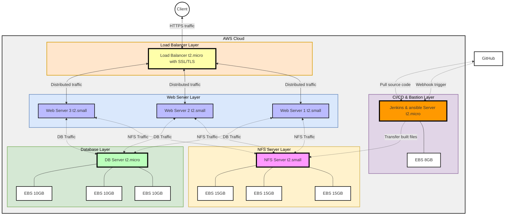
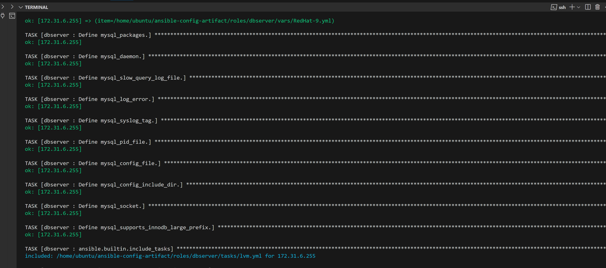

# Ansible Dynamic Assignments (include) and Community Roles

## Table of Contents
1. [Introduction](#introduction)
2. [Project Overview](#project-overview)
3. [Architecture Workflow](#architecture-overview)
4. [Prerequisites](#prerequisites)
5. [AWS setup overview](#aws-setup-overview)
6. [Self-Study](#self-study)
	 - [Reusing Ansible Artifacts](#reusing-ansible-artifacts)
7. [Implementation](#implementation)
8. [Testing and Validation](#testing-and-validation)
9. [Future Improvements](#future-improvements)
10. [References](#references)

## Introduction
Building on the foundation of [Ansible Refactoring & Static Assignments (Imports & Roles)](../Ansible_refactoring_static_assignments_imports_and_roles/README.md), this project introduces dynamic automation and community-driven collaboration to elevate the [DevOps Tooling Solution](../DevOps_tooling_website_solution/README.md) into a fully scalable, secure, and adaptable 3-tier application. By leveraging Ansible’s include module for runtime flexibility and integrating pre-built community roles alongside custom logic, we streamline the deployment of a robust architecture featuring load balancers, web servers, a database, and shared storage. This approach not only enhances maintainability but also aligns with industry best practices for infrastructure-as-code (IaC), enabling seamless scaling and environment consistency.

## Project Overview
### Objective 
This initiative extends the previous static Ansible framework by introducing **dynamic assignments** and **community roles** to automate the deployment of a 3-tier [DevOps Tooling Solution](../DevOps_tooling_website_solution/README.md) on AWS. The architecture includes:  

- **Web Servers**: Horizontally scalable Apache/Nginx instances.  
- **NFS Server**: Centralized storage for shared content.  
- **Database Server**: MySQL backend with dedicated EBS volumes.  
- **Dynamic Load Balancers**: Configurable at runtime (Apache/Nginx) with SSL termination.  

### **Core Enhancements**  
1. **Dynamic Playbook Execution with `include`**:  
   - Use Ansible’s `include` module to conditionally load playbooks and variables during runtime, enabling environment-specific configurations (e.g., selecting Apache or Nginx as the load balancer).  

   - Example variable-driven logic:  

     ```yaml
     # Dynamically enable load balancer type
     nginx_lb_enabled: false
     apache_lb_enabled: true
     load_balancer_is_required: true
     ```  

2. **Community & Custom Role Integration**:  
   - **Pre-built Community Roles**: Leverage Ansible Galaxy roles (e.g., `geerlingguy.nginx`, `geerlingguy.mysql`) to accelerate setup while minimizing redundant code.

   - **Custom Roles**: Extend functionality with bespoke roles for NFS configuration, SSL certificate management, and application deployment.  

3. **SSL Automation with Certbot**:  
   - Integrate Let’s Encrypt certificates dynamically into the load balancer configuration using the `certbot` role, ensuring encrypted client traffic.

4. **Architecture Flexibility**:  
   - **Runtime Decisions**: Dynamically include/exclude components (e.g., load balancers) based on playbook variables.  
   - **Scalable 3-Tier Design**:  
     - **Web Layer**: Auto-configured Apache/Nginx servers.  
     - **Storage Layer**: NFS server with attached EBS volumes for shared assets.  
     - **Database Layer**: MySQL instance with dedicated storage for data persistence.  

#### Architecture Overview



This architecture includes a client, GitHub for source control, Jenkins for CI/CD, and an AWS environment with the following components:
- A **Load Balancer Layer** using Nginx or Apache with SSL/TLS.
- **Web Server Layer** with three web servers handling application traffic.
- **NFS Server Layer** for shared storage across web servers.
- **Database Layer** to support data needs.
- **CI/CD & Ansible Layer** for automated builds and deployments using Jenkins and automated configuration management using Ansible. 

#### **Key Benefits**  
- **Reduced Complexity**: Dynamic assignments eliminate hard-coded configurations, enabling reusable, environment-agnostic playbooks.  
- **Faster Deployments**: Community roles accelerate setup, while custom roles ensure alignment with project-specific needs.  
- **Security**: Automated SSL provisioning via Certbot ensures encrypted traffic without manual intervention.  
- **Cost Efficiency**: AWS resource optimization (e.g., `t2.micro` for DB, `t2.small` for web/NFS) balances performance and cost.  

By merging Ansible’s dynamic capabilities with the power of community collaboration, this project delivers a future-proof, modular framework for deploying and managing cloud-native applications.


## Prerequisites  
To successfully execute this project, ensure the following prerequisites are met. This project builds directly on the infrastructure and configurations from **[Ansible Refactoring & Static Assignments (Imports & Roles)](../Ansible_refactoring_static_assignments_imports_and_roles/README.md)**.  

### 1. Previous Project Completion 
- ✅ **Complete the [Ansible Refactoring & Static Assignments](https://youtu.be/EuSXv3BpxAI) project first**.  
  - A working Jenkins-Ansible server setup is required (see **[Ansible Configuration Management](../Ansible_Configuration_Management/README.md)** for setup steps).  
  - Familiarity with the existing codebase in the [`ansible-config-mgt`](https://github.com/fmanimashaun/ansible-config-mgt) repository is essential.  

### 2. Local Development Environment Setup 
1. **Clone the Repository**:  
   ```bash
   git clone https://github.com/fmanimashaun/ansible-config-mgt.git
   cd ansible-config-mgt
   code .  # Open in VS Code (or your preferred editor)
   ```  

2. **Validate Previous Configurations**:  
   - Ensure static assignments, roles, and playbooks from the prior project are functional.  

### 3. Infrastructure Requirements
#### **AWS Instances**  
Ensure the following instances are running (as per the [architecture diagram](#architecture-overview)):  
- **Web Servers**: 3x `t2.small` instances (Apache/Nginx).  
- **NFS Server**: 1x `t2.small` with 3x 15GB EBS volumes attached.  
- **Database Server**: 1x `t2.micro` with 3x 10GB EBS volumes.  
- **Load Balancers**:  
  - **2x Identical Servers**: 1x Apache (`apache_lb_enabled: true`) and 1x Nginx (`nginx_lb_enabled: false`) for dynamic runtime selection.  

#### **Jenkins-Ansible Server**  
- A dedicated server with Jenkins and Ansible installed (configured in prior projects).  
- SSH access to all target servers from this node.  

### **4. Configuration & Access**  
- **Security Groups**: Allow traffic on ports `22` (SSH), `80` (HTTP), `443` (HTTPS), `2049` (NFS), and `3306` (MySQL).  
- **SSH Keys**: Ensure Ansible can connect to all servers via SSH keys. 

>**Note**: For unresolved issues from the previous project, review the [video guide](https://youtu.be/EuSXv3BpxAI) or validate configurations in the [`ansible-config-mgt`](https://github.com/fmanimashaun/ansible-config-mgt) repository.

**2. Set Up the Python Virtual Environment**

Open the terminal inside Visual Studio Code (`Ctrl + \`` or **Terminal > New Terminal**).

Create a Python virtual environment within your project folder by running:

```bash
python -m venv .venv
```

This will create a `.venv` directory in your project folder containing the isolated Python environment.

>NB: Ensure you are using the latest python (v3.13)

**3. Activate the Virtual Environment**

Once the virtual environment is created, activate it by running:

- **On Windows:**

  ```bash
  .venv\Scripts\activate
  ```

- **On macOS/Linux:**

  ```bash
  source .venv/bin/activate
  ```

The terminal should now indicate that the virtual environment is active, for example:

```
(.venv) your-folder-name $
```

**4. Install Ansible in the Virtual Environment**

With the virtual environment activated, install Ansible by running the following command:

```bash
pip install ansible
```

in case you needed to update your `ansible-lint` module, run:

```bash
pip install --upgrade ansible-lint
```

This will install Ansible and its dependencies within the isolated virtual environment.

**5. Verify the Installation**

After installing Ansible, confirm the installation by running:

```bash
ansible --version
```

This should output the installed version of Ansible, confirming that the installation was successful.

**6. Install Ansible Extension for VS Code (Optional)**

For enhanced Ansible development in Visual Studio Code, install the **Ansible extension**. This extension provides syntax highlighting, linting, and other features specific to Ansible playbooks.

You can find the extension in the [VS Code marketplace](https://marketplace.visualstudio.com/items?itemName=vscoss.vscode-ansible).

### Self-Study: Dynamic Assignments & Community Roles
#### 1. Dynamic Assignments
Dynamic assignments in Ansible refer to the practice of conditionally loading tasks, variables, or roles **during playbook execution**. Unlike static imports (pre-processed at playbook parsing), dynamic includes adapt to runtime conditions, enabling environment-specific or scenario-driven automation.  

**Key Characteristics**:  
- **Runtime Flexibility**: Decisions are made during execution (e.g., selecting a load balancer type based on flags like `apache_lb_enabled`).  
- **Conditional Logic**: Tasks or roles are included/excluded using `when` clauses, variables, or inventory groups.  
- **Iterative Workflows**: Supports loops for repetitive actions (e.g., attaching NFS volumes across multiple servers).  

**Use Cases**:  
- **Environment-Specific Configurations**: Load different variables for `dev`, `prod`, or `uat` environments.  
- **Resource Toggling**: Activate/deactivate components (e.g., Apache vs. Nginx load balancers) without rewriting playbooks.  
- **Runtime Input Handling**: Adjust workflows based on user input or external data (e.g., dynamic inventory from cloud providers).  

**Best Practices**:  
- Use for conditional workflows where behavior depends on real-time variables or inventory.  
- Avoid mixing `include` and `import` for the same tasks to prevent unpredictable execution order.  

#### 2. Community Roles
Community roles are pre-built, reusable Ansible components shared publicly via platforms like **Ansible Galaxy**. They encapsulate best practices for common tasks (e.g., setting up databases, web servers) and reduce redundant code.  

**Key Characteristics**:  
- **Accelerated Development**: Leverage tested solutions instead of reinventing the wheel (e.g., `geerlingguy.mysql` for MySQL setup).  
- **Standardization**: Promote consistency across projects by adopting widely used configurations.  
- **Customizability**: Override default variables or extend roles to align with project-specific needs.  

**Use Cases**:  
- **Infrastructure Services**: Deploy databases (MySQL, PostgreSQL), web servers (Apache, Nginx), or monitoring tools (Prometheus).  
- **Security & Compliance**: Integrate roles for SSL/TLS (Certbot), firewall rules, or hardening benchmarks.  
- **Cloud Integrations**: Use roles for AWS, Azure, or GCP resource provisioning.  

**Best Practices**:  
- **Pin Versions**: Specify role versions to avoid breaking changes (e.g., `geerlingguy.mysql: 3.3.0`).  
- **Layer Custom Logic**: Extend community roles with project-specific tasks or handlers (e.g., adding custom NFS mounts to a web server role).  
- **Audit Roles**: Review community role code for security and compatibility with your environment.  

#### Why These Concepts Matter for the Project
1. **Scalability**:  
   - **Dynamic Assignments** enable the DevOps Tooling Solution to adapt to varying environments (e.g., enabling Apache LB in staging, Nginx LB in production).  
   - **Community Roles** simplify scaling by reusing proven automation patterns (e.g., adding new web servers with identical configurations).  

2. **Maintainability**:  
   - Dynamic logic reduces code duplication (e.g., a single playbook handles multiple LB types).  
   - Community roles abstract complexity, making playbooks cleaner and easier to update.  

3. **Collaboration**:  
   - Teams can share and reuse roles across projects, fostering consistency.  
   - Dynamic variables allow environment-specific configurations without altering core playbooks.  

4. **Security & Reliability**:  
   - Community roles often follow security best practices (e.g., automated SSL with Certbot).  
   - Dynamic includes minimize manual intervention, reducing human error.  

#### **Alignment with DevOps Principles**  
- **Infrastructure-as-Code (IaC)**: Both concepts treat infrastructure configurations as version-controlled, reusable code.  
- **Continuous Improvement**: Community roles evolve with community contributions, while dynamic assignments allow iterative refinements.  
- **Cross-Team Efficiency**: Developers and operations teams collaborate on shared, modular automation components.  

By mastering dynamic assignments and community roles, you unlock Ansible’s full potential to build **adaptive, efficient, and future-proof automation frameworks**.

## Implementation

### 1. Setting up the Dynamic Directory:

- Within the **ansible-config-mgt** repo directory on the local machine, create the following folder structure:

   ```markdown
   📦dynamics-assignments
   ┣ 📂env-vars
   ┃ ┣ 📜dev.yml
   ┃ ┣ 📜prod.yml
   ┃ ┣ 📜stage.yml
   ┃ ┗ 📜uat.yml
   ┗ 📜env-vars.yml
   ```

   This will help us create specific environment variables that can be dynamically including in the playbook during run-time.

- In the `env-vars.yml`, add the following:

   ```yml
   ---
   - name: Load environment variables
   ansible.builtin.include_vars: "{{ item }}"
   with_first_found:
      - files:
         - "{{ inventory_file | basename | splitext | first }}.yml"
         paths:
         - "{{ playbook_dir }}/../dynamics-assignments/env-vars"
   tags:
      - always
   ```

   The idea of the code above is to examine the current inventory file being use with the current playbook and use that to determine the right environment file to include. For example, if we run the following:

   ```bash
   ansible-playbook -i inventory/uat playbooks/site.yml
   ```

   Since the `uat` was the inventory file used in the current play, the Ansible include module will dynamically include the `uat.yml` env file during run-time as defined in the `site.yml`.

   ```yml
   ---
   - name: Load dynamic variables
   hosts: all
   become: true
   tasks:
      - name: Include environment variables from dynamic assignments
         ansible.builtin.include_tasks: "../dynamics-assignments/env-vars.yml"
   tags:
      - always
   ```

### 2. Creating community role for the MySQL db

We will create a role for the MySQL db that installs the MySQL package, creates a database and configure users. Rather than, starting from scratch we will use a pre-existing production ready role from the [ansible galaxy](https://galaxy.ansible.com/).

First we will download the Mysql ansible role. Available community roles can be found in the ansible galaxy website

For the MySQL role we use a popular one by [geerlingguy](https://galaxy.ansible.com/ui/standalone/roles/geerlingguy/mysql/). To do this, Within the **ansible-config-mgt** repo directory on the local machine, navigate into the **/roles** directory and run:

```bash
git checkout -b features/role

ansible-galaxy role install geerlingguy.mysql

sudo mv geerlingguy.mysql/ dbserver
```

Edit the roles configuration to use the correct credentials for MySQL required for the `tooling` website.

We can use the community role to:
- Manage our existing database
- Create databases for different environments.

To apply the community role to our use case, managing our existing database, first, we will define environment variables.

   - Define environment-specific MySQL database credentials in each of your `env-vars` files (like `dev.yml`, `prod.yml`, etc.)
  For instance, the `uat.yml` example:

  ```yaml
  # Define databases and users to be created for the uat environment
   mysql_databases:
   - name: "tooling"
     encoding: "utf8"
     collation: "utf8_general_ci"

   mysql_users:
   - name: "webaccess"
     host: "172.31.%"
     password: "Password@1"
     priv: "tooling.*:ALL"
  ```
  Replace the database name, mysql_users name and passwords as appropriate.

Update similarly for `prod.yml`, `staging.yml`, and `dev.yml` with specific database names and credentials for each environment.

Next, we update the inventory files with environment-specific variables. Each inventory file (like `inventory/dev.yml`, `inventory/prod.yml`), include the path to the relevant environment variables file.

**Example (`inventory/uat.yml)**

```yaml
[web_servers]
172.31.15.254 ansible_ssh_user=ec2-user ansible_host=172.31.15.254 backend_name=web1
172.31.1.205 ansible_ssh_user=ec2-user ansible_host=172.31.1.205 backend_name=web2
172.31.14.95 ansible_ssh_user=ec2-user ansible_host=172.31.14.95 backend_name=web3

[db_server]
172.31.6.255 ansible_ssh_user=ec2-user

[nfs_server]
172.31.8.245 ansible_ssh_user=ec2-user

[lb_servers]
172.31.3.63 ansible_ssh_user=ubuntu lb_type=nginx domain_name=nginx.facilitiesmanager.com.ng
172.31.11.254 ansible_ssh_user=ubuntu lb_type=apache domain_name=apache.facilitiesmanager.com.ng

[all:vars]
ansible_ssh_common_args='-o StrictHostKeyChecking=no'
nfs_server_ip=172.31.8.245
```

Next, update playbook configuration in `playbooks/site.yml` including the variable file and specifying the renamed role `mysql` 

```yml
---
- name: Load dynamic variables
  hosts: all
  become: true
  tasks:
    - name: Include environment variables from dynamic assignments
      ansible.builtin.include_tasks: "../dynamics-assignments/env-vars.yml"
  tags:
    - always

# Set up MySQL on database servers
- name: Set up MySQL
  hosts: db_server
  become: true
  roles:
    - dbserver
```

To align the ansible `dbserver` with the manual configuration we did with the [DevOps Tooling Website Solution](../DevOps_tooling_website_solution/README.md) project, we will add addition tasks for LVM setup  and also a task to restore the datbase in the `dbserver` role:

```markdown
📦tasks
 ┣ 📜configure.yml
 ┣ 📜databases.yml
 ┣ 📜lvm.yml
 ┣ 📜main.yml
 ┣ 📜replication.yml
 ┣ 📜restore-db.yml
 ┣ 📜secure-installation.yml
 ┣ 📜setup-Archlinux.yml
 ┣ 📜setup-Debian.yml
 ┣ 📜setup-RedHat.yml
 ┣ 📜users.yml
 ┗ 📜variables.yml
```

```yml
# roles/dbserver/tasks/lvm.yml

---
# create the backup marker
- name: Check if backup marker exists in /var/log
  become: true
  ansible.builtin.stat:
    path: /var/log/backup_done_marker
  register: backup_marker

# Install the LVM2 package
- name: Install LVM2 package
  ansible.builtin.package:
    name: lvm2
    state: present

# Ensure necessary directories exist before any operations
- name: Create required directories
  ansible.builtin.file:
    path: "{{ item }}"
    state: directory
    mode: '0755'
  loop:
    - /db
    - /home/recovery/logs

# Partition EBS volumes with parted
- name: Partition EBS volumes with parted
  community.general.parted:
    device: "{{ item }}"
    number: 1
    state: present
    part_type: primary
    fs_type: ext4
    align: optimal
  loop:
    - /dev/xvdb
    - /dev/xvdc
    - /dev/xvdd
  register: parted_results

# Create physical volumes on new partitions
- name: Create physical volumes on new partitions
  ansible.builtin.command: "pvcreate {{ item }}"
  loop:
    - /dev/xvdb1
    - /dev/xvdc1
    - /dev/xvdd1
  args:
    creates: "{{ item }}"

# Create volume group 'dbdata-vg'
- name: Create volume group 'dbdata-vg'
  community.general.lvg:
    vg: dbdata-vg
    pvs:
      - /dev/xvdb1
      - /dev/xvdc1
      - /dev/xvdd1

- name: Pause for 5 seconds to allow VG recognition
  ansible.builtin.pause:
    seconds: 5

# Get the total size of volume group 'dbdata-vg' in gigabytes
- name: Get total size of volume group dbdata-vg
  ansible.builtin.command: "vgs --noheadings --units g --nosuffix -o vg_size dbdata-vg"
  register: vg_size_cmd
  changed_when: false

- name: Set VG total size fact
  ansible.builtin.set_fact:
    vg_total_size: "{{ vg_size_cmd.stdout | trim | float }}"

- name: Debug VG total size
  ansible.builtin.debug:
    msg: "Volume group total size: {{ vg_total_size }}G"

# Calculate half the VG total size for the logical volumes
- name: Set half VG size for logical volumes
  ansible.builtin.set_fact:
    half_vg_size: "{{ (vg_total_size | float / 2) | round(0, 'floor') }}"

- name: Debug half VG size
  ansible.builtin.debug:
    msg: "Half of VG size: {{ half_vg_size }}G"

# Create logical volumes for database data and logs using dynamically calculated size
- name: Create logical volumes for database data and logs using dynamically calculated size
  community.general.lvol:
    vg: dbdata-vg
    lv: "{{ item }}"
    size: "{{ half_vg_size }}g"
    state: present
  loop:
    - db-lv
    - log-lv

# Create ext4 filesystem on the new logical volumes
- name: Create ext4 filesystem on the new logical volumes
  community.general.filesystem:
    fstype: ext4
    dev: "/dev/dbdata-vg/{{ item }}"
  loop:
    - db-lv
    - log-lv

# Backup /var/log only if it is not mounted yet (i.e. this is the first run)
- name: Backup /var/log to /home/recovery/logs using synchronize
  delegate_to:  "{{ inventory_hostname }}"
  become: true
  ansible.posix.synchronize:
    src: /var/log/
    dest: /home/recovery/logs/
    archive: yes
  when: not backup_marker.stat.exists

# Mount the logical volume for database and log data persistently to /db and /var/log respectively
- name: Mount logical volumes persistently
  ansible.posix.mount:
    path: "{{ item.path }}"
    src: "{{ item.src }}"
    fstype: ext4
    opts: defaults
    state: mounted
  loop:
    - { path: "/db", src: "/dev/dbdata-vg/db-lv" }
    - { path: "/var/log", src: "/dev/dbdata-vg/log-lv" }

# Restore /var/log from backup, but only if the backup task actually ran
- name: Restore /var/log from backup using synchronize
  delegate_to:  "{{ inventory_hostname }}"
  become: true
  ansible.posix.synchronize:
    src: /home/recovery/logs/
    dest: /var/log/
    archive: yes
  when: not backup_marker.stat.exists

# create a marker file to indicate that the backup/restore process has completed
- name: Create marker file to indicate backup/restore completed
  become: true
  ansible.builtin.file:
    path: /var/log/backup_done_marker
    state: touch
```

```yml
# roles/dbserver/tasks/restore_db.yml

- name: Check if tooling database import has been performed
  become: true
  ansible.builtin.stat:
    path: /var/lib/mysql/tooling_import_complete
  register: tooling_import_marker

- name: Clone the tooling repository using environment variable
  become: true
  ansible.builtin.git:
    repo: "{{ tooling_repo }}"
    dest: /tmp/tooling
    version: main
    force: true
  when: not tooling_import_marker.stat.exists

- name: Import tooling database dump using MySQL root credentials
  become: true
  community.mysql.mysql_db:
    login_user: root
    login_password: "{{ mysql_root_password }}"
    login_unix_socket: /var/lib/mysql/mysql.sock
    name: tooling
    state: import
    target: /tmp/tooling/tooling-db.sql
  when: not tooling_import_marker.stat.exists

- name: Create marker file indicating tooling database import was completed
  become: true
  ansible.builtin.file:
    path: /var/lib/mysql/tooling_import_complete
    state: touch
  when: not tooling_import_marker.stat.exists

- name: Remove the cloned tooling repository from /tmp
  become: true
  ansible.builtin.file:
    path: /tmp/tooling
    state: absent
  when: not tooling_import_marker.stat.exists
```

Then update the **/roles/dbserver/tasks/main.yml**

```yml
---
# Variable configuration.
- ansible.builtin.include_tasks: variables.yml

# Include LVM tasks (make sure this runs before any MySQL setup tasks).
- ansible.builtin.include_tasks: lvm.yml

# Setup/install tasks.
- ansible.builtin.include_tasks: setup-RedHat.yml
  when: ansible_os_family == 'RedHat'

- ansible.builtin.include_tasks: setup-Debian.yml
  when: ansible_os_family == 'Debian'

- ansible.builtin.include_tasks: setup-Archlinux.yml
  when: ansible_os_family == 'Archlinux'

- name: Check if MySQL packages were installed.
  ansible.builtin.set_fact:
    mysql_install_packages: "{{ (rh_mysql_install_packages is defined and rh_mysql_install_packages.changed)
      or (deb_mysql_install_packages is defined and deb_mysql_install_packages.changed)
      or (arch_mysql_install_packages is defined and arch_mysql_install_packages.changed) }}"

# Configure MySQL.
- ansible.builtin.include_tasks: configure.yml
- ansible.builtin.include_tasks: secure-installation.yml
- ansible.builtin.include_tasks: databases.yml
- ansible.builtin.include_tasks: users.yml
- ansible.builtin.include_tasks: replication.yml
- ansible.builtin.include_tasks: restore-db.yml
```

Run the ansible-playbook command from the root directory.

```bash
ansible-playbook -i inventory/dev.yml playbooks/site.yml
```



### 3. Creating custom NFS role for NFS server:

To align  our ansible appoach to the [DevOps Tooling Website Solution](../DevOps_tooling_website_solution/README.md) project


## Future Improvements

To streamline and enhance the deployment process of the [DevOps Tooling Website Solution](/Projects_documenration/DevOps_tooling_website_solution/README.md), the following future improvements are proposed:

1. **Automated Deployment Using Ansible**  
   Transition from manual deployment to a fully automated process by configuring the database, NFS server, and web server using Ansible. This ensures consistency, reduces human error, and speeds up deployments.

2. **Integration with Jenkins Workflows**  
   Integrate Ansible playbooks into Jenkins workflows to create a robust CI/CD pipeline. This will enable end-to-end automation of the deployment process, from infrastructure provisioning to application updates.

3. **Implementation of a Load Balancer**  
   Add a load balancer to distribute incoming traffic across multiple web servers, improving fault tolerance, scalability, and user experience.

By implementing these improvements, the solution will become a fully automated and scalable system, aligning with DevOps best practices for deployment and management.


## References

1. **Ansible Documentation**:  
   Ansible documentation provides comprehensive information on using Ansible for automation and configuration management.  
   URL: [https://docs.ansible.com/](https://docs.ansible.com/)

2. **GitHub - Ansible Config Management Repository**:  
   The repository containing the implementation and resources for the Ansible configuration management project.  
   URL: [https://github.com/fmanimashaun/ansible-config-mgt](https://github.com/fmanimashaun/ansible-config-mgt)

3. **Ansible Best Practices**:  
   A guide on how to structure Ansible projects for maximum maintainability and scalability.  
   URL: [https://docs.ansible.com/ansible/latest/user_guide/playbooks_best_practices.html](https://docs.ansible.com/ansible/latest/user_guide/playbooks_best_practices.html)

4. **Jenkins Documentation**:  
   Official Jenkins documentation providing insights into setting up and managing CI/CD pipelines.  
   URL: [https://www.jenkins.io/doc/](https://www.jenkins.io/doc/)

5. **DevOps Tooling Website Solution - Manual Deployment**:  
   The documentation outlining the steps for the manual deployment of the project.  
   URL: [https://github.com/fmanimashaun/devops-tooling-website](https://github.com/fmanimashaun/devops-tooling-website)

9. **Video demonstration**:
   A simple demonstration of the whole project from setup to running the ansible playbook
   URL: [Video Demonstration Link](https://youtu.be/EuSXv3BpxAI)

