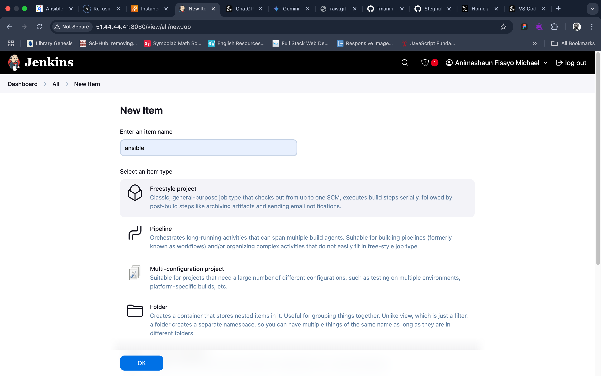
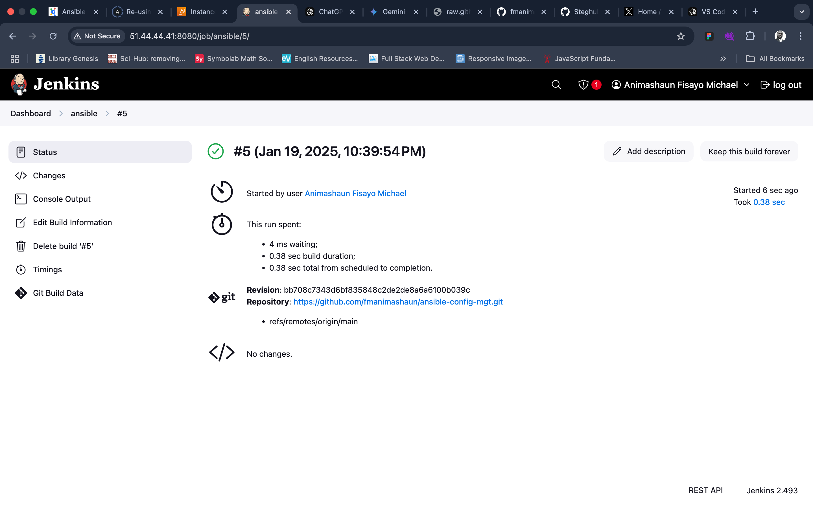

# Ansible Refactoring & Static Assignments(imports & roles)

## Table of Contents
1. [Introduction](#introduction)
2. [Project Overview](#project-overview)
3. [Architecture](#architecture)
4. [Prerequisites](#prerequisites)
5. [AWS setup overview](#aws-setup-overview)
6. [Self-Study](#self-study)
	 - [Reusing Ansible Artifacts](#reusing-ansible-artifacts)
7. [Implementation](#implementation)
8. [Testing and Validation](#testing-and-validation)
9. [Future Improvements](#future-improvements)
10. [References](#references)

## Introduction

This project builds upon the [Ansible Configuration Management](../Ansible_configuration_management/README.md) - Jenkins workflow by enhancing the automation of configuration management and application deployment. By integrating Ansible and Jenkins, the project leverages Jenkins as a bastion host to execute Ansible playbooks seamlessly across target servers. The focus of the project is to refactor Ansible code for improved maintainability, adopt static assignments, and utilize imports and roles to enhance code reusability.


## Project Overview
The objective of the project is to refactor the existing Ansible codebase for better organization, readability, and extensibility. This involves breaking down monolithic playbooks into smaller, reusable components through the use of imports and roles. The key improvements include:

- **Enhanced Jenkins Workflow**: Introducing a new Jenkins job to streamline artifact storage and reduce space consumption.
- **Code Refactoring**: Splitting large playbooks into modular components for easier maintenance and reuse.
- **Static Assignments**: Organizing playbooks and roles into structured directories for better clarity.
- **Reusable Roles**: Creating dedicated Ansible roles for common tasks like configuring web servers and deploying applications.

By adopting these practices, the project aligns with the DevOps philosophy of iterative improvement, promoting better collaboration, efficiency, and scalability.

## Architecture

The architecture of the project comprises the following key components:

1. **Jenkins-Ansible Server**:
	- Acts as a bastion host.
	- Hosts Jenkins for CI/CD automation.
	- Executes Ansible playbooks on target servers.

2. **Target Servers**:
	- Various environments (e.g., dev, stage, uat, prod).
	- Configured and managed using Ansible.

3. **Ansible Codebase**:
	- Organized into structured directories:
		- static-assignments: Contains reusable playbooks like common.yml.
		- roles: Contains modular roles for specific tasks.
	- Centralized entry point (site.yml) for playbook execution.

4. **Artifact Management**:
	- Artifacts generated during Jenkins builds are stored in a dedicated directory (/home/ubuntu/ansible-config-artifact).
	- Managed using the Copy Artifact plugin in Jenkins.


## Prerequisites
To successfully set up your local development environment for this project, follow the steps below.

**1. Clone the `ansible-config-mgt` Repository**

Start by cloning the `ansible-config-mgt` repository from GitHub:

```bash
git clone https://github.com/fmanimashaun/ansible-config-mgt.git
```

Navigate into the cloned repository:

```bash
cd ansible-config-mgt
```

Open the project in Visual Studio Code:

```bash
code .
```

**2. Set Up the Python Virtual Environment**

Open the terminal inside Visual Studio Code (`Ctrl + \`` or **Terminal > New Terminal**).

Create a Python virtual environment within your project folder by running:

```bash
python -m venv .venv
```

This will create a `.venv` directory in your project folder containing the isolated Python environment.

>NB: Ensure you are using the latest python (v3.13)

**3. Activate the Virtual Environment**

Once the virtual environment is created, activate it by running:

- **On Windows:**

  ```bash
  .venv\Scripts\activate
  ```

- **On macOS/Linux:**

  ```bash
  source .venv/bin/activate
  ```

The terminal should now indicate that the virtual environment is active, for example:

```
(.venv) your-folder-name $
```

**4. Install Ansible in the Virtual Environment**

With the virtual environment activated, install Ansible by running the following command:

```bash
pip install ansible
```

in case you needed to update your `ansible-lint` module, run:

```bash
pip install --upgrade ansible-lint
```

This will install Ansible and its dependencies within the isolated virtual environment.

**5. Verify the Installation**

After installing Ansible, confirm the installation by running:

```bash
ansible --version
```

This should output the installed version of Ansible, confirming that the installation was successful.

**6. Install Ansible Extension for VS Code (Optional)**

For enhanced Ansible development in Visual Studio Code, install the **Ansible extension**. This extension provides syntax highlighting, linting, and other features specific to Ansible playbooks.

You can find the extension in the [VS Code marketplace](https://marketplace.visualstudio.com/items?itemName=vscoss.vscode-ansible).


## Self-Study

### Reusing Ansible Artifacts

Efficiently managing and organizing Ansible automation requires breaking down tasks into smaller, reusable files. The following concepts are central to mastering this approach:

**Creating Reusable Components**
- **Variables Files**: Dedicated files containing only variables for consistent use.
- **Task Files**: Modular files that focus solely on specific tasks.
- **Roles**: Comprehensive sets of tasks, variables, defaults, and handlers organized into structured directories for specific functionalities.

**Dynamic and Static Reuse**
- **Dynamic Reuse (Includes)**:
	- Processed at runtime, enabling tasks to adapt based on earlier playbook results.
	- Includes modules such as include_role and include_tasks.
	- Ideal for scenarios requiring loops or variable input.

- **Static Reuse (Imports)**:
	- Pre-processed during playbook parsing, ensuring predictable execution order.
	- Incorporates modules like import_role and import_tasks.
	- Suitable for workflows requiring strict task sequencing.

**When to Use Roles**
- Simplify complex playbooks by encapsulating logic into roles.
- Store defaults, handlers, and tasks in separate directories for clarity and reusability.
- Share and version control roles easily using platforms like Ansible Galaxy.

**Key Considerations**
- **Task and Handler Reuse**: Use `include_tasks` or `import_tasks` for repetitive actions (e.g., restarting services).
- **Performance Impact**: Dynamic reuse may increase runtime complexity, while static reuse enhances performance by reducing processing overhead.
- **Avoid Mixing Approaches**: For consistency, use either dynamic or static reuse within a single playbook.


## Implementation

### Step 1: Set Up Jenkins Server
1. Provision an EC2 instance for Jenkins (t2.micro, Ubuntu 24.04 LTS).
2. Configure security groups to allow necessary traffic (SSH on port 22, HTTP on port 8080).


### Step 2: Configure Jenkins for CI/CD

1. Update the system and install the default JDK:

   ```bash
   sudo apt update
   sudo apt install default-jdk-headless
   ```

2. Install Jenkins using the official Jenkins repository:

   ```bash
   sudo wget -O /usr/share/keyrings/jenkins-keyring.asc \
     https://pkg.jenkins.io/debian/jenkins.io-2023.key
   echo "deb [signed-by=/usr/share/keyrings/jenkins-keyring.asc]" \
     https://pkg.jenkins.io/debian binary/ | sudo tee \
     /etc/apt/sources.list.d/jenkins.list > /dev/null
   ```

   ```bash
   sudo apt-get update
   sudo apt-get install jenkins
   ```

3. Start Jenkins and enable it to run on boot:

   ```bash
   sudo systemctl start jenkins
   sudo systemctl enable jenkins
   ```

4. Check the status of Jenkins to ensure it's running:

   ```bash
   sudo systemctl status jenkins
   ```

5. Access Jenkins through your browser by navigating to `http://<your-server-ip>:8080` and complete the initial setup.

6. During the initial setup, you'll be asked for the initial admin password. You can retrieve it with:

   ```bash
   sudo cat /var/lib/jenkins/secrets/initialAdminPassword
   ```

7. Follow the on-screen instructions to complete the installation, including installing recommended plugins and creating the first admin user.


### Step 3: Setup initial Jenkin job flow
1. Add a Webhook in GitHub

   - Open the GitHub repository for your project: [https://github.com/fmanimashaun/ansible-config-mgt](https://github.com/fmanimashaun/ansible-config-mgt).
   - Go to **Settings** > **Webhooks**.
   - Click **Add webhook** and configure it as follows:
     - **Payload URL**: Enter your Jenkins webhook URL:
       
       ```
       http://<your-server-ip>:8080/github-webhook/
       ```

     - **Content type**: Select `application/json`.
     - **Which events would you like to trigger this webhook?**: Choose **Just the push event**.
   - Click **Add webhook** to save.

This webhook will notify Jenkins of any push events in the GitHub repository, triggering an automated build.


2. <a id="create-a-new-jenkins-job"></a>Create a New Jenkins Job

   - Go to your Jenkins Dashboard at `http://<your-server-ip>:8080`.
   - Click **New Item**.
   - Name the job `ansible`, select **Freestyle project**, and click **OK**.

   

3. Configure Source Code Management

   - In the job configuration page, scroll to the **Source Code Management** section.
   - Select **Git** and enter the GitHub repository URL:

     `https://github.com/fmanimashaun/ansible-config-mgt.git`

   - In the **Credentials** dropdown, add your GitHub credentials (username and password or a personal access token)
   
   

   - save and then test the configuration by clicking **build now** in job page
   

4. Configure Build Trigger

   - In the job page, click on **configure** 
   - Scroll down to the **Build Triggers** section.
   - Select **GitHub hook trigger for GITScm polling**. This will ensure Jenkins triggers a build every time a change is pushed to GitHub.
   - Scroll to the **Post-build Actions** section.
   - Click **Add post-build action** and select **Archive the artifacts**.
   - In the **Files to archive** field, enter `**`, which will archive all files generated during the build.
   - Click **Save** to finalize the configuration.
   - To test the setup, push a change to the GitHub repository, which should trigger an automatic build in Jenkins.
   - Check the **Build History** in Jenkins to confirm that the build triggered correctly. You should also see the archived files in the build’s **Artifacts** section.

   

### Step 4: Jenkins Job Enhancement

1. Connect to the jenkins-server via ssh and run the following commands:
```bash
sudo mkdir /home/ubuntu/ansible-config-artifact
sudo chmod -R 777 /home/ubuntu/ansible-config-artifact
sudo usermod -a -G ubuntu jenkins
```

2. Go to Jenkins web console  and Naviage to **Dashboard** -> **Manage Jenkins** -> **Plugins** -> on **Available plugins** tab search for `Copy Artifact` and install the plugin.
    

3. Create a new Freestyle project similar to the one [Step 3: Setup initial Jenkin job flow](#create-a-new-jenkins-job), however, we won't be using github to trigger this but the completion of the `ansible` job.
   
   

4. Add a build step that copy the artifact from jenkins job `ansible` and send it to the `/home/ubuntu/ansible-config-artifact` on the jenkins-server
   
   

5. Test the setup by updating the readme file of the `ansible-config-mgt` repo.
   
   

### Step 5: Refactor Ansible code by importing other playbook

1. Create a branch called `features/refactor`:

   ```bash
   git checkout -b features/refactor
   ```

2. Create a folder `static-assignments` in the root of the repo and move the `common.yml` inside

3. Inside the `playbooks` folder, create a `site.yml` and import the common playbook inside:

```yml
---
- name: Common tasks play
  ansible.builtin.import_playbook: ../static-assignments/common.yml
```

### 6. Test the refactored Ansible code
1. Setting Up AWS EC2 Instances

Follow these steps to set up the required EC2 instances:

   -  **Launch NFS Server**:
      - Navigate to EC2 dashboard in AWS Console
      - Click "Launch Instance"
      - Choose "Red Hat Enterprise Linux 9.4" AMI
      - Select t2.micro instance type

   - **Launch Web Servers** (Repeat 3 times):
      - Follow similar steps as NFS server

   - **Launch Database Server**:
      - Follow similar steps as NFS server

   - **Launch Load balancer Server**:
      - Follow similar steps as NFS server
      - Choose Ubuntu Server 24.04 LTS (HVM), SSD Volume Type

>**Notice:** 
>- Ensure all instances are launched in the same subnet (availability zone). Also, update the private IP of all hosts in the `dev` inventory.
>- Update the security group for all instances to allow the ssh port to all instances in the subnet `172.31.0.0/20`

2. Setup the SSH-agent on the local machine - vscode:
   - Follow the instruction in [Configure SSH Agent on Local Machine](../Ansible_configuration_management/README.md#step-1-configure-ssh-agent-on-local-machine)
   - connect to the jenkins-server and ssh into the various instances from the jenkins server using their private IPs to test the ssh agent
   - In the jenkins-server terminal run:
   ```bash
   ansible-playbook -i inventory/dev playbooks/site.yml
   ```
      

2. Update the playbook:
   - In the repo, create a playbook `common-del.yml` inside the `static-assignments`
   ```yml
   ---
   - name: Update web, nfs, and db servers
   hosts: nfs_server, web_servers, db_server
   become: true
   become_user: root
   tasks:
      - name: Delete wireshark
         ansible.builtin.dnf:
         name: wireshark
         state: removed

   - name: Update LB server
   hosts: lb_server
   become: true
   remote_user: ubuntu
   become_user: root
   tasks:
      - name: Delete wireshark
         ansible.builtin.apt:
         name: wireshark
         state: absent
         autoremove: true
         purge: true
         autoclean: true
   ```
   - Update the `site.yml` as follows:
   ```yml
   ---
   - name: Common tasks play
     ansible.builtin.import_playbook: ../static-assignments/common-del.yml
   ```
   - Push the update the github and create a PR and merge the update to the main for the jenkins pipeline to copy the latest ansible code to the `/home/ubuntu/ansible-config-artifact`. ssh into the jenkin-servver using the ssh-agent and run the playbook with:
   ```bash
   ansible-playbook -i inventory/dev playbooks/site.yml
   ```
   


## Future Improvements


## References

1. **Ansible Documentation**:  
   Ansible documentation provides comprehensive information on using Ansible for automation and configuration management.  
   URL: [https://docs.ansible.com/](https://docs.ansible.com/)

2. **GitHub - Ansible Config Management Repository**:  
   The repository containing the implementation and resources for the Ansible configuration management project.  
   URL: [https://github.com/fmanimashaun/ansible-config-mgt](https://github.com/fmanimashaun/ansible-config-mgt)

3. **Ansible Best Practices**:  
   A guide on how to structure Ansible projects for maximum maintainability and scalability.  
   URL: [https://docs.ansible.com/ansible/latest/user_guide/playbooks_best_practices.html](https://docs.ansible.com/ansible/latest/user_guide/playbooks_best_practices.html)

4. **Video demonstration**:
   A simple demonstration of the whole project from setup to running the ansible playbook
   URL: [Video Demonstration Link](https://youtu.be/Ng4j6ldrf7Q)

