# Project: Web Solution Implementation Using WordPress on AWS EC2


## Table of Contents

1. [Introduction](#introduction)
2. [Prerequisites](#prerequisites)
3. [Architecture Overview](#architecture-overview)
4. [Setting Up AWS EC2 Instances](#setting-up-aws-ec2-instances)
5. [Configuring EBS and Logical Volume Manager (LVM) web-server](#configuring-ebs-and-logical-volume-manager-lvm-web-server)
   - [EBS Setup](#ebs-setup)
   - [LVM Configuration](#lvm-configuration)
6. [Configuring EBS and Logical Volume Manager (LVM) db-server](#configuring-ebs-and-logical-volume-manager-lvm-db-server)
   - [EBS Setup](#ebs-setup)
   - [LVM Configuration](#lvm-configuration)
7. [AWS Security Group Configuration](#aws-security-group-configuration)
8. [Install and Configure MYSQL Database server](#install-and-configure-mysql-database-server)
9. [Installing Apache, PHP 8.3, and PHP Extensions on web-server instance](#installing-apache-php-83-and-php-extensions-on-web-server-instance)
   - [Step 1: Verify RHEL Version](#step-1-verify-rhel-version)
   - [Step 2: Install Apache (httpd)](#step-2-install-apache-httpd)
   - [Step 3: Enable Necessary Repositories](#step-3-enable-necessary-repositories)
   - [Step 4: Install PHP 8.3 and Extensions](#step-4-install-php-83-and-extensions)
   - [Step 5: Configure SELinux (Security-Enhanced Linux)](#step-5-configure-selinux-security-enhanced-linux)
   - [Step 6: Verify PHP Installation](#step-6-verify-php-installation)
   - [Step 7: Test PHP Functionality](#step-7-test-php-functionality)
10. [WordPress Installation](#wordpress-installation)
11. [Final Steps and Reflections](#final-steps-and-reflections)


## Introduction

This project involves setting up **WordPress** on an **EC2** instance running **Red Hat Enterprise Linux (RHEL) 9.4** with 3 **EBS volumes** (each 10GB) attached to two separate instances: 
- **web-server**: Responsible for running the WordPress application.
- **db-server**: Running **MySQL** database.

The web-server will be a minimum of **t2.small** instance type, while the db-server can be a **t2.micro** instance. 

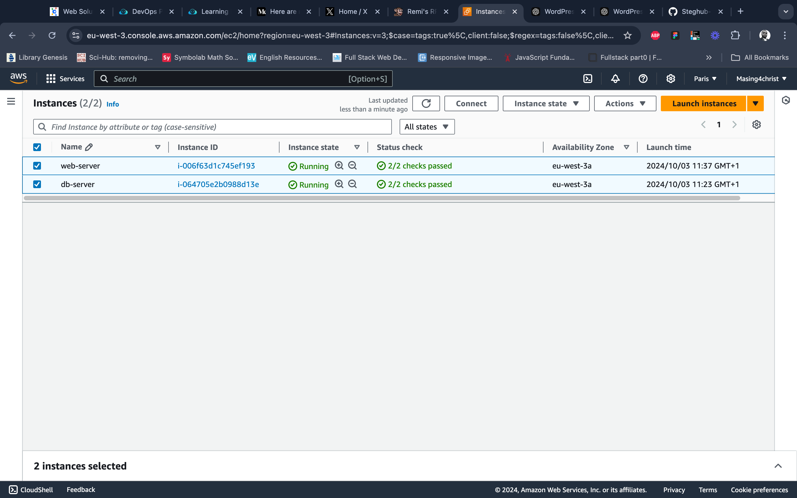

## Prerequisites

Before starting, I ensured:
- Two AWS EC2 instances (for WordPress and MySQL) running Red Hat Enterprise Linux 9.4.
- Familiarity with basic AWS EC2 and LVM concepts.
- SSH access to both instances.
- Minimum instance size: t2.small for the web-server instance (to avoid issues with package installations).

## Architecture Overview

**Web-Server Instance:**
- **Instance Type**: t2.small
- **3 EBS Volumes**: 10GB each (`/dev/xvdb`, `/dev/xvdc`, `/dev/xvdd`)

**DB-Server Instance:**
- **Instance Type**: t2.micro
- **3 EBS Volumes**: 10GB each (`/dev/xvdb`, `/dev/xvdc`, `/dev/xvdd`)

> Each server will use **Logical Volume Manager (LVM)** to dynamically manage the attached EBS volumes for application data and logs.
> Make sure the EBS volume blocks are created in the same availability zone as the instance they will be attached to.

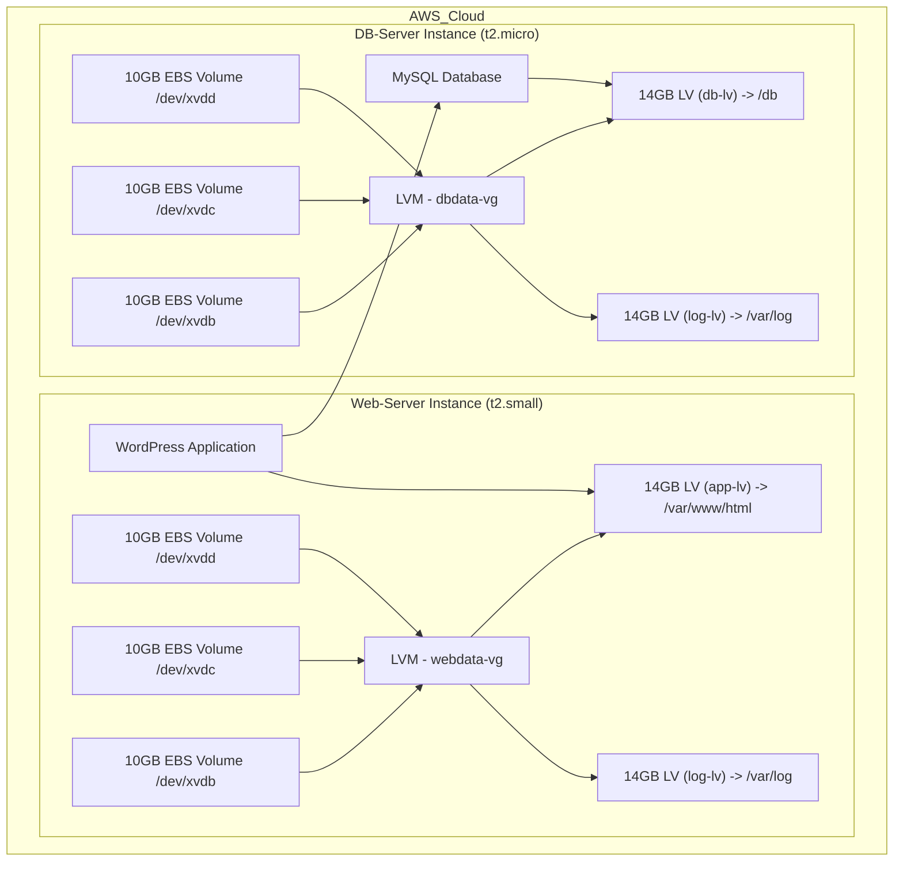

> **Insight:** Using LVM allows dynamic scaling and better management of storage volumes without downtime.

## Setting Up AWS EC2 Instances

1. **Launch EC2 Instances**:
   - Created two EC2 instances running Red Hat Enterprise Linux 9.4 for WordPress and MySQL, ensuring the instance for the webserver is at least t2.small and take note of the availability zone used in the instance creation.
   
2. **Attach EBS Volumes**:
   - Added three EBS volumes to each instance for managing application data and logs.
   > To be able to identify the EBS, name them as follows in the AWS console:
   >
   > - **Web Server:**
   >   - **web-server-root** - for the default EBS attached to the web-server instance when created
   >   - **web-server-vol-1** - for the xvdb attached to the web-server
   >   - **web-server-vol-2** - for the xvdc attached to the web-server
   >   - **web-server-vol-3** - for the xvdd attached to the web-server
    >
   > - **DB Server:**
   >   - **db-server-root** - for the default EBS attached to the db-server instance when created
   >   - **db-server-vol-1** - for the xvdb attached to the db-server
   >   - **db-server-vol-2** - for the xvdc attached to the db-server
   >   - **db-server-vol-3** - for the xvdd attached to the db-server

   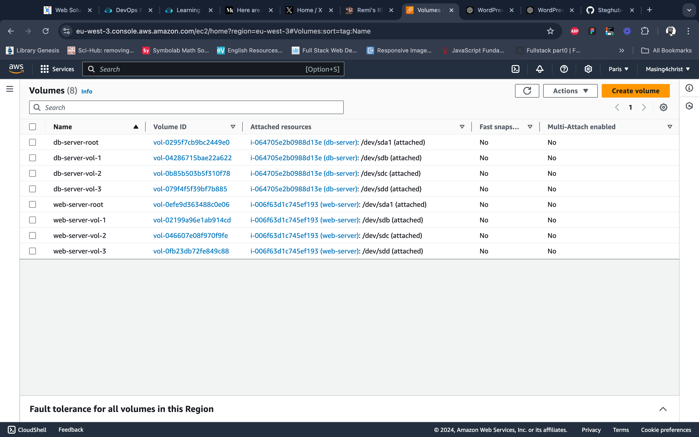

## Configuring EBS and Logical Volume Manager (LVM) web-server

Connect to the web-server instance via the ssh terminal to have access to the system.

### EBS Setup

1. **Check Volume Visibility**:
   After SSH'ing into the instances, I listed the attached block devices using:

   ```bash
   lsblk
   ```
   The new volumes appeared as `/dev/xvdb`, `/dev/xvdc`, and `/dev/xvdd`.

   

   > note down the name of the EBB volumes as shown on the output of the **lsblk** command

### LVM Configuration

1. **Install LVM Tools**:
   Since Red Hat Enterprise Linux 9.4 was being used, I ensured LVM was installed, I also installed nano (text editor) and wget (for downloading)

   ```bash
   sudo dnf update
   sudo dnf install lvm2 nano wget
   ```

   you can check for available partition using **lvmdiskscan** command, however, since it is a fresh EBS volumes, there is no partition on it at the moment.

2. **Create partitions on EBS volumes**:

   Using the **gdisk** utitlity to create a single partition on each EBS block as follows:

   ```bash
   sudo gdisk /dev/xvdb
   ```

   This will launch the partition utility interface as shown below:

   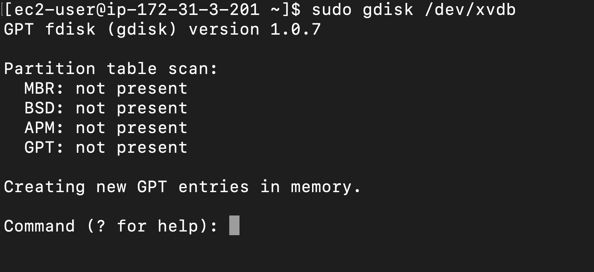

   use the following commands to create and save the partition table to disk:
   - **n** - To create a partition table, accept all defaults by pressing **Enter** key
   - **p** - Print partition table informatoon
   - **w** - Write changes to disk

   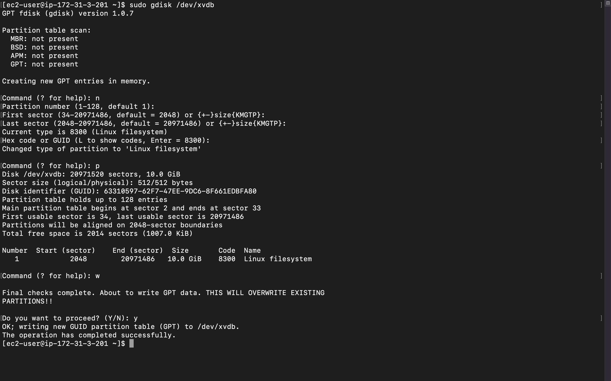

   You do the same for the remaining EBS blocks using the commands below:
   - xvdc block:
   ```bash
   sudo gdisk /dev/xvdc
   ```

    - xvdd block:
   ```bash
   sudo gdisk /dev/xvdd
   ```

   confirm the partitions using **lsblk**
   ```bash
   lsblk
   ```


> note down the partition names: **xvdb1**, **xvdc1** and **xvdd1**

3. **Create Physical Volumes**:
   Converted the three attached EBS block partitions into physical volumes (PVs):

   ```bash
   sudo pvcreate /dev/xvdb1 /dev/xvdc1 /dev/xvdd1
   ```

4. **Create Volume Group**:
   Next, Created a volume group (VG) to aggregate the PVs:

   ```bash
   sudo vgcreate webdata-vg /dev/xvdb1 /dev/xvdc1 /dev/xvdd1
   ```

5. **Create Logical Volumes**:
   Created logical volumes (LVs) for storing WordPress application data and logs. Here's how I did it:

   ```bash
   sudo lvcreate -n app-lv -L 14G  webdata-vg
   sudo lvcreate -n log-lv -L 14G  webdata-vg
   lsblk
   ```

   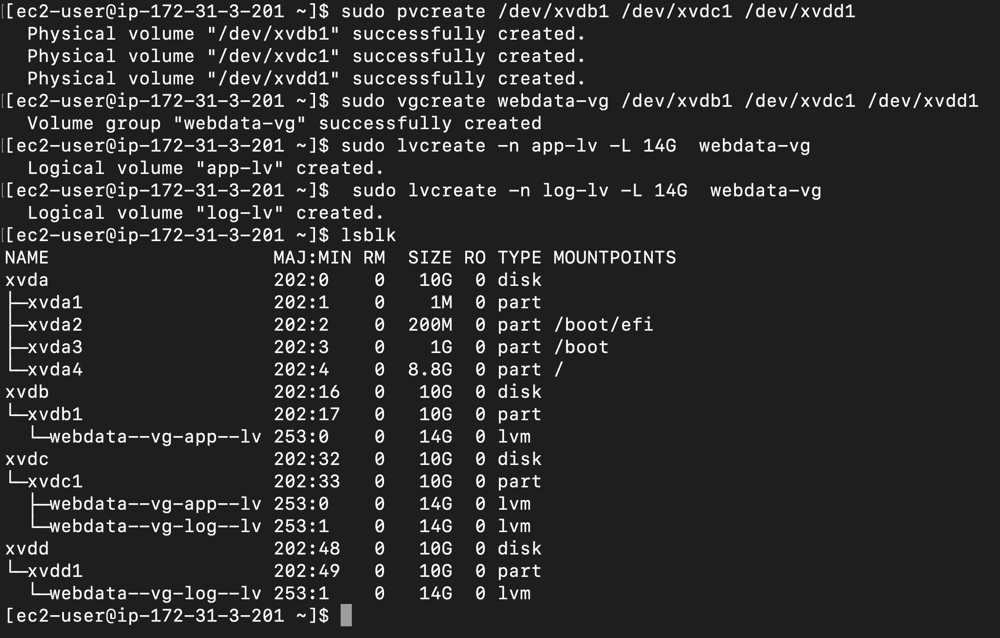

   To verify the entire setup - view the VG, PV and LV, you can run:
   ```bash
   sudo vgdisplay -v
   ```

6. **Create File system and Mount LVs**:
   Create o a file system on the Logival volumes by running the follwoing commands:

   ```bash
   sudo mkfs -t ext4 /dev/webdata-vg/app-lv
   sudo mkfs -t ext4 /dev/webdata-vg/log-lv
   ```

   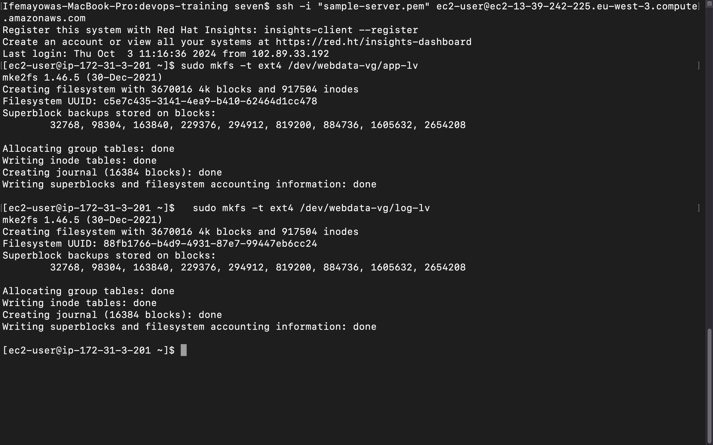

   Then mounted them:

   - Create the following locations:

   ```bash
   sudo mkdir -p /var/www/html /home/recovery/logs
   ```

   > note the **-p** is to ensure the parent directory are created if not existing.

   > The **/home/recovery/logs** directory is to backup the **/var/log** directory before mounting the **/dev/webdata-vg/log-lv** to the location as the mount process will wipe the location clean.

   - Backup the **/var/log**:
   ```bash
   sudo rsync -av /var/log/ /home/recovery/logs/
   ```
   >The -av flag in the rsync command has the following meanings:
   >
   > - a (archive): This option enables archive mode, which ensures that the data is copied recursively and preserves symbolic links, file permissions, timestamps, and ownership. It's a commonly used option when making backups or transfers where you want to keep the file attributes intact.
   >
   > - v (verbose): This option enables verbose mode, meaning that rsync will display detailed information about what files are being transferred during the operation. It helps to see the progress and details of the copy process.

   - Mount the LVs:

   ```bash
   sudo mount /dev/webdata-vg/app-lv /var/www/html
   sudo mount /dev/webdata-vg/log-lv /var/log
   ```

   - Restore the **/var/log**:
      ```bash
      sudo rsync -av /home/recovery/logs/ /var/log/ 
      ```

7. **Persistent Mounts**:
   To ensure the volumes are automatically mounted at boot, updated `/etc/fstab`:

   - Get the UUID of the LVs:
      ```bash
      sudo blkid
      ```

   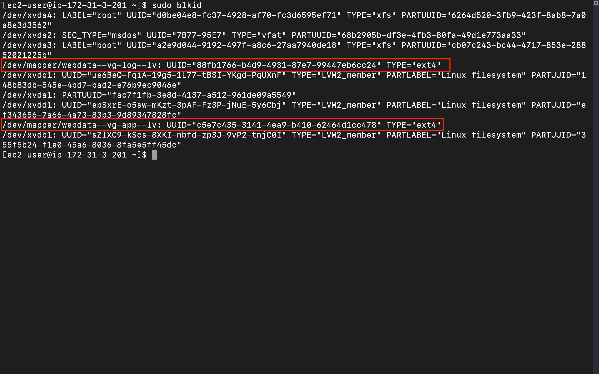

   - Update the `/etc/fstab`:
   ```bash
   sudo nano /etc/fstab
   ```

   - Paste the code below:
   ```yml
   # mounts for wordpress webserver
   UUID=c5e7c435-3141-4ea9-b410-62464d1cc478 /var/www/html ext4 defaults 0 0
   UUID=88fb1766-b4d9-4931-87e7-99447eb6cc24 /var/log ext4 defaults 0 0
   ```

   - Save and reload the daemon:
   ```bash
   sudo systemctl daemon-reload
   ```

   - Test the mount:
   ```bash
   sudo mount -a # if no output, the mount is successfully added to the fstab
   ```

## Configuring EBS and Logical Volume Manager (LVM) db-server:

Connect to the db-server instance via the ssh terminal to have access to the system.

### EBS Setup

1. **Check Volume Visibility**:
   After SSH'ing into the instances, I listed the attached block devices using:

   ```bash
   lsblk
   ```
   The new volumes appeared as `/dev/xvdb`, `/dev/xvdc`, and `/dev/xvdd`.

   

   > note down the name of the EBB volumes as shown on the output of the **lsblk** command

### LVM Configuration

1. **Install LVM Tools**:
   Since Red Hat Enterprise Linux 9.4 was being used, I ensured LVM was installed, I also installed nano (text editor) and wget (for downloading)

   ```bash
   sudo dnf update
   sudo dnf install lvm2 nano
   ```

   you can check for available partition using **lvmdiskscan** command, however, since it is a fresh EBS volumes, there is no partition on it at the moment.

2. **Create partitions on EBS volumes**:

   Using the **gdisk** utitlity to create a single partition on each EBS block as follows:

   ```bash
   sudo gdisk /dev/xvdb
   ```

   This will launch the partition utility interface as shown below:

   

   use the following commands to create and save the partition table to disk:
   - **n** - To create a partition table, accept all defaults by pressing **Enter** key
   - **p** - Print partition table informatoon
   - **w** - Write changes to disk

   

   You do the same for the remaining EBS blocks using the commands below:
   - xvdc block:
   ```bash
   sudo gdisk /dev/xvdc
   ```

    - xvdd block:
   ```bash
   sudo gdisk /dev/xvdd
   ```

   confirm the partitions using **lsblk**
   ```bash
   lsblk
   ```


> note down the partition names: **xvdb1**, **xvdc1** and **xvdd1**

3. **Create Physical Volumes**:
   Converted the three attached EBS block partitions into physical volumes (PVs):

   ```bash
   sudo pvcreate /dev/xvdb1 /dev/xvdc1 /dev/xvdd1
   ```

4. **Create Volume Group**:
   Next, Created a volume group (VG) to aggregate the PVs:

   ```bash
   sudo vgcreate dbdata-vg /dev/xvdb1 /dev/xvdc1 /dev/xvdd1
   ```

5. **Create Logical Volumes**:
   Created logical volumes (LVs) for storing WordPress application data and logs. Here's how I did it:

   ```bash
   sudo lvcreate -n db-lv -L 14G  dbdata-vg
   sudo lvcreate -n log-lv -L 14G  dbdata-vg
   lsblk
   ```

   

   To verify the entire setup - view the VG, PV and LV, you can run:
   ```bash
   sudo vgdisplay -v
   ```

6. **Create File system and Mount LVs**:
   Create o a file system on the Logival volumes by running the follwoing commands:

   ```bash
   sudo mkfs -t ext4 /dev/dbdata-vg/db-lv
   sudo mkfs -t ext4 /dev/dbdata-vg/log-lv
   ```

   

   Then mounted them:

   - Create the following locations:

   ```bash
   sudo mkdir -p /db /home/recovery/logs
   ```

   > note the **-p** is to ensure the parent directory are created if not existing.

   > The **/home/recovery/logs** directory is to backup the **/var/log** directory before mounting the **/dev/dbdata-vg/log-lv** to the location as the mount process will wipe the location clean.

   - Backup the **/var/log**:
   ```bash
   sudo rsync -av /var/log/ /home/recovery/logs/
   ```
   >The -av flag in the rsync command has the following meanings:
   >
   > - a (archive): This option enables archive mode, which ensures that the data is copied recursively and preserves symbolic links, file permissions, timestamps, and ownership. It's a commonly used option when making backups or transfers where you want to keep the file attributes intact.
   >
   > - v (verbose): This option enables verbose mode, meaning that rsync will display detailed information about what files are being transferred during the operation. It helps to see the progress and details of the copy process.

   - Mount the LVs:

   ```bash
   sudo mount /dev/dbdata-vg/db-lv /db
   sudo mount /dev/dbdata-vg/log-lv /var/log
   ```

   - Restore the **/var/log**:
   ```bash
   sudo rsync -av /home/recovery/logs/ /var/log/ 
   ```

7. **Persistent Mounts**:
   To ensure the volumes are automatically mounted at boot, updated `/etc/fstab`:

   - Get the UUID of the LVs:
      ```bash
      sudo blkid
      ```

   

   - Update the `/etc/fstab`:
   ```bash
   sudo nano /etc/fstab
   ```

   - Paste the code below:
   ```yml
   # mounts for wordpress webserver
   UUID=c5e7c435-3141-4ea9-b410-62464d1cc478 /db ext4 defaults 0 0
   UUID=88fb1766-b4d9-4931-87e7-99447eb6cc24 /var/log ext4 defaults 0 0
   ```

   - Save and reload the daemon:
   ```bash
   sudo systemctl daemon-reload
   ```

   - Test the mount:
   ```bash
   sudo mount -a # if no output, the mount is successfully added to the fstab
   ```

> **Insight:** Configuring LVM provided flexibility to scale storage without downtime. For WordPress, separate volumes for data and logs made it easier to manage and monitor disk usage.

## AWS Security Group Configuration

Security groups were configured to control access between the WordPress and MySQL instances.

1. **MySQL Security Group**:
   - Allowed traffic on port 3306 from the private IP of the **web-server** instance for database communication.
   - Opened SSH (port 22) for administrative access.

2. **WordPress Security Group (using the default Security group)**:
   - Opened HTTP (port 80) for public access.
   - Opened SSH (port 22) for administrative access.

## Install and Configure MYSQL Database server
While still inside the **db-server**, let setup the mysql database:

```bash
sudo dnf update
sudo dnf install mysql-server -y
```

### Initial Configuration

2. Started and enabled the MySQL service:

```bash
sudo systemctl start mysqld
sudo systemctl enable mysqld
```

3. Set the root password:

```bash
sudo mysql
ALTER USER 'root'@'localhost' IDENTIFIED WITH mysql_native_password BY 'Password.1';
FLUSH PRIVILEGES;
EXIT;
```

4. Ran the secure installation script:

```bash
sudo mysql_secure_installation
```

> **Personal Note:** I initially ran the `mysql_secure_installation` script without setting the root password first. This locked me out of the root account, leading to a valuable lesson on the importance of following the correct sequence of steps.

5. Verified the installation:

```bash
sudo systemctl status mysqld
```

6. Create admin user for the wordpress application:
```bash
sudo mysql -u root -p
```

```bash
CREATE DATABASE wordpress;
CREATE USER 'myuser'@'172.31.3.201' IDENTIFIED WITH mysql_native_password BY 'Password.1';
GRANT ALL PRIVILEGES ON wordpress.* TO 'myuser'@'172.31.3.201';
FLUSH PRIVILEGES;
EXIT;
```

7. Test the remote connection to the newly created database via **web-server** instance:
   Connect to the web-server instance via the ssh interface and run this command:

   - Install the MySQL client:
   ```bash
   sudo dnf install mysql
   ```
   - Connect to the remote mysql server:
   ```bash
   sudo mysql -h 172.31.3.113 -u myuser -p
   ```

   if you can connect into the mysql shell, then the setup was successful.

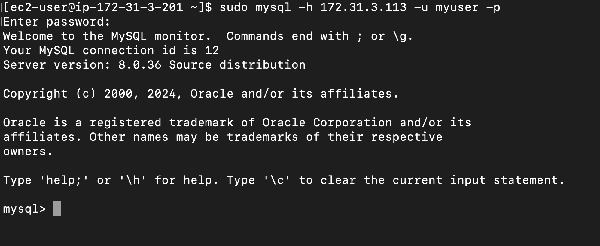

## Installing Apache, PHP 8.3, and PHP Extensions on web-server instance

### Step 1: Verify RHEL Version

Before starting, ensure you are running **RHEL 9.4**. This can be done with the following command:

```bash
cat /etc/redhat-release
```

Expected output:
```
Red Hat Enterprise Linux release 9.4 (Plow)
```

### Step 2: Install Apache (httpd)

WordPress requires a web server to handle HTTP requests, and **Apache** is the most commonly used web server for WordPress installations. 

1. Install **Apache** using the `dnf` package manager:
   ```bash
   sudo dnf install httpd
   ```

2. Start and enable Apache to ensure it runs on boot:
   ```bash
   sudo systemctl start httpd
   sudo systemctl enable httpd
   ```

3. Check that Apache is running:
   ```bash
   sudo systemctl status httpd
   ```
3. Access the web browser:
   `http://your-server-ip`

   If everything is configured correctly, you should see the default redhat page.

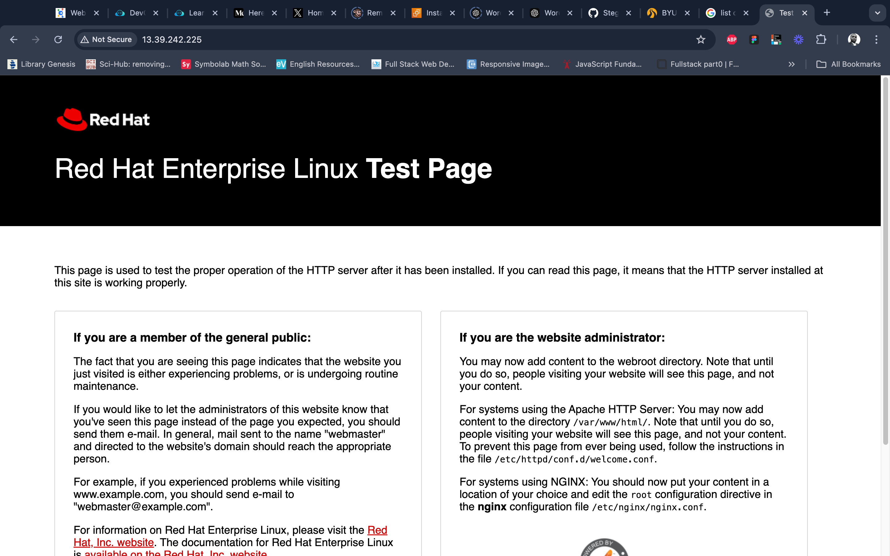

### Step 3: Enable Necessary Repositories

To install the latest PHP version, we need to enable additional repositories, which are not enabled by default on **RHEL 9**.

> you can see detailed decommentation from [Remi's site](https://rpms.remirepo.net/wizard/)

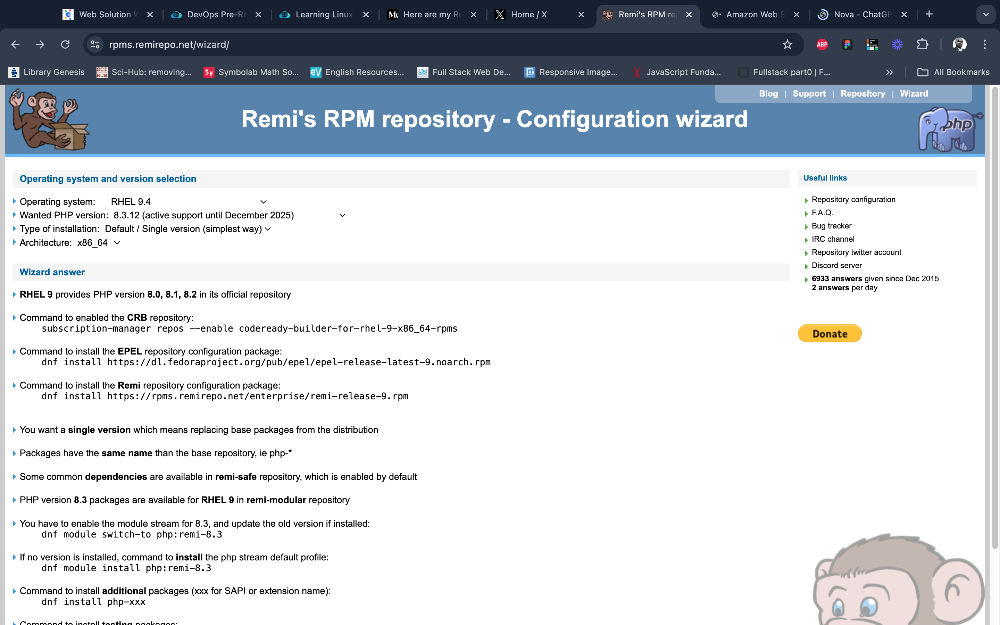

#### Install the EPEL Repository

**EPEL (Extra Packages for Enterprise Linux)** is a repository that contains additional software packages that are not provided in the default RHEL repository but are often needed for full functionality.

```bash
sudo dnf install https://dl.fedoraproject.org/pub/epel/epel-release-latest-9.noarch.rpm
```

#### Install the Remi Repository

**Remi’s repository** is required to install **PHP 8.3**, as RHEL’s default repositories only provide PHP versions up to 8.2.

```bash
sudo dnf install https://rpms.remirepo.net/enterprise/remi-release-9.rpm
```

### Step 4: Install PHP 8.3 and Extensions

1. enable the module stream for **PHP 8.3**:
   ```bash
   sudo dnf module switch-to php:remi-8.3
   ```
2. install the module stream for **PHP 8.3** with default extension:
   ```bash
   sudo dnf module install php:remi-8.3
   ```

3. Install **PHP 8.3** and the necessary extensions for WordPress:
   ```bash
   sudo dnf install php php-opcache php-gd php-curl php-mysqlnd php-xml php-json php-mbstring php-intl php-soap php-zip
   ```

#### Explanation of Key PHP Extensions:

- **php-opcache**: Boosts performance by storing precompiled script bytecode in memory.
- **php-gd**: Provides image manipulation capabilities (needed for image uploads and manipulation in WordPress).
- **php-curl**: Allows external HTTP requests, used by WordPress to connect to other websites (e.g., for API calls).
- **php-mysqlnd**: Native MySQL driver for connecting WordPress to the database.
- **php-xml**: Handles XML parsing and writing.
- **php-json**: Allows WordPress to handle JSON data (used heavily in REST APIs).
- **php-mbstring**: Helps in handling multi-byte strings (essential for supporting various languages).
- **php-intl**: Adds support for internationalization features.
- **php-soap**: Adds SOAP protocol support.
- **php-zip**: Required for managing ZIP files (used for plugin/theme uploads and updates).


4. Start and enable **PHP-FPM**:
   ```bash
   sudo systemctl start php-fpm
   sudo systemctl enable php-fpm
   ```

5. Restart Apache to apply the changes:
   ```bash
   sudo systemctl restart httpd
   ```


### Step 5: Configure SELinux (Security-Enhanced Linux)

#### Why SELinux?

**SELinux** is a security module that enforces strict access control policies on your system, especially important for enterprise environments like Red Hat. It helps limit the damage that could be caused by compromised services, including the web server and PHP. By default, **SELinux** is set to **enforcing** mode on **RHEL**. This mode restricts many actions that Apache and PHP-FPM might need to function correctly.

#### Check SELinux Status

Verify that SELinux is enabled and in **enforcing** mode:
```bash
sestatus
```

Expected output:
```
SELinux status:                 enabled
Current mode:                   enforcing
```

#### Configure SELinux for PHP and Apache

To allow **Apache** and **PHP-FPM** to run without issues, you need to allow specific actions that would otherwise be restricted by SELinux.

1. Allow **Apache** to execute memory operations (needed by PHP’s OpCache):
   ```bash
   sudo setsebool -P httpd_execmem 1
   ```

2. Allow **Apache** to make network connections (required for external HTTP requests, for example, for connecting to APIs or downloading plugins/themes):
   ```bash
   sudo setsebool -P httpd_can_network_connect 1
   ```


### Step 6: Verify PHP Installation

After installation, check that PHP 8.3 is correctly installed and running.

1. Check the **PHP version**:
   ```bash
   php --version
   ```

   You should see output similar to:
   ```
   PHP 8.3.12 (cli) (built: Sep 26 2024 02:19:56) ( NTS )
   ```

2. List the installed **PHP modules**:
   ```bash
   php -m
   ```

   Ensure all necessary extensions for WordPress (like `curl`, `gd`, `mbstring`, etc.) are listed, see recommended list from [Wordpress](https://make.wordpress.org/hosting/handbook/server-environment/).


### Step 7: Test PHP Functionality

Create a **PHP info page** to verify that PHP is correctly served through Apache:

1. Create a test PHP file:
   ```bash
   sudo nano /var/www/html/info.php
   ```

2. Add the following code:
   ```php
   <?php
   phpinfo();
   ?>
   ```

3. Access this file via your web browser:
   `http://your-server-ip/info.php`

   If everything is configured correctly, a page displaying detailed PHP information should appear. kindly delete the info.php once testing is done.


## Wordpress Installation

1. Install the wget package
   ```bash
   sudo dnf install wget
   ```

2. Download the latest version of **WordPress**:
   ```bash
   sudo wget https://wordpress.org/latest.tar.gz
   ```

3. Extract the WordPress archive:
   ```bash
   sudo tar -xzvf latest.tar.gz
   sudo rm latest.tar.gz
   ```

>The `-xzvf` flag in the `tar` command is a combination of options used to extract (`x`), compress/uncompress (`z`), show verbose output (`v`), and specify the file (`f`). Here's the breakdown:
>
> - **`x`**: Extracts the files from the archive.
> - **`z`**: Tells `tar` to decompress the file using `gzip`. The `.gz` extension indicates the file was compressed using `gzip`.
> - **`v`**: Displays the files being extracted (verbose output), so you can see what `tar` is doing.
> - **`f`**: Specifies the file to operate on (`latest.tar.gz` in this case).


4. Move WordPress folder to your **Apache web root**:
   ```bash
   sudo mv wordpress/ /var/www/html/
   ```

5. Set the correct permissions for the **Apache** user:
   ```bash
   sudo chown -R apache:apache /var/www/html/wordpress
   sudo chmod -R 755 /var/www/html/wordpress
   sudo chcon -t httpd_sys_rw_content_t  /var/www/html/wordpress -R
   ```

   >**Note**: This sets the proper SELinux context (httpd_sys_rw_content_t) on the WordPress directory, allowing Apache (httpd) to write to files within it, which is crucial for tasks like uploading media, installing plugins, and updating WordPress. The -R flag applies the change recursively to all files and subdirectories.

6. Restart Apache to apply the changes:
   ```bash
   sudo systemctl restart httpd
   ```
7. accessing `http://instance-public-ip/wordpress` from your browser to see the wordpress installation
 
 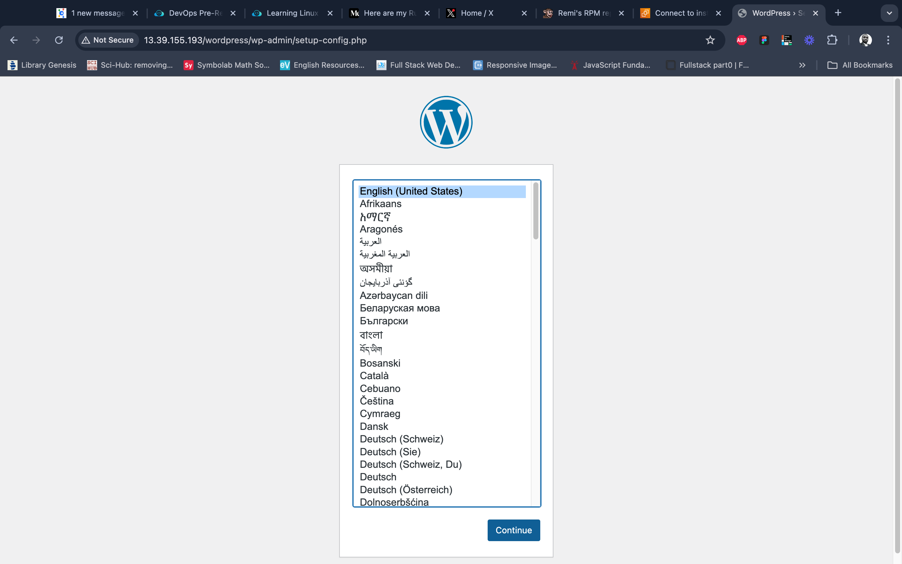
 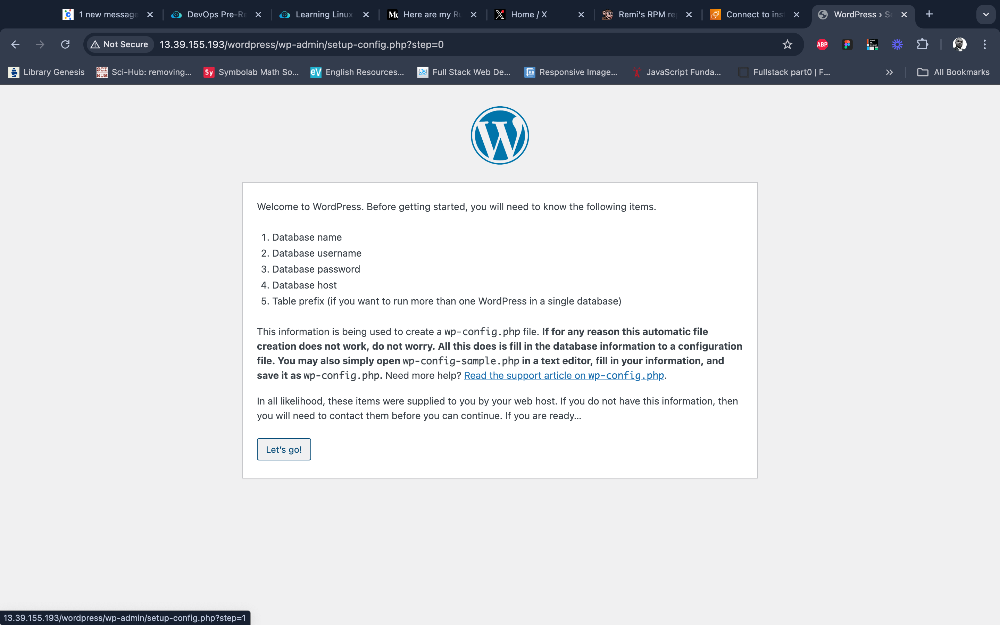
 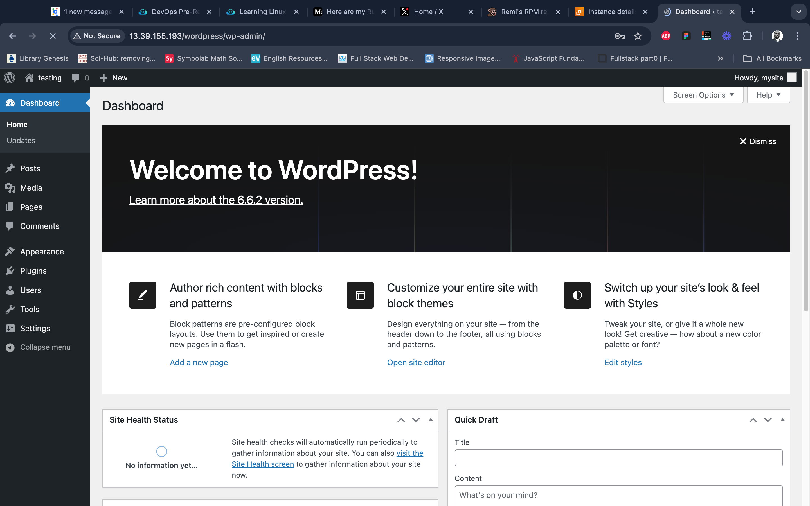

## Final Steps and Reflections

At this point, the infrastructure was set up with WordPress and MySQL on separate EC2 instances, using EBS volumes managed by LVM for flexible storage.

### Reflections
- **LVM**: Extremely helpful in dynamic storage management without needing to detach and re-attach EBS volumes.
- **Instance Types**: Using at least t2.small EC2 instances for web-server prevented resource limitations during installations.
