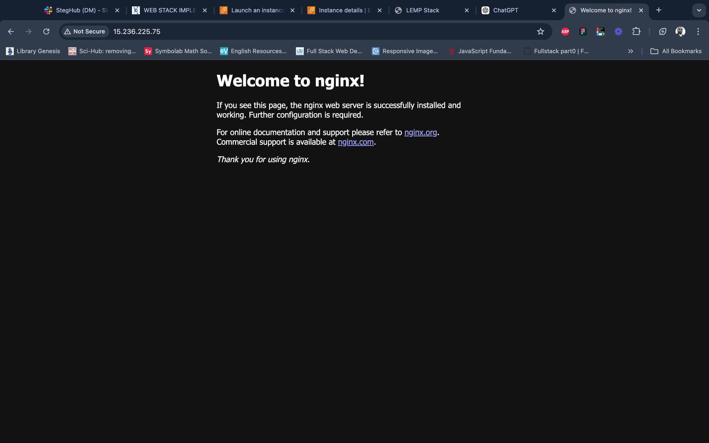
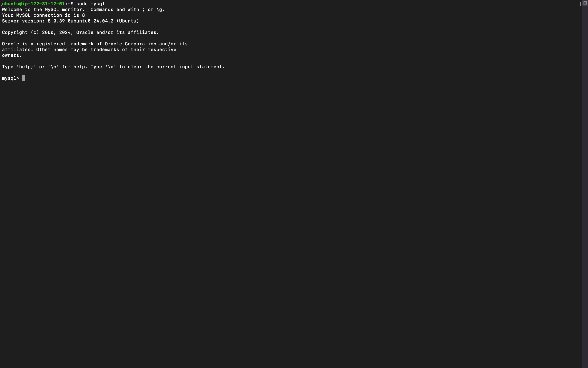
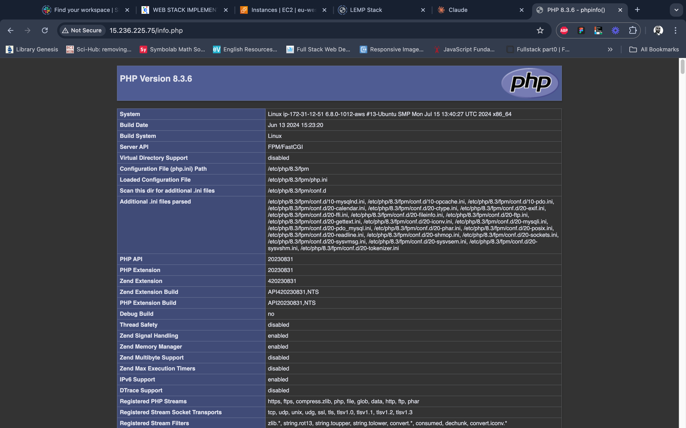

# LEMP Stack Implementation on AWS EC2

This README documents the process of deploying a **LEMP stack** (Linux, Nginx, MySQL, PHP) on an AWS EC2 instance running Ubuntu 24.04 LTS. The LEMP stack is used to serve dynamic web pages and applications and is an alternative to the LAMP stack (where Apache is used instead of Nginx).

---

## Table of Contents
1. [Introduction](#introduction)
2. [Prerequisites](#prerequisites)
3. [Launching an EC2 Instance](#launching-an-ec2-instance)
4. [Installing Nginx](#installing-nginx)
5. [Installing MySQL](#installing-mysql)
6. [Installing PHP](#installing-php)
7. [Configuring Nginx for PHP Processing](#configuring-nginx-for-php-processing)
8. [Setting Up the Database](#setting-up-the-database)
9. [Creating a PHP Application](#creating-a-php-application)
10. [Testing the Application](#testing-the-application)
11. [Conclusion](#conclusion)
12. [References](#references)

---

## Introduction

The **LEMP stack** (Linux, Nginx, MySQL, PHP) is a group of open-source software used to serve dynamic websites and web applications. Nginx, pronounced "Engine-X", is chosen over Apache due to its efficient handling of concurrent connections, especially under heavy load. This guide covers the step-by-step process of deploying LEMP on an AWS EC2 instance.

**Related Project:** [LAMP Stack Implementation](https://github.com/fmanimashaun/Steghub-DevOps-training/tree/main/Webstack_implementation_lamp)

---

## Prerequisites

Before starting, ensure you have the following:
- An **AWS account** and basic knowledge of **EC2**.
- An understanding of SSH to connect to your instance.
- [AWS CLI](https://aws.amazon.com/cli/) or PuTTY installed to connect to your instance (depending on your OS).

---

## Launching an EC2 Instance

### Steps to Launch:
1. Log in to your [AWS Console](https://aws.amazon.com/console/).
2. Navigate to **EC2 Dashboard** and click **Launch Instance**.
3. Choose the Ubuntu 24.04 LTS AMI.
4. Select an instance type (e.g., `t2.micro` for free-tier).
5. Configure the instance, ensuring you allow HTTP (port 80) and SSH (port 22) in your **security group**.
6. Launch the instance and connect using SSH:
   ```bash
   ssh -i "your-key.pem" ubuntu@<your-ec2-public-ip>
   ```

**Video tutorial:** [How to Set Up a LAMP Stack on AWS EC2 with Ubuntu | Step-by-Step Tutorial](https://youtu.be/5K0mHssuN-I)

---

## Installing Nginx

Nginx is the web server used in the LEMP stack.

### Commands to Install Nginx:
```bash
sudo apt update
sudo apt install nginx
sudo systemctl status nginx  # Check Nginx status
```
> If Nginx is running correctly, you will see `active (running)` as the output.

### Test Nginx:
In your browser, navigate to:
```
http://<ec2-instance-public-ip>
```
You should see the Nginx welcome page.



---

## Installing MySQL

MySQL is the database server in the LEMP stack.

### Commands to Install MySQL:
```bash
sudo apt install mysql-server
sudo mysql_secure_installation  # Follow the prompts to secure MySQL
```

### Create a MySQL User and Database:
1. Log in to the MySQL shell:
   ```bash
   sudo mysql
   ```
2. Set a password for the root user:
   ```sql
   ALTER USER 'root'@'localhost' IDENTIFIED WITH mysql_native_password BY 'Password.1';
   ```
3. Create a database and user for your application:
   ```sql
   CREATE DATABASE test_db;
   CREATE USER 'testuser'@'localhost' IDENTIFIED BY 'Password.1';
   GRANT ALL PRIVILEGES ON test_db.* TO 'testuser'@'localhost';
   FLUSH PRIVILEGES;
   EXIT;
   ```

---

## Installing PHP

PHP is the scripting language used to generate dynamic content in web applications.

### Commands to Install PHP:
```bash
sudo apt install php-fpm php-mysql
```
> `php-fpm` is the PHP FastCGI Process Manager, which handles PHP processing for Nginx.

### Test PHP installation

1. Create info.php file in the default website root
```bash
sudo nano /var/www/info.php
```

2. Add the following content:

```php
<?php
phpinfo();
?>
```

In your browser, navigate to:
```
http://<ec2-instance-public-ip>/info.php
```

> Kindly remove the info.php when done as it holds very sensitive information about you web server.




> Note: you need to configure the default nginx conf to point to the php by editing the default configuration.

---

## Configuring Nginx for PHP Processing

By default, Nginx does not handle PHP files. You need to configure it to pass PHP requests to `php-fpm`.

### Create a Directory for the Website:
```bash
sudo mkdir /var/www/projectLEMP
sudo chown -R $USER:$USER /var/www/projectLEMP
```

### Configure Nginx:
1. Create a new configuration file for the site:
   ```bash
   sudo nano /etc/nginx/sites-available/projectLEMP
   ```

2. Add the following content:
   ```nginx
   server {
       listen 80;
       server_name projectLEMP www.projectLEMP;
       root /var/www/projectLEMP;

       index index.html index.php;

       location / {
           try_files $uri $uri/ =404;
       }

       location ~ \.php$ {
           include snippets/fastcgi-php.conf;
           fastcgi_pass unix:/var/run/php/php8.3-fpm.sock;
       }

       location ~ /\.ht {
           deny all;
       }
   }
   ```

3. Enable the configuration:
   ```bash
   sudo ln -s /etc/nginx/sites-available/projectLEMP /etc/nginx/sites-enabled/
   sudo nginx -t  # Test configuration
   ```

4. Disable the default configuration:
   ```bash
   sudo unlink /etc/nginx/sites-enabled/default
   ```

5. Restart Nginx:
   ```bash
   sudo systemctl restart nginx
   ```
6. create an index.php by running the following command:

```bash
PUBLIC_IP=$(curl -s http://169.254.169.254/latest/meta-data/public-ipv4)
echo "Hello LEMP from projectLEMP with public IP $PUBLIC_IP" | sudo tee /var/www/projectLEMP/index.html
```

> "|" is a pipe command that help to pass output of one left command as input to the right command while the "tee" command help to simultaneously write the input into the file and also display in the console
In your browser, navigate to:
```
http://<ec2-instance-public-ip>
```
---

## Setting Up the Database

Create a table in the MySQL database to store tasks for a todo list:

```sql
USE test_db;
CREATE TABLE todo_list (
    item_id INT AUTO_INCREMENT,
    content VARCHAR(255),
    PRIMARY KEY(item_id)
);

INSERT INTO todo_list (content) VALUES ('My first important item');
INSERT INTO todo_list (content) VALUES ('My second important item');
INSERT INTO todo_list (content) VALUES ('My third important item');
```

---

## Creating a PHP Application

Create a simple PHP application to display the contents of the todo list.

### Create a PHP file:
```bash
sudo nano /var/www/projectLEMP/todo_list.php
```

### Add the following PHP code:
```php
<?php
$user = 'testuser';
$password = 'Password.1';
$database = 'test_db';
$table = 'todo_list';

try {
    $db = new PDO('mysql:host=localhost;dbname=' . $database, $user, $password);
    echo '<h2>Todo List</h2><ol>';
    $todo_list = $db->query("SELECT content FROM $table");

    foreach($todo_list as $row) {
        echo '<li>' . $row['content'] . '</li>';
    }

    echo '</ol>';
} catch (PDOException $e) {
    echo 'Error: ' . $e->getMessage() . '<br/>';
    die();
}
?>
```

---

## Testing the Application

Navigate to your EC2 instance's public IP to test the PHP application:
```
http://<ec2-instance-public-ip>/todo_list.php
```

You should see the todo list items displayed.

---

## Conclusion

In this guide, you have successfully implemented the LEMP stack on an AWS EC2 instance running Ubuntu 24.04 LTS. You installed Nginx as the web server, MySQL as the database, and PHP for dynamic content processing. You also created a simple PHP application to interact with your MySQL database.

---

## References
- [Nginx Documentation](https://nginx.org/en/docs/)
- [MySQL Documentation](https://dev.mysql.com/doc/)
- [PHP PDO Documentation](https://www.php.net/manual/en/book.pdo.php)
- [AWS EC2 Documentation](https://docs.aws.amazon.com/ec2/index.html)
- [LEMP vs LAMP Stack](https://www.digitalocean.com/community/tutorials/lemp-vs-lamp-whats-the-difference)
- [Video Tutorial](https://www.youtube.com/watch?v=WTpdTachEmY)
- [Blog Post](https://fmanimashaun.hashnode.dev/deploying-a-lemp-stack-on-aws-ec2-a-step-by-step-guide?t=1726251972790)

---

Happy coding! 🚀
