# DevOps Tooling Website Deployment with CI/CD - Jenkins

## Table of Contents

1. [Introduction](#introduction)
2. [Project Overview](#project-overview)
3. [Architecture](#architecture)
4. [Prerequisites](#prerequisites)
5. [Self-Study: Understanding CI/CD](#self-study-understanding-cicd)
6. [Implementation Steps](#implementation-steps)
   - [Step 1: Set Up Jenkins Server](#step-1-set-up-jenkins-server)
   - [Step 2: Configure Jenkins for CI/CD](#step-2-configure-jenkins-for-cicd)
   - [Step 3: Integrate GitHub with Jenkins with Webhook](#step-3-integrate-github-with-jenkins-with-webhook)
7. [Testing and Validation](#testing-and-validation)
8. [Troubleshooting](#troubleshooting)
9. [Conclusion](#conclusion)
10. [Future Improvements](#future-improvements)
11. [References](#references)

## Introduction

This project builds upon two previous projects:
1. [DevOps Tooling Website Solution](https://github.com/fmanimashaun/Steghub-DevOps-training/blob/main/DevOps_tooling_website_solution)
2. [Load Balancer Solution with Apache](https://github.com/fmanimashaun/Steghub-DevOps-training/blob/main/Load_balancer_solution_with_apache)

We're extending these solutions by introducing Continuous Integration/Continuous Deployment (CI/CD) using Jenkins. The goal is to create a more automated deployment process for our DevOps tooling website.

### Project Purpose

The implementation of CI/CD in this project ensures continuous delivery of changes to the DevOps tooling website with minimal manual intervention. This setup automates build, test, and deployment processes, which reduces errors, improves development speed, and ensures that each release is reliable and deployable.

## Project Overview

We're enhancing our existing infrastructure by:

1. Utilizing the web, database, and NFS server setup from the [DevOps Tooling Website Solution](https://github.com/fmanimashaun/Steghub-DevOps-training/blob/main/DevOps_tooling_website_solution) project.
2. Leveraging the load balancer implemented in the [Load Balancer Solution with Apache](https://github.com/fmanimashaun/Steghub-DevOps-training/blob/main/Load_balancer_solution_with_apache) project.
3. Setting up a Jenkins server for automated building and deployment of our application.
4. Integrating our GitHub repository with Jenkins for continuous integration.

This setup will streamline our development and deployment processes, providing a robust infrastructure for our DevOps tooling website.

## Architecture

Our updated architecture includes the following components:

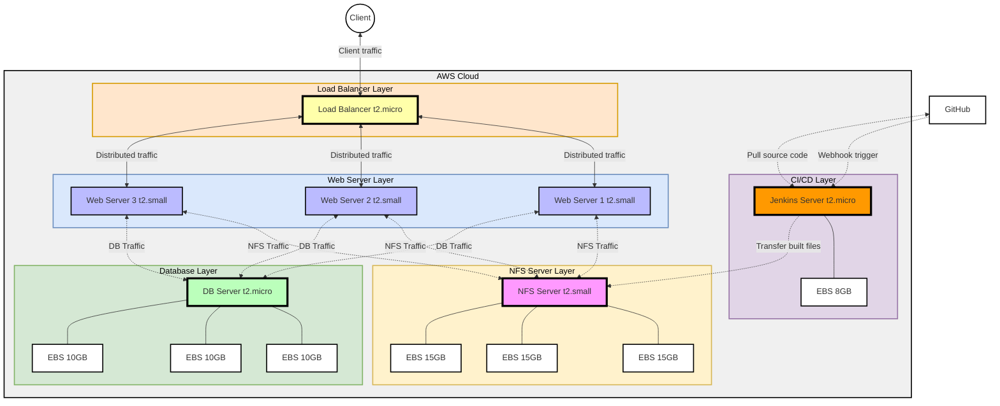

This architecture consists of:
- A load balancer layer for traffic distribution.
- Three web servers connected to an NFS server and a database server.
- A CI/CD layer using Jenkins to automate build and deployment.
- GitHub repository integration to trigger builds via webhook.

## Prerequisites

Before starting this project, ensure you have:

1. Completed the setup described in the [DevOps Tooling Website Solution](https://github.com/fmanimashaun/Steghub-DevOps-training/blob/main/DevOps_tooling_website_solution), including:
   - NFS Server
   - Database Server
   - Three Web Servers
2. Implemented the load balancer as described in the [Load Balancer Solution with Apache](https://github.com/fmanimashaun/Steghub-DevOps-training/blob/main/Load_balancer_solution_with_apache) project.
3. Basic understanding of Linux systems and the command line.
4. Familiarity with Jenkins.
5. Access to an AWS account.
6. A GitHub account and a repository for your project.

## Self-Study: Understanding CI/CD

During my self-study on Continuous Integration and Continuous Delivery/Deployment (CI/CD), I gained insights into their crucial role in modern software development. Here are the key points:

1. **Continuous Integration (CI)**:
   - Developers frequently integrate code changes into a shared repository.
   - Automated builds and tests run on each integration.
   - Purpose: Detect and fix integration issues early.

2. **Continuous Delivery (CD)**:
   - Automatically prepare code for release after passing CI.
   - Deploy to a staging environment for final testing.
   - Requires manual approval for production deployment.

3. **Continuous Deployment (CD)**:
   - Extends Continuous Delivery by automatically deploying to production.
   - No manual intervention if all tests pass.

4. **Key Benefits of CI/CD**:
   - Faster time to market
   - Improved code quality and stability
   - Increased team productivity
   - Better response to customer feedback

5. **Essential Practices**:
   - Frequent code commits
   - Comprehensive automated testing
   - Consistent environments across development, testing, and production
   - Automated build and deployment processes

This study has highlighted how CI/CD practices are fundamental to efficient, high-quality software development and delivery in today's fast-paced tech environment.

## Implementation Steps

### Step 1: Set Up Jenkins Server

1. Provision an EC2 instance for Jenkins (t2.micro, Ubuntu 24.04 LTS).
2. Configure security groups to allow necessary traffic (SSH on port 22, HTTP on port 8080).

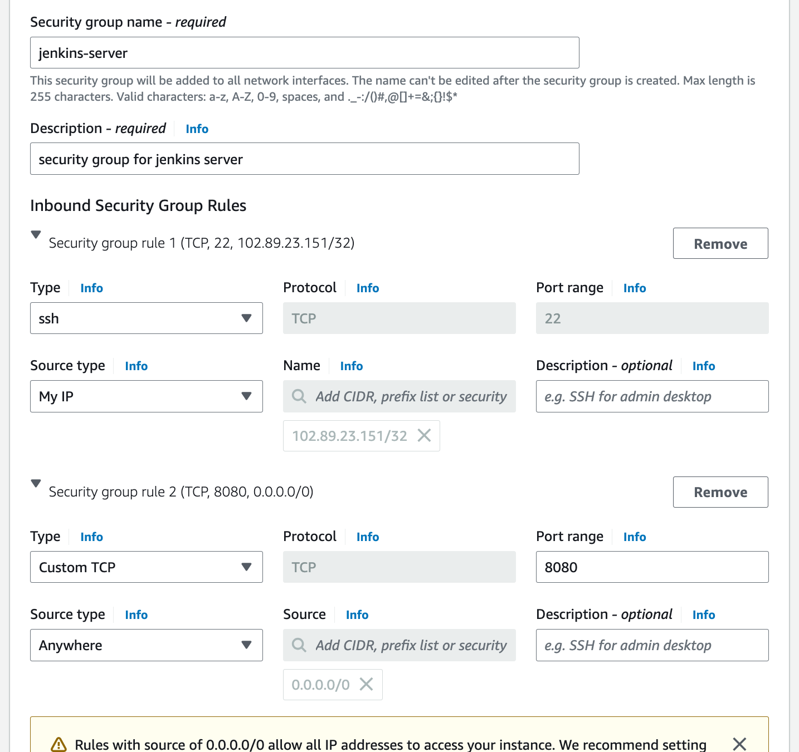

### Step 2: Configure Jenkins for CI/CD

1. Update the system and install the default JDK:

   ```bash
   sudo apt update
   sudo apt install default-jdk-headless
   ```

2. Install Jenkins using the official Jenkins repository:

   ```bash
   sudo wget -O /usr/share/keyrings/jenkins-keyring.asc \
     https://pkg.jenkins.io/debian/jenkins.io-2023.key
   echo "deb [signed-by=/usr/share/keyrings/jenkins-keyring.asc]" \
     https://pkg.jenkins.io/debian binary/ | sudo tee \
     /etc/apt/sources.list.d/jenkins.list > /dev/null
   ```

   ```bash
   sudo apt-get update
   sudo apt-get install jenkins
   ```

3. Start Jenkins and enable it to run on boot:

   ```bash
   sudo systemctl start jenkins
   sudo systemctl enable jenkins
   ```

4. Check the status of Jenkins to ensure it's running:

   ```bash
   sudo systemctl status jenkins
   ```

5. Access Jenkins through your browser by navigating to `http://<your-server-ip>:8080` and complete the initial setup.

6. During the initial setup, you'll be asked for the initial admin password. You can retrieve it with:

   ```bash
   sudo cat /var/lib/jenkins/secrets/initialAdminPassword
   ```

7. Follow the on-screen instructions to complete the installation, including installing recommended plugins and creating the first admin user.

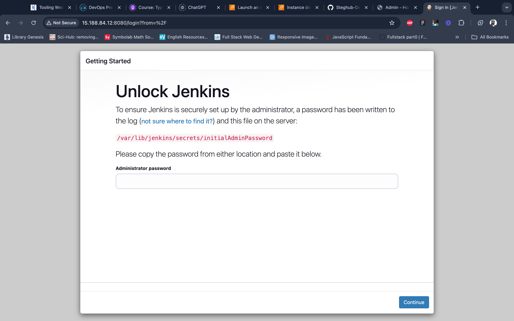


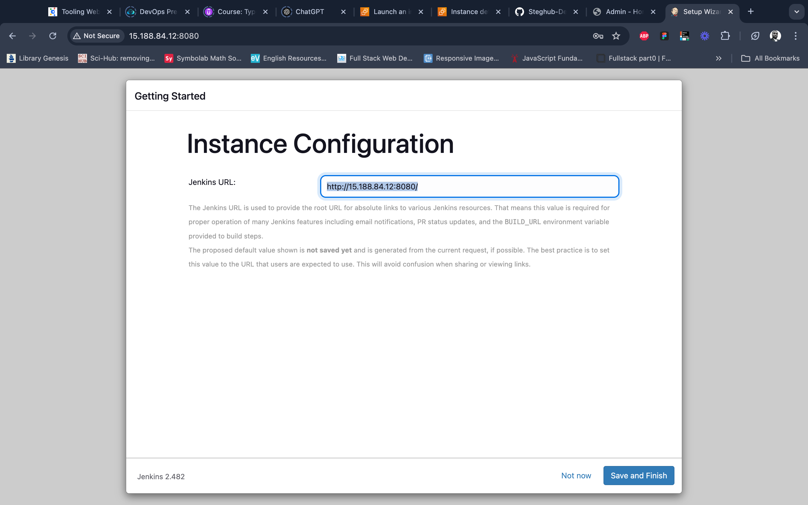
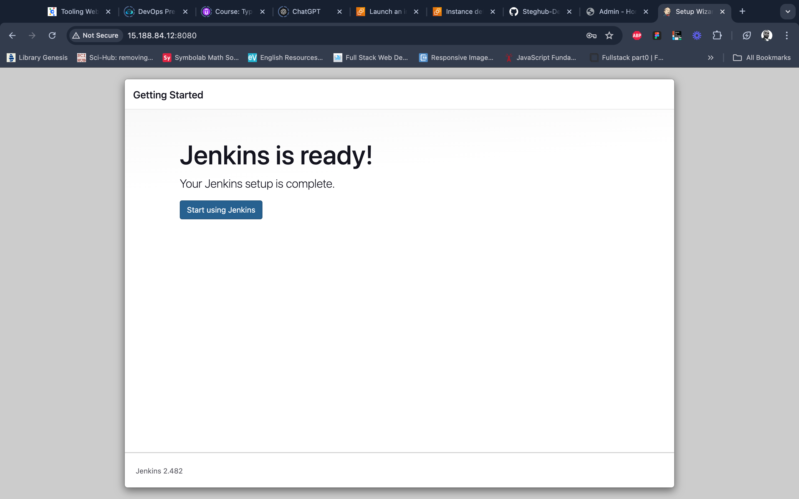

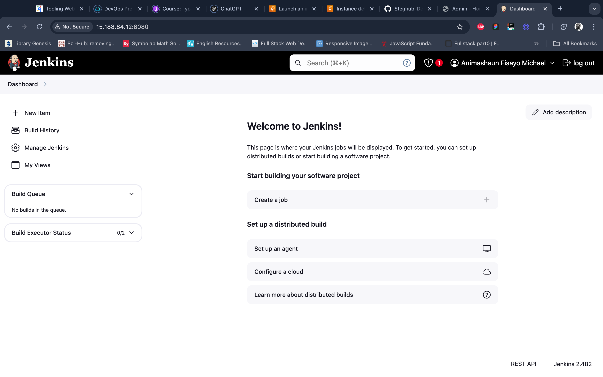

### Step 3: Integrate GitHub with Jenkins with Webhook

1. Add a Webhook in GitHub

   - Open the GitHub repository for your project: [https://github.com/fmanimashaun/tooling](https://github.com/fmanimashaun/tooling).
   - Go to **Settings** > **Webhooks**.
   - Click **Add webhook** and configure it as follows:
     - **Payload URL**: Enter your Jenkins webhook URL:
       
       ```
       http://15.188.84.12:8080/github-webhook/
       ```

     - **Content type**: Select `application/json`.
     - **Which events would you like to trigger this webhook?**: Choose **Just the push event**.
   - Click **Add webhook** to save.

This webhook will notify Jenkins of any push events in the GitHub repository, triggering an automated build.

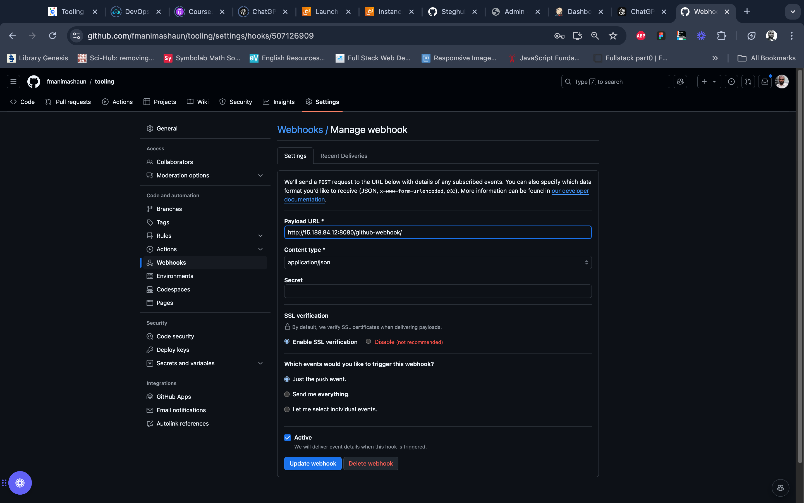

2. Create a New Jenkins Job

   - Go to your Jenkins Dashboard at `http://15.188.84.12:8080/`.
   - Click **New Item**.
   - Name the job `tooling_github`, select **Freestyle project**, and click **OK**.

   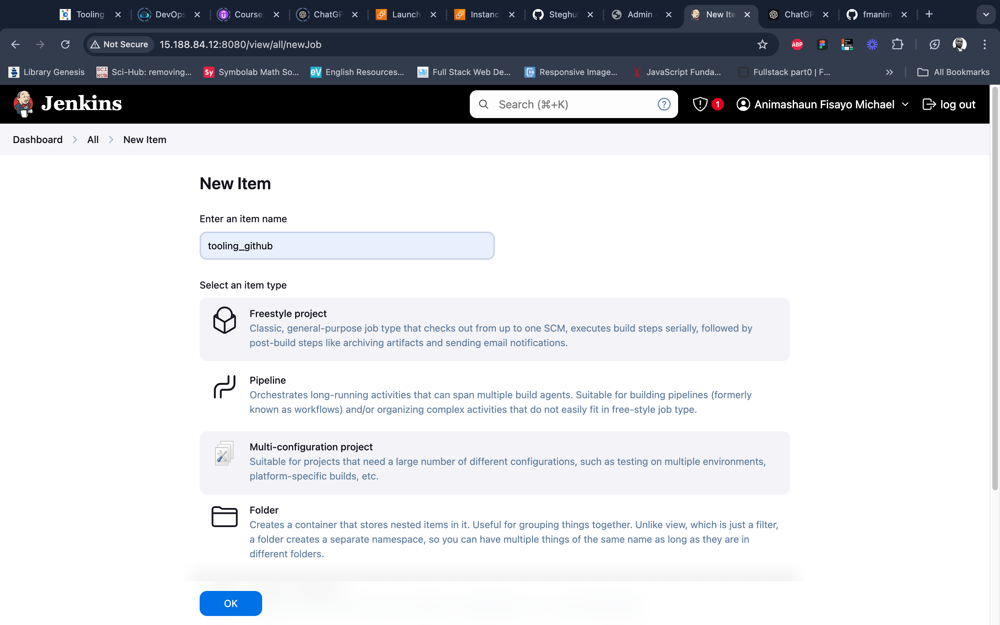

3. Configure Source Code Management

   - In the job configuration page, scroll to the **Source Code Management** section.
   - Select **Git** and enter the GitHub repository URL:

     ```
     https://github.com/fmanimashaun/tooling.git
     ```

   - In the **Credentials** dropdown, add your GitHub credentials (username and password or a personal access token)
   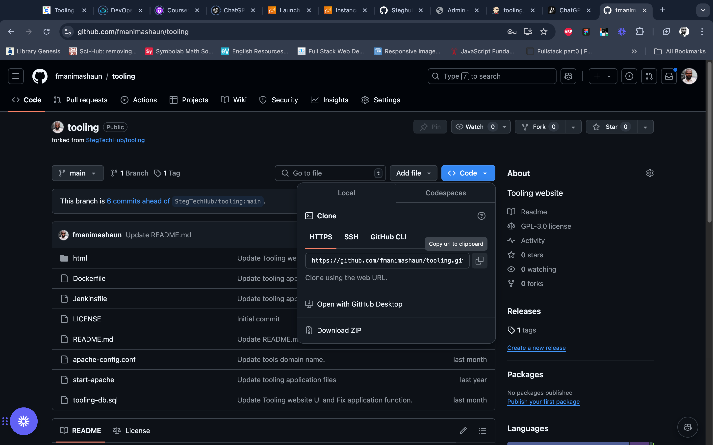
   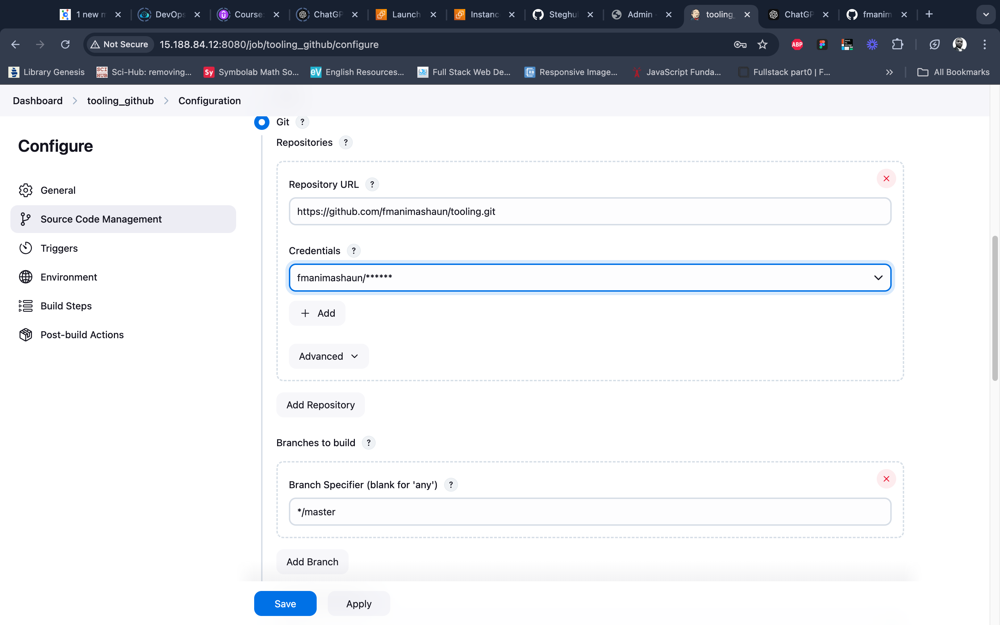

   - save and then test the configuration by clicking **build now** in job page
   

4. Configure Build Trigger

   - In the job page, click on **configure** 
   - Scroll down to the **Build Triggers** section.
   - Select **GitHub hook trigger for GITScm polling**. This will ensure Jenkins triggers a build every time a change is pushed to GitHub.
   - Scroll to the **Post-build Actions** section.
   - Click **Add post-build action** and select **Archive the artifacts**.
   - In the **Files to archive** field, enter `**`, which will archive all files generated during the build.
   - Click **Save** to finalize the configuration.
   - To test the setup, push a change to the GitHub repository, which should trigger an automatic build in Jenkins.
   - Check the **Build History** in Jenkins to confirm that the build triggered correctly. You should also see the archived files in the build’s **Artifacts** section.

   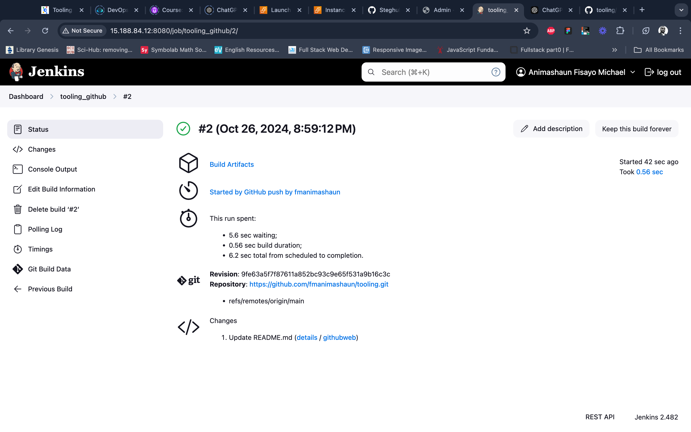

### Step 4: Configure Jenkins to copy build files to NFS server vis SSH

1. Install the "Publish over SSH" Plugin

   - From the Jenkins Dashboard, go to **Manage Jenkins**.
   - Select **Manage Plugins**.
   - Go to the **Available plugins** tab.
   - Search for **Publish over SSH** and install it by clicking **Install without restart**.
   - Once installed, restart Jenkins to apply the plugin.

2. Configure SSH Connection to the NFS Server

   - From the Jenkins Dashboard, go to **Manage Jenkins** > **Configure System**.
   - Scroll down to the **Publish over SSH** section.
   - Click **Add** under the SSH Servers to add the NFS server configuration.

   Enter the following details about the NFS server:

   - **Name**: Enter an identifiable name (e.g., "NFS server").
   - **Hostname**: Enter the private IP of the NFS server: `172.31.10.195`.
   - **Username**: Enter the SSH username for the NFS server (typically `ec2-user`).
   - **Remote Directory**: Enter the target directory on the NFS server where files will be copied (e.g., `/mnt/apps`).
   - **SSH Key**: Paste the content of the Jenkins server’s private SSH key.

   > **Note**: Ensure the NFS server's `~/.ssh/authorized_keys` file includes the public key matching this SSH private key.

   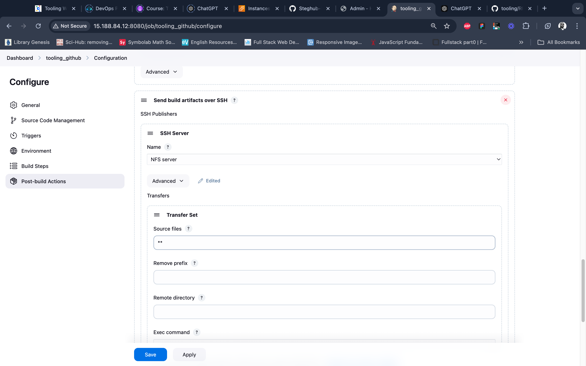

3. Update NFS Server Security Group for SSH Access

   - In the AWS Management Console, go to **EC2** > **Security Groups**.
   - Locate and edit the security group associated with the NFS server.
   - Add an inbound rule to allow SSH access (port 22) from the Jenkins server’s private IP.
   - Save the changes.

4. Test the SSH Configuration

   - Click **Test Configuration** to verify the SSH connection to the NFS server.
   - If successful, Jenkins has established an SSH connection with the NFS server.

5. Save Configuration

   - In Jenkins, scroll down and click **Save**.

6. Test the Configuration with a GitHub Commit

   - Make a change to any file in your GitHub repository (`https://github.com/fmanimashaun/tooling`) and push the update.
   - Check the **Build History** in Jenkins to verify that the webhook triggered a new build.
   - If the build completes successfully, Jenkins should copy the build files to the `/mnt/apps` directory on the NFS server.

7. Troubleshoot File Permissions on the NFS Server (if Build Fails)

   - If the build fails to copy files, check the ownership and permissions of the `/mnt/apps` directory on the NFS server.
   - On the NFS server, verify the current permissions. If the ownership is not `nobody:nobody` and permissions are not `777`, run the following commands to correct them:

     ```bash
     sudo chown -R nobody: /mnt/apps
     sudo chmod -R 777 /mnt/apps
     ```

   - After updating permissions, go back to Jenkins, open your project, and click **Build Now** to trigger the build again.
   - If configured correctly, the build should complete, and the files should be accessible on the NFS server.

8. Address Database Configuration Issues

   - Check if the web server is functioning via the load balancer after a successful build.
   - If the web server fails due to overwritten database connection details in `function.php`, update the configuration in your GitHub repository with the correct database connection details.
   - Jenkins will detect this change, trigger a new build, and deploy the updated file to the NFS server.

## Testing and Validation

1. Access your DevOps tooling website through the load balancer's public IP.
2. Make changes to your GitHub repository and ensure that Jenkins automatically builds and deploys the changes.
3. Verify that all web servers are serving the updated content from the NFS server after a Jenkins build.

## Troubleshooting

- **Jenkins Webhook Issues**: Ensure the webhook is properly configured in GitHub with the correct URL and permissions.
- **File Syncing with NFS**: Verify that NFS mounts are correct on each web server.
- **Security Group Configurations**: Ensure necessary ports are open for connectivity between Jenkins, NFS, and web servers.
- **Build Failures**: Check Jenkins logs and review build configurations if builds do not trigger as expected.

## Conclusion

This project has successfully extended our DevOps Tooling Website Solution and Load Balancer Solution with a CI/CD pipeline using Jenkins. This improvement increases the efficiency of our application deployment process, providing a more automated infrastructure for our DevOps tooling website.

## Future Improvements

- Implement **automated testing** in the CI/CD pipeline (e.g., JUnit for unit tests, Selenium for integration tests).
- Set up **monitoring and alerting** for the entire infrastructure, including Jenkins, using tools like Prometheus or Grafana.
- Explore **containerization** (e.g., Docker) for easier deployment and scaling.
- Implement a **blue-green deployment** strategy for zero-downtime updates.

## References

- [DevOps Tooling Website Solution](https://github.com/fmanimashaun/Steghub-DevOps-training/blob/main/DevOps_tooling_website_solution)
- [Load Balancer Solution with Apache](https://github.com/fmanimashaun/Steghub-DevOps-training/blob/main/Load_balancer_solution_with_apache)
- [Jenkins Documentation](https://www.jenkins.io/doc/)
- [AWS Documentation](https://docs.aws.amazon.com/)
- [GitHub Webhooks](https://docs.github.com/en/developers/webhooks-and-events/webhooks/about-webhooks)
- [Youtube Tutorial](https://youtu.be/jkOIwwBbG3g)
