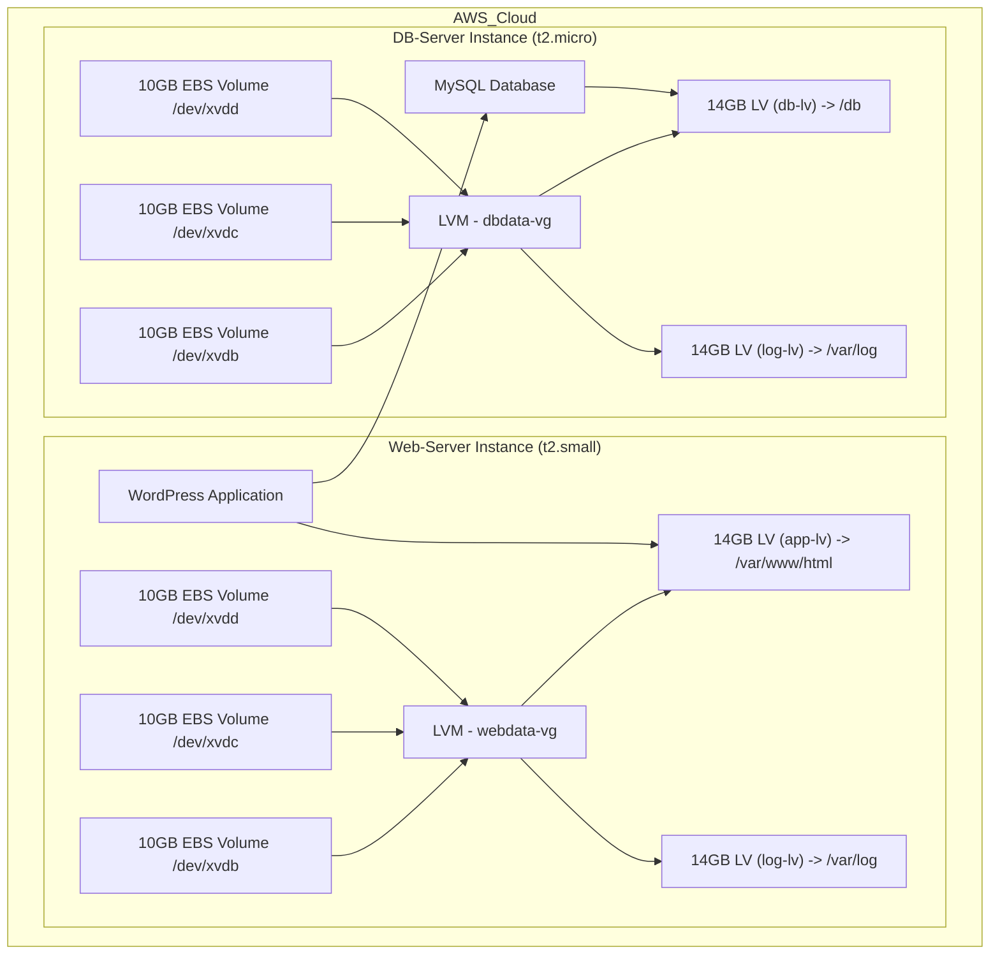

# Project: Web Solution Implementation Using WordPress on AWS EC2


## Table of Contents

1. [Introduction](#introduction)
2. [Prerequisites](#prerequisites)
3. [Architecture Overview](#architecture-overview)
4. [Setting Up AWS EC2 Instances](#setting-up-aws-ec2-instances)
5. [Configuring EBS and Logical Volume Manager (LVM)](#configuring-ebs-and-logical-volume-manager-lvm)
   - [EBS Setup](#ebs-setup)
   - [LVM Configuration](#lvm-configuration)
6. [AWS Security Group Configuration](#aws-security-group-configuration)
7. [Installing Apache, PHP 8.3, and PHP Extensions on RHEL 9.4](#installing-apache-php-83-and-php-extensions-on-rhel-94)
   - [Step 1: Verify RHEL Version](#step-1-verify-rhel-version)
   - [Step 2: Install Apache (httpd)](#step-2-install-apache-httpd)
   - [Step 3: Enable Necessary Repositories](#step-3-enable-necessary-repositories)
   - [Step 4: Install PHP 8.3 and Extensions](#step-4-install-php-83-and-extensions)
   - [Step 5: Configure SELinux (Security-Enhanced Linux)](#step-5-configure-selinux-security-enhanced-linux)
   - [Step 6: Verify PHP Installation](#step-6-verify-php-installation)
   - [Step 7: Test PHP Functionality](#step-7-test-php-functionality)
8. [WordPress Installation](#wordpress-installation)
9. [Final Steps and Reflections](#final-steps-and-reflections)


## Introduction

This project involves setting up **WordPress** on an **EC2** instance running **Red Hat Enterprise Linux (RHEL) 9.4** with 3 **EBS volumes** (each 10GB) attached to two separate instances: 
- **web-server**: Responsible for running the WordPress application.
- **db-server**: Running **MySQL** database.

The web-server will be a **t2.small** instance type, while the db-server can be a **t2.micro** instance. 

## Prerequisites

Before starting, I ensured:
- Two AWS EC2 instances (for WordPress and MySQL) running Red Hat Enterprise Linux 9.4.
- Familiarity with basic AWS EC2 and LVM concepts.
- SSH access to both instances.
- Minimum instance size: t2.small for the web-server instance (to avoid issues with package installations).

## Architecture Overview

**Web-Server Instance:**
- **Instance Type**: t2.small
- **3 EBS Volumes**: 10GB each (`/dev/xvdb`, `/dev/xvdc`, `/dev/xvdd`)

**DB-Server Instance:**
- **Instance Type**: t2.micro
- **3 EBS Volumes**: 10GB each (`/dev/xvdb`, `/dev/xvdc`, `/dev/xvdd`)

> Each server will use **Logical Volume Manager (LVM)** to dynamically manage the attached EBS volumes for application data and logs.
> Make sure the EBS volume blocks are created in the same availability zone as the instance they will be attached to.



> **Insight:** Using LVM allows dynamic scaling and better management of storage volumes without downtime.

## Setting Up AWS EC2 Instances

1. **Launch EC2 Instances**:
   - Created two EC2 instances running Red Hat Enterprise Linux 9.4 for WordPress and MySQL, ensuring instance size t2.small or larger.
   
2. **Attach EBS Volumes**:
   - Added three EBS volumes to each instance for managing application data and logs. 

## Configuring EBS and Logical Volume Manager (LVM)

### EBS Setup

1. **Attach EBS Volumes**:
   - I attached three EBS volumes (each 20GB) to both the WordPress and MySQL instances via the AWS Management Console.

2. **Check Volume Visibility**:
   After SSH'ing into the instances, I listed the attached block devices using:

   ```bash
   lsblk
   ```

   The new volumes appeared as `/dev/nvme1n1`, `/dev/nvme2n1`, and `/dev/nvme3n1`.

### LVM Configuration

1. **Install LVM Tools**:
   Since Red Hat Enterprise Linux 9.4 was being used, I ensured LVM was installed:

   ```bash
   sudo yum install lvm2
   ```

2. **Create Physical Volumes**:
   I converted the three attached EBS volumes into physical volumes (PVs):

   ```bash
   sudo pvcreate /dev/nvme1n1 /dev/nvme2n1 /dev/nvme3n1
   ```

3. **Create Volume Group**:
   Next, I created a volume group (VG) to aggregate the PVs:

   ```bash
   sudo vgcreate vg_wpdata /dev/nvme1n1 /dev/nvme2n1 /dev/nvme3n1
   ```

4. **Create Logical Volumes**:
   I created logical volumes (LVs) for storing WordPress data and logs. Here's how I did it:

   ```bash
   sudo lvcreate -L 50G -n lv_wpdata vg_wpdata
   sudo lvcreate -L 10G -n lv_wplogs vg_wpdata
   ```

5. **Format and Mount Volumes**:
   I formatted the new logical volumes and mounted them for use:

   ```bash
   sudo mkfs.ext4 /dev/vg_wpdata/lv_wpdata
   sudo mkfs.ext4 /dev/vg_wpdata/lv_wplogs
   ```

   Then mounted them:

   ```bash
   sudo mkdir /mnt/wpdata /mnt/wplogs
   sudo mount /dev/vg_wpdata/lv_wpdata /mnt/wpdata
   sudo mount /dev/vg_wpdata/lv_wplogs /mnt/wplogs
   ```

6. **Persistent Mounts**:
   To ensure the volumes are automatically mounted at boot, I updated `/etc/fstab`:

   ```bash
   echo '/dev/vg_wpdata/lv_wpdata /mnt/wpdata ext4 defaults 0 0' | sudo tee -a /etc/fstab
   echo '/dev/vg_wpdata/lv_wplogs /mnt/wplogs ext4 defaults 0 0' | sudo tee -a /etc/fstab
   ```

> **Insight:** Configuring LVM provided flexibility to scale storage without downtime. For WordPress, separate volumes for data and logs made it easier to manage and monitor disk usage.

## AWS Security Group Configuration

Security groups were configured to control access between the WordPress and MySQL instances.

1. **MySQL Security Group**:
   - Allowed traffic on port 3306 from the private IP of the WordPress instance for database communication.

2. **WordPress Security Group**:
   - Opened HTTP (port 80) for public access.
   - Opened SSH (port 22) for administrative access.

## Installing Apache, PHP 8.3, and PHP Extensions on RHEL 9.4

### Step 1: Verify RHEL Version

Before starting, ensure you are running **RHEL 9.4**. This can be done with the following command:

```bash
cat /etc/redhat-release
```

Expected output:
```
Red Hat Enterprise Linux release 9.4 (Plow)
```

### Step 2: Install Apache (httpd)

WordPress requires a web server to handle HTTP requests, and **Apache** is the most commonly used web server for WordPress installations. 

1. Install **Apache** using the `dnf` package manager:
   ```bash
   sudo dnf install httpd
   ```

2. Start and enable Apache to ensure it runs on boot:
   ```bash
   sudo systemctl start httpd
   sudo systemctl enable httpd
   ```

3. Check that Apache is running:
   ```bash
   sudo systemctl status httpd
   ```


### Step 3: Enable Necessary Repositories

To install the latest PHP version, we need to enable additional repositories, which are not enabled by default on **RHEL 9**.

> you can see detailed decommentation from [Remi's site](https://rpms.remirepo.net/wizard/)

#### Install the EPEL Repository

**EPEL (Extra Packages for Enterprise Linux)** is a repository that contains additional software packages that are not provided in the default RHEL repository but are often needed for full functionality.

```bash
sudo dnf install https://dl.fedoraproject.org/pub/epel/epel-release-latest-9.noarch.rpm
```

#### Install the Remi Repository

**Remi’s repository** is required to install **PHP 8.3**, as RHEL’s default repositories only provide PHP versions up to 8.2.

```bash
sudo dnf install https://rpms.remirepo.net/enterprise/remi-release-9.rpm
```

### Step 4: Install PHP 8.3 and Extensions

1. enable the module stream for **PHP 8.3**:
   ```bash
   sudo dnf module switch-to php:remi-8.3
   ```
2. install the module stream for **PHP 8.3** with default extension:
   ```bash
   sudo dnf module install php:remi-8.3
   ```

3. Install **PHP 8.3** and the necessary extensions for WordPress:
   ```bash
   sudo dnf install php php-opcache php-gd php-curl php-mysqlnd php-xml php-json php-mbstring php-intl php-soap php-zip
   ```

#### Explanation of Key PHP Extensions:

- **php-opcache**: Boosts performance by storing precompiled script bytecode in memory.
- **php-gd**: Provides image manipulation capabilities (needed for image uploads and manipulation in WordPress).
- **php-curl**: Allows external HTTP requests, used by WordPress to connect to other websites (e.g., for API calls).
- **php-mysqlnd**: Native MySQL driver for connecting WordPress to the database.
- **php-xml**: Handles XML parsing and writing.
- **php-json**: Allows WordPress to handle JSON data (used heavily in REST APIs).
- **php-mbstring**: Helps in handling multi-byte strings (essential for supporting various languages).
- **php-intl**: Adds support for internationalization features.
- **php-soap**: Adds SOAP protocol support.
- **php-zip**: Required for managing ZIP files (used for plugin/theme uploads and updates).


4. Start and enable **PHP-FPM**:
   ```bash
   sudo systemctl start php-fpm
   sudo systemctl enable php-fpm
   ```

5. Restart Apache to apply the changes:
   ```bash
   sudo systemctl restart httpd
   ```


### Step 5: Configure SELinux (Security-Enhanced Linux)

#### Why SELinux?

**SELinux** is a security module that enforces strict access control policies on your system, especially important for enterprise environments like Red Hat. It helps limit the damage that could be caused by compromised services, including the web server and PHP. By default, **SELinux** is set to **enforcing** mode on **RHEL**. This mode restricts many actions that Apache and PHP-FPM might need to function correctly.

#### Check SELinux Status

Verify that SELinux is enabled and in **enforcing** mode:
```bash
sestatus
```

Expected output:
```
SELinux status:                 enabled
Current mode:                   enforcing
```

#### Configure SELinux for PHP and Apache

To allow **Apache** and **PHP-FPM** to run without issues, you need to allow specific actions that would otherwise be restricted by SELinux.

1. Allow **Apache** to execute memory operations (needed by PHP’s OpCache):
   ```bash
   sudo setsebool -P httpd_execmem 1
   ```

2. Allow **Apache** to make network connections (required for external HTTP requests, for example, for connecting to APIs or downloading plugins/themes):
   ```bash
   sudo setsebool -P httpd_can_network_connect 1
   ```


### Step 6: Verify PHP Installation

After installation, check that PHP 8.3 is correctly installed and running.

1. Check the **PHP version**:
   ```bash
   php --version
   ```

   You should see output similar to:
   ```
   PHP 8.3.12 (cli) (built: Sep 26 2024 02:19:56) ( NTS )
   ```

2. List the installed **PHP modules**:
   ```bash
   php -m
   ```

   Ensure all necessary extensions for WordPress (like `curl`, `gd`, `mbstring`, etc.) are listed.


### Step 7: Test PHP Functionality

Create a **PHP info page** to verify that PHP is correctly served through Apache:

1. Create a test PHP file:
   ```bash
   sudo nano /var/www/html/info.php
   ```

2. Add the following code:
   ```php
   <?php
   phpinfo();
   ?>
   ```

3. Access this file via your web browser:
   ```bash
   http://your-server-ip/info.php
   ```

   If everything is configured correctly, a page displaying detailed PHP information should appear. kindly delete the info.php once testing is done.


## Wordpress Installation

1. Install the wget package
   ```bash
   sudo dnf install wget
   ```

2. Download the latest version of **WordPress**:
   ```bash
   sudo wget https://wordpress.org/latest.tar.gz
   ```

3. Extract the WordPress archive:
   ```bash
   sudo tar -xzvf latest.tar.gz
   ```

4. Move WordPress folder to your **Apache web root**:
   ```bash
   sudo mv wordpress/ /var/www/html/
   ```

5. Set the correct permissions for the **Apache** user:
   ```bash
   sudo chown -R apache:apache /var/www/html/wordpress
   sudo chmod -R 755 /var/www/html/wordpress
   sudo chcon -t httpd_sys_rw_content_t  /var/www/html/wordpress -R
   ```

6. Restart Apache to apply the changes:
   ```bash
   sudo systemctl restart httpd
   ```
7. accessing `http://instance-public-ip/wordpress` from your browser to see the wordpress installation
 

## Final Steps and Reflections

At this point, the infrastructure was set up with WordPress and MySQL on separate EC2 instances, using EBS volumes managed by LVM for flexible storage. Next steps would involve completing the WordPress and MySQL configuration, but those details are beyond the scope of this guide.

### Reflections
- **LVM**: Extremely helpful in dynamic storage management without needing to detach and re-attach EBS volumes.
- **Instance Types**: Using at least t2.small EC2 instances prevented resource limitations during installations.
