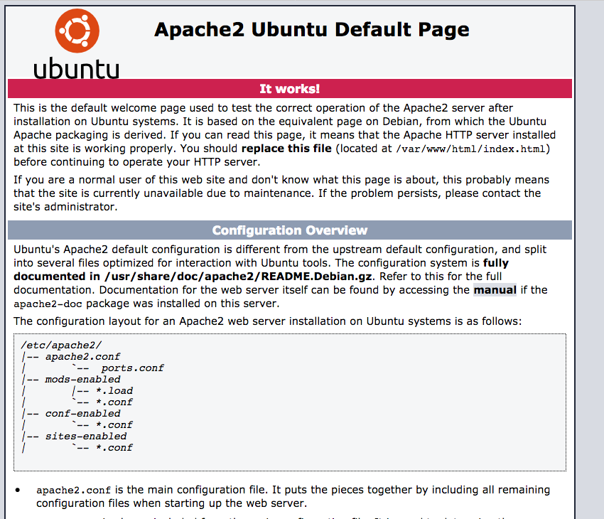

# WEB STACK IMPLEMENTATION (LAMP) in AWS

For this project-based learning task,  I deployed a LAMP stack on an AWS EC2 instance. The LAMP stack consists of Linux, Apache, MySQL, and PHP. I used an Ubuntu 22 server for Linux, Apache for the web server, MySQL for the database, and PHP for the server-side scripting language. I also configured the Apache web server with virtual hosts.

Skills: `scripting`, `Foundations of DevOps`

## Learning Outcomes

- [x] I explored the basics of the Software Development Life Cycle(SDLC)
- [x] I learned to set up my AWS console for managing cloud resources
- [x] I learned to create an EC2 instance on AWS and connect to it using SSH
- [x] I learned about Web Server Technology Stacks
- [x] I learned How to install Apache, MySQL, and PHP on an EC2 instance
- [x] I learned to configure the Apache web server with virtual hosts

## Tasks

### Software Development Life Cycle(SDLC) Side Self-study

I did a self-study on the Software Development Life Cycle(SDLC) to understand the different phases of the SDLC and how DevOps practices can be integrated into the SDLC. I took a few notes on the SDLC and DevOps practices. [link to notes](https://docs.google.com/document/d/1DenkrVLdUXVcRnKIlTI6yVVglpX3bBFlwXb-BC_X62Q/edit) 

### 101 Environment Setup

I did the basic environment setup to work as a DevOps engineer in training.

- I set up my VS Code environment for coding and writing markdown files.
- I created an AWS account and set up my AWS console for managing cloud resources.
- I created an EC2 instance on AWS and connected to it using SSH.

#### My AWS EC2 instance after connecting to it using SSH


### 102 Installing Apache and Updating Firewall Rules

After learning about Web servers and how they work, I chose Apache as my web server for the LAMP stack implementation. I chose Apache because of the community support and the ease of use. I installed Apache on my EC2 instance and updated the firewall rules to allow HTTP and HTTPS traffic.

#### My Apache2 webserver Status after installation


#### The default Apache webpage



### 103 Installing MySQL

After Apache2 web server installation, it was time to install database management software to store data for the web application that will be served on the LAMP stack. I settled on MySQL since it's the appropriate DBMS for a **LAMP** stack implementation. I installed MySQL on my EC2 instance and secured it by running the `mysql_secure_installation` script. The script removed some default settings that made the MySQL installation less secure. I also set a secured password for the root user.

#### MySQL Installation Status


To continue the implementation of the LAMP stack, I will install PHP and configure the Apache web server with virtual hosts.

### 104 Installing PHP

At this point, I had installed Apache and MySQL on my EC2 instance. The next step was to install PHP, the server-side scripting language that will process the code and generate dynamic content for the web application. I installed PHP on my EC2 instance and tested the PHP installation by creating a PHP file in the Apache root directory.

#### PHP Installation Status


The lamp stack checklist is now complete:

- [x] **L**inux (Ubuntu 24) - Installed on AWS EC2 instance
- [x] **A**pache - Installed on EC2 instance
- [x] **M**ySQL - Installed on EC2 instance
- [x] **P**HP - Installed on EC2 instance

To complete the LAMP stack implementation, I needed to configure an Apache Virtual Host to serve multiple websites on the same server.
The default page we saw earlier during the apache2 installation was served using the default and only virtual host on the server. I will create a new virtual host to serve a different website. the default page was served from `/var/www/html/` directory.

The apache2 server was configured by default to look for the index.html file in the `/var/www/html/` directory to serve the default page.
let's take a look at the default configuration file for the default virtual host.

```bash
cat /etc/apache2/sites-available/000-default.conf
```

```bash
<VirtualHost *:80>
    # The ServerName directive sets the request scheme, hostname and port that
    # the server uses to identify itself. This is used when creating
    # redirection URLs. In the context of virtual hosts, the ServerName
    # specifies what hostname must appear in the request's Host: header to
    # match this virtual host. For the default virtual host (this file) this
    # value is not decisive as it is used as a last resort host regardless.
    # However, you must set it for any further virtual host explicitly.
    #ServerName www.example.com
    ServerAdmin webmaster@localhost
    DocumentRoot /var/www/html
    # Available loglevels: trace8, ..., trace1, debug, info, notice, warn,
    # error, crit, alert, emerg.
    # It is also possible to configure the loglevel for particular
    # modules, e.g.
    #LogLevel info ssl:warn
    ErrorLog ${APACHE_LOG_DIR}/error.log
    CustomLog ${APACHE_LOG_DIR}/access.log combined
    # For most configuration files from conf-available/, which are
    # enabled or disabled at a global level, it is possible to
    # include a line for only one particular virtual host. For example the
    # following line enables the CGI configuration for this host only
    # after it has been globally disabled with "a2disconf".
    #Include conf-available/serve-cgi-bin.conf
</VirtualHost>
```

for the next steps, I will define a new virtual host for a new website called projectlamp which will be served dynamically through php.

### 105 Adding a New Apache Virtual Host

#### Add new directory for projectlamp domain

```bash
sudo mkdir /var/www/projectlamp
```

#### Assign Ownership of the Directory to the Ubuntu User

```bash
sudo chown -R $USER:$USER /var/www/projectlamp
```

next up, let's create the new projectlamp virtual server by adding a new block file in the  `/etc/apache2/sites-available/` directory.

#### Create  a New Virtual Host File

```bash
sudo vim /etc/apache2/sites-available/projectlamp.conf
```

I added the following bare-bones configuration to the block file

```bash
cat /etc/apache2/sites-available/projectlamp.conf
```

```bash
<VirtualHost *:80>
    ServerName projectlamp
    ServerAlias www.projectlamp
    ServerAdmin webmaster@localhost
    DocumentRoot /var/www/projectlamp
    ErrorLog ${APACHE_LOG_DIR}/error.log
    CustomLog ${APACHE_LOG_DIR}/access.log combined
</VirtualHost>
```

The configuration file tells the Apache web server to serve the projectlamp website when a request is made to the projectlamp domain. The `DocumentRoot` directive specifies the directory where the website files are stored. The `ErrorLog` and `CustomLog` directives specify the location of the error and access logs for the website.

#### Enable the New Virtual Host

The virtual host won't respond to requests until it's enabled. We can fix that with a simple command.

```bash
sudo a2ensite projectlamp
```

#### Disable the Default Virtual Host

This is necessary to avoid conflicts between the default 000-default.conf and the new projectlamp.conf virtual host files. This conflict happens because we don't have a Custom domain name for the projectlamp website therefore Apache will serve the default website when a request is made to the server's IP address.

```bash
sudo a2dissite 000-default
```

Finally, let's reload the apache2 server to apply the changes.

```bash
sudo systemctl reload apache2
```

Our new virtual host is now ready to serve the projectlamp website. but there is currently nothing to serve. I will create an index.htm file in the `/var/www/projectlamp` directory to test the virtual host configuration, and then I will create an index.php file to test the PHP installation.

#### Create an index.html file in the /var/www/projectlamp directory

```bash
sudo echo 'Hello LAMP from hostname' $(curl -s http://169.254.169.254/latest/meta-data/public-hostname)  'with public IP' $(curl -s http://169.254.169.254/latest/....)> /var/www/projectlamp/index.html
```

#### Browser view of the index.html file


This is the expected output of the index.html file. The file is served by the projectlamp virtual host. 
The projectlamp virtual host works as expected. now let's go ahead and test the PHP installation.


### 106 Enable PHP on the new website

currently, if we add an index.php file to the `/var/www/projectlamp` directory, the index.html file will be served because the  `DirectoryIndex directive` inside the `/etc/apache2/mods-enabled/dir.conf` file is set to serve `index.html` files first before index.php files. so the index.html file we just creaated will be served instead of the `index.php` file we are about to create.

let's see what the `dir.conf` file looks like:

```bash
cat /etc/apache2/mods-enabled/dir.conf
```

```bash
<IfModule mod_dir.c>
    DirectoryIndex index.html index.cgi index.pl index.php index.xhtml index.htm
</IfModule>
```

Let's change the order of the `DirectoryIndex` directive to serve index.php files first before index.html files.

```bash
sudo vim /etc/apache2/mods-enabled/dir.conf
```

```bash
<IfModule mod_dir.c>
    DirectoryIndex index.php index.html index.cgi index.pl index.xhtml index.htm
</IfModule>
```

#### Create an index.php file

Now that we have changed the order of `the DirectoryIndex` directive, let's create an index.php file in the `/var/www/projectlamp` directory.

```bash
sudo echo '<?php phpinfo(); ?>' > /var/www/projectlamp/index.php
```

#### Browser view of the index.php file


finally, the PHP installation is working as expected. The projectlamp virtual host is now serving the index.php file. The LAMP stack implementation is now complete.

## Conclusion

In this project-based learning project, I deployed a LAMP stack on an AWS EC2 instance. I learned about the basics of the Software Development Life Cycle(SDLC), set up my AWS console for managing cloud resources, created an EC2 instance on AWS, and connected to it using SSH. I learned about Web Server Technology Stacks and installed Apache, MySQL, and PHP on an EC2 instance. I also configured the Apache web server with virtual hosts to serve multiple websites on the same server. I learned a lot about cloud computing and server-side scripting languages. This project was a great learning experience for me as a DevOps engineer in training.
